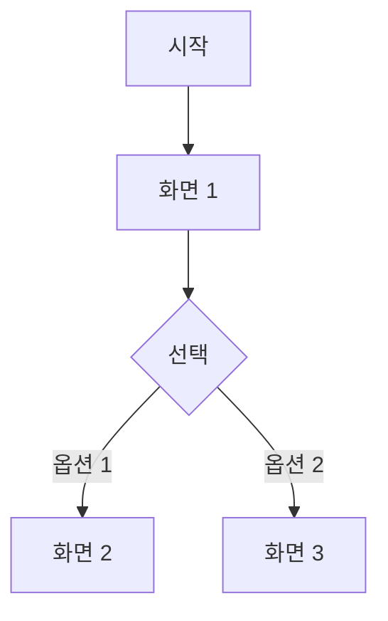

# /wf:start - 워크플로우 시작

> **상태 전환**: `[ ] Todo` → `[bd] 기본설계` | `[an] 분석` | `[dd] 상세설계`
>
> **계층 입력 지원**: Work Package, Activity, Task 단위 입력 가능 (WP/ACT 입력 시 하위 Task 병렬 처리)

## 사용법

```bash
/wf:start [WP-ID | ACT-ID | Task-ID]

# Task 단위 (기존)
/wf:start TSK-01-01-01

# Activity 단위 (ACT 내 모든 Todo Task 병렬 처리)
/wf:start ACT-01-01

# Work Package 단위 (WP 내 모든 Todo Task 병렬 처리)
/wf:start WP-01
```

## 계층 입력 처리

@.claude/includes/wf-hierarchy-input.md

### 입력 타입별 처리

| 입력 | 처리 방식 | 상태 필터 |
|------|----------|----------|
| `TSK-XX-XX-XX` | 단일 Task 처리 | `[ ]` Todo |
| `ACT-XX-XX` | ACT 내 모든 Task 병렬 처리 | `[ ]` Todo |
| `WP-XX` | WP 내 모든 Task 병렬 처리 | `[ ]` Todo |

## 상태 전환 규칙

| category | 현재 상태 | 다음 상태 | 생성 문서 |
|----------|----------|----------|----------|
| development | `[ ]` Todo | `[bd]` 기본설계 | `010-basic-design.md` |
| defect | `[ ]` Todo | `[an]` 분석 | `010-defect-analysis.md` |
| infrastructure | `[ ]` Todo | `[dd]` 상세설계 | `tech-design.md` (선택) |

## 개념 충돌 해결

@.claude/includes/wf-conflict-resolution.md

---

## 실행 과정

### 1단계: Task 정보 수집

1. **Task JSON에서 Task 찾기**: `.orchay/projects/{project}/tasks/{TSK-ID}/task.json`
2. **수집할 정보**:
   - Task ID, Task명, category
   - 상위 계층 (WP-ID, ACT-ID)
   - Task 설명 (불릿 포인트 내용)
   - **PRD 참조**: `_요구사항: PRD X.X.X` 형식에서 섹션 번호 추출
3. **현재 상태 검증**: `[ ]` Todo 상태인지 확인

**예시 - WBS에서 추출**:
```markdown
- [ ] **TSK-01-01-01**: Project CRUD 구현 `[development]`
  - Project 생성, 수정, 삭제, 아카이브 기능
  - Backend: `/api/projects` REST API 엔드포인트
  - Frontend: Project 생성/편집 Form, 목록 화면
  - _요구사항: PRD 3.1.4 Project 관리_
```

**추출 결과**:
- Task ID: `TSK-01-01-01`
- Task명: `Project CRUD 구현`
- category: `development`
- PRD 참조: `3.1.4 Project 관리`
- 구현 범위: Project 생성/수정/삭제/아카이브, REST API, Form/목록 화면

---

### 2단계: PRD/TRD 내용 추출

#### 2.1 PRD 참조 섹션 읽기

1. `.orchay/projects/{project}/project.json` 또는 `.orchay/projects/{project}/prd.md` 열기
2. WBS에서 추출한 PRD 섹션 번호로 해당 내용 찾기
3. **추출할 내용** (비즈니스 관점):
   - 해당 섹션의 기능 설명
   - 관련 비즈니스 규칙
   - 사용자 시나리오
   - UI/화면 요구사항 (있는 경우)

**중요**: Task 설명에 명시된 범위 내의 내용만 추출

#### 2.2 TRD 참조 내용 읽기 (참고용)

1. `.orchay/projects/{project}/trd.md` 열기
2. Task와 관련된 기술 요구사항 참고 (상세설계 단계에서 활용)

---

### 3단계: 범위 검증 (Scope Validation)

문서 생성 전, 추출한 내용이 Task 범위에 맞는지 검증합니다.

#### 3.1 범위 기준 설정

**Task 범위 = WBS Task 설명에 명시된 항목**

```
✅ 범위 내: WBS Task 설명에 직접 언급된 기능/화면/API
❌ 범위 외: Task 설명에 없지만 PRD 동일 섹션에 있는 다른 기능
```

#### 3.2 범위 검증 체크리스트

| 검증 항목 | 확인 내용 | 조치 |
|----------|----------|------|
| **누락 확인** | WBS Task 설명의 모든 항목이 포함되었는가? | 누락 항목 추가 |
| **초과 확인** | Task 설명에 없는 기능이 포함되었는가? | 초과 항목 제거 |
| **PRD 정합성** | PRD 섹션 내용과 일치하는가? | 불일치 시 PRD 기준 |

---

### 4단계: 문서 디렉토리 생성

@.claude/includes/wf-common.md

1. 공통 모듈의 폴더 경로 규칙에 따라 Task 폴더 경로 생성
2. 폴더가 없으면 생성

**Task 폴더 경로**:
```
.orchay/projects/{project}/tasks/{TSK-ID}/
```

**예시**:
- Task 폴더: `.orchay/projects/orchay/tasks/TSK-01-01-01/`
- Task JSON: `.orchay/projects/orchay/tasks/TSK-01-01-01/task.json`
- 설계 문서: `.orchay/projects/orchay/tasks/TSK-01-01-01/010-basic-design.md`

---

### 5단계: category별 문서 생성

#### development 카테고리

```
[Task-ID]/
└── 010-basic-design.md  # 기본설계 문서 (비즈니스 위주)
```

**010-basic-design.md 템플릿** (비즈니스 위주):
```markdown
# 기본설계: [Task명]

## 문서 정보
| 항목 | 내용 |
|------|------|
| Task ID | [Task-ID] |
| Category | development |
| 상태 | [bd] 기본설계 |
| 상위 Activity | [ACT-ID] |
| 상위 Work Package | [WP-ID] |
| PRD 참조 | [PRD 섹션 번호] |
| 작성일 | [오늘 날짜] |

---

## 1. 개요

### 1.1 목적
[Task 목적 - WBS 설명 기반, 비즈니스 관점에서 왜 이 기능이 필요한지]

### 1.2 구현 범위
> WBS Task 설명에서 추출

- [WBS에서 추출한 구현 항목 1]
- [WBS에서 추출한 구현 항목 2]

### 1.3 제외 범위
> 동일 PRD 섹션이지만 다른 Task에서 구현

- [제외 항목 1] → [담당 Task ID]

---

## 2. 사용자 시나리오

### 2.1 주요 사용자
- [사용자 역할 1]: [이 기능을 사용하는 목적]
- [사용자 역할 2]: [이 기능을 사용하는 목적]

### 2.2 사용 시나리오
> 사용자 관점에서 기능 사용 흐름

**시나리오 1: [시나리오명]**
1. 사용자가 [행동]
2. 시스템이 [반응]
3. 사용자가 [결과 확인]

**시나리오 2: [시나리오명]**
1. ...

---

## 3. 기능 요구사항
> PRD [섹션 번호]에서 범위 내 항목만 추출

### 3.1 [기능 1]
**설명**: [기능의 비즈니스 목적]
**입력**: [사용자가 제공하는 정보]
**출력**: [사용자가 받는 결과]
**제약조건**: [비즈니스 제약사항]

### 3.2 [기능 2]
...

---

## 4. 비즈니스 규칙
> PRD에서 추출한 범위 내 규칙만

| 규칙 ID | 규칙 설명 | 적용 시점 |
|---------|----------|----------|
| BR-001 | [비즈니스 규칙 1] | [언제 적용되는지] |
| BR-002 | [비즈니스 규칙 2] | [언제 적용되는지] |

---

## 5. 데이터 요구사항 (개념)
> 비즈니스 관점의 데이터 정의

### 5.1 주요 데이터
| 데이터 | 설명 | 비즈니스 의미 |
|--------|------|--------------|
| [데이터 1] | [설명] | [왜 필요한지] |
| [데이터 2] | [설명] | [왜 필요한지] |

### 5.2 데이터 관계
```mermaid
erDiagram
    %% 비즈니스 관점의 개념적 관계
```

---

## 6. 화면 요구사항 (개념)
> 사용자 관점의 화면 정의

### 6.1 화면 목록
| 화면 | 목적 | 주요 기능 |
|------|------|----------|
| [화면 1] | [사용자가 이 화면에서 하는 일] | [주요 액션] |
| [화면 2] | [사용자가 이 화면에서 하는 일] | [주요 액션] |

### 6.2 화면 흐름


### 6.3 화면 와이어프레임 (개념)
```
┌─────────────────────────────────┐
│ [화면명]                         │
├─────────────────────────────────┤
│ [주요 컨텐츠 영역 설명]          │
│                                  │
│ [버튼/액션 영역 설명]            │
└─────────────────────────────────┘
```

---

## 7. 인터페이스 요구사항 (개념)
> 비즈니스 관점의 API 정의

| 기능 | 설명 | 입력 | 출력 |
|------|------|------|------|
| [기능 1] | [비즈니스 목적] | [필요 데이터] | [결과 데이터] |
| [기능 2] | [비즈니스 목적] | [필요 데이터] | [결과 데이터] |

---

## 8. 수용 기준
> 비즈니스 관점의 완료 조건

- [ ] [사용자 시나리오 1] 정상 동작
- [ ] [사용자 시나리오 2] 정상 동작
- [ ] [비즈니스 규칙 1] 적용됨
- [ ] [비즈니스 규칙 2] 적용됨

---

## 9. 다음 단계
- `/wf:draft` 명령어로 상세설계 진행

---

## 관련 문서
- 프로젝트 정보: `.orchay/projects/{project}/project.json`
- PRD: `.orchay/projects/{project}/prd.md`
- TRD: `.orchay/projects/{project}/trd.md`


#### defect 카테고리
```
[Task-ID]/
└── 010-defect-analysis.md  # 결함 분석 문서
```

**010-defect-analysis.md 템플릿**:
```markdown
# 결함 분석: [Task명]

## 결함 정보
| 항목 | 내용 |
|------|------|
| Task ID | [Task-ID] |
| Category | defect |
| 상태 | [an] 분석 |
| 심각도 | [severity] |
| 재현성 | [reproducibility] |

## 1. 결함 현상
[결함 발생 상황 설명]

## 2. 재현 방법
1. 단계 1
2. 단계 2
3. 예상 결과 vs 실제 결과

## 3. 원인 분석
### 3.1 영향받는 파일
| 파일 | 영향 |
|------|------|

### 3.2 근본 원인
[원인 분석 결과]

## 4. 수정 방안
### 4.1 수정 범위
- 파일 1: 수정 내용
- 파일 2: 수정 내용

### 4.2 회귀 테스트 범위
- 테스트 1
- 테스트 2

## 5. 다음 단계
- `/wf:analyze` 명령어로 수정 단계 진행
```

#### infrastructure 카테고리
```
[Task-ID]/
└── 010-tech-design.md  # 기술 설계 문서 (선택)
```

**010-tech-design.md 템플릿**:
```markdown
# 기술 설계: [Task명]

## Task 정보
| 항목 | 내용 |
|------|------|
| Task ID | [Task-ID] |
| Category | infrastructure |
| 상태 | [dd] 상세설계 |

## 1. 목적
[인프라/리팩토링 목적]

## 2. 현재 상태
### 2.1 현재 구조
[현재 아키텍처/코드 구조]

### 2.2 문제점
- 문제 1
- 문제 2

## 3. 목표 상태
### 3.1 목표 구조
[목표 아키텍처/코드 구조]

### 3.2 개선 효과
- 효과 1
- 효과 2

## 4. 구현 계획
### 4.1 변경 사항
| 파일/모듈 | 변경 내용 |
|----------|----------|

### 4.2 마이그레이션 계획
[필요시 마이그레이션 단계]

## 5. 다음 단계
- `/wf:design` 또는 `/wf:skip`으로 구현 단계 진행
```

---

### 6단계: Task JSON 상태 업데이트

1. Task JSON 파일 열기: `.orchay/projects/{project}/tasks/{TSK-ID}/task.json`
2. status 필드 변경: `"[ ]"` → `"[bd]"` | `"[an]"` | `"[dd]"`
3. updated_at 필드 업데이트
4. 파일 저장
---

## 출력 예시

### development Task

```
[wf:start] 워크플로우 시작

Task: TSK-01-01-01
Category: development
상태 전환: [ ] Todo → [bd] 기본설계

📋 PRD 참조 추출:
- PRD 섹션: 3.1.4 Project 관리

🔍 범위 검증 결과:
✅ 포함 항목:
  - Project 생성/수정/삭제/아카이브
  - /api/projects REST API
  - Project 생성/편집 Form, 목록 화면

❌ 제외 항목 (다른 Task 범위):
  - 일정 설정, 진행률 계산 → TSK-01-01-02
  - 문서 연동 → TSK-01-01-03

생성된 문서:
└── 010-basic-design.md (기본설계, 비즈니스 위주)

다음 단계:
  - Frontend 포함 시: /wf:ui TSK-01-01-01
  - Backend only 시: /wf:draft TSK-01-01-01
```

---

## 에러 케이스

| 에러 | 메시지 |
|------|--------|
| Task 없음 | `[ERROR] Task를 찾을 수 없습니다: [Task-ID]` |
| 잘못된 상태 | `[ERROR] Todo 상태가 아닙니다. 현재 상태: [상태]` |
| category 없음 | `[ERROR] Task category가 지정되지 않았습니다` |
| PRD 참조 없음 | `[WARN] PRD 참조를 찾을 수 없습니다. 수동 입력 필요` |
| PRD 섹션 없음 | `[ERROR] PRD 섹션 [번호]를 찾을 수 없습니다` |

---

## 다음 명령어

| category | 다음 명령어 | 설명 |
|----------|------------|------|
| development | `/wf:draft` | 상세설계 진행 (기술 위주) |
| defect | `/wf:analyze` | 수정 단계 진행 |
| infrastructure | `/wf:design` 또는 `/wf:skip` | 구현 단계 진행 |

---

## WP/ACT 단위 병렬 처리

### 병렬 처리 출력 예시

```
[wf:start] 워크플로우 시작 (병렬 처리)

입력: WP-01 (Work Package)
범위: Core - Issue Management
전체 Task: 15개
대상 Task: 8개 (상태 필터: [ ] Todo)

━━━━━━━━━━━━━━━━━━━━━━━━━━━━━━━━━━━━━━━━━

📦 병렬 처리 진행:
├── [1/8] TSK-01-01-01: Project CRUD 구현 ✅ [development] → [bd]
├── [2/8] TSK-01-01-02: Project 대시보드 ✅ [development] → [bd]
├── [3/8] TSK-01-02-01: WP CRUD 구현 ✅ [development] → [bd]
├── [4/8] TSK-01-02-02: WP 계층 관리 ✅ [development] → [bd]
├── [5/8] TSK-01-03-01: ACT CRUD 구현 ✅ [development] → [bd]
├── [6/8] TSK-01-03-02: ACT 정렬 기능 ✅ [development] → [bd]
├── [7/8] TSK-01-04-01: Task CRUD 구현 ✅ [development] → [bd]
└── [8/8] TSK-01-04-02: Task 상태 관리 ✅ [development] → [bd]

━━━━━━━━━━━━━━━━━━━━━━━━━━━━━━━━━━━━━━━━━

📊 처리 결과:
├── 성공: 8개
├── 실패: 0개
└── 스킵: 7개 (이미 시작됨)

다음 단계: /wf:draft WP-01 (또는 개별 Task별 실행)
```

---

## 마지막 단계: 자동 Git Commit

@.claude/includes/wf-auto-commit.md

---

<!--
orchay 프로젝트 - Workflow Command
author: 장종익 
Command: wf:start
Version: 1.0

Changes (v1.0):
- 생성
-->
