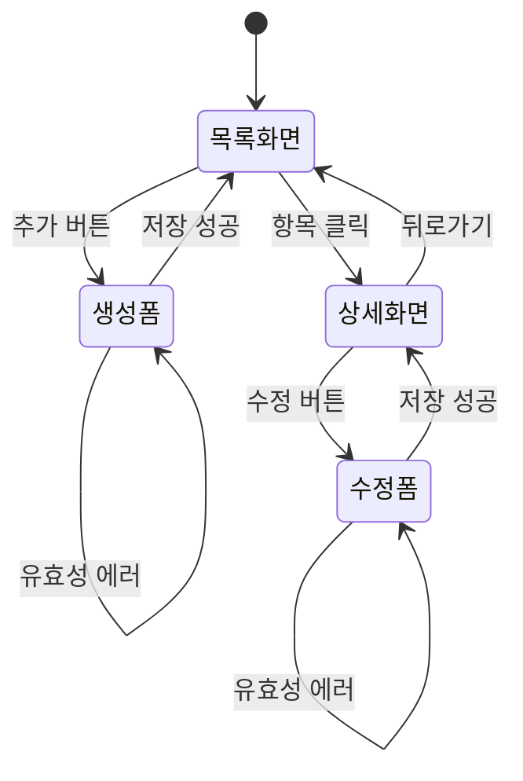

# /wf:ui - 화면설계 작성

> **상태 액션**: 상태 변경 없음 (`[bd] 기본설계` 유지)
> **적용 category**: development only
>
> **계층 입력 지원**: Work Package, Activity, Task 단위 입력 가능 (WP/ACT 입력 시 하위 Task 병렬 처리)
>
> 📐 **화면 설계 목적**: 사용자 인터랙션 흐름과 화면 레이아웃을 SVG 기반으로 상세 설계
> 🎨 **SVG 출력**: 각 화면 상태를 SVG 파일로 생성하여 시각적 명세 제공

## 사용법

```bash
/wf:ui [WP-ID | ACT-ID | Task-ID]

# Task 단위 (기존)
/wf:ui TSK-01-01-01

# Activity 단위 (ACT 내 모든 기본설계 완료 Task 병렬 처리)
/wf:ui ACT-01-01

# Work Package 단위 (WP 내 모든 기본설계 완료 Task 병렬 처리)
/wf:ui WP-01
```

## 계층 입력 처리

@.claude/includes/wf-hierarchy-input.md

### 입력 타입별 처리

| 입력 | 처리 방식 | 상태 필터 |
|------|----------|----------|
| `TSK-XX-XX-XX` | 단일 Task 처리 | `[bd]` 기본설계 |
| `ACT-XX-XX` | ACT 내 모든 Task 병렬 처리 | `[bd]` 기본설계 |
| `WP-XX` | WP 내 모든 Task 병렬 처리 | `[bd]` 기본설계 |

## 상태 규칙

| category | 현재 상태 | 액션 후 상태 | 생성 문서 |
|----------|----------|-------------|----------|
| development | `[bd]` 기본설계 | `[bd]` 기본설계 (유지) | `011-ui-design.md`, `ui-assets/*.svg` |

---

## 문서 경로

@.claude/includes/wf-common.md

## 개념 충돌 해결

@.claude/includes/wf-conflict-resolution.md

**Task 폴더 구조**:
```
.jjiban/projects/{project}/tasks/{TSK-ID}/
├── task.json
├── 010-basic-design.md     ← 입력 (필수)
├── 011-ui-design.md        ← 출력 (화면설계 문서)
└── ui-assets/              ← SVG 파일 폴더
    ├── screen-01-list.svg
    ├── screen-02-form.svg
    ├── screen-02-form-validation.svg
    └── screen-03-detail.svg
```

---

## 자동 실행 플로우

### 1단계: Task 검증 및 기본설계 분석
**MCP**: sequential-thinking

**자동 실행 단계**:

1. **Task ID 파싱 및 검증**:
   - Task JSON에서 Task 찾기
   - category가 `development`인지 확인
   - 현재 상태가 `[bd]` 기본설계인지 확인

2. **기본설계 문서 존재 확인**:
   - `010-basic-design.md` 파일 존재 확인
   - 파일 없을 시 에러 반환

3. **기본설계에서 화면 요구사항 추출**:
   ```
   추출 항목:
   ├── 화면 목록 (섹션 6.1)
   ├── 화면 흐름 (섹션 6.2)
   ├── 화면 와이어프레임 개념 (섹션 6.3)
   ├── 사용자 시나리오 (섹션 2.2)
   └── 기능 요구사항 중 UI 관련 항목 (섹션 3)
   ```

---

### 2단계: 화면 흐름 분석
**MCP**: sequential-thinking

**자동 실행 단계**:

1. **화면 목록 정의**:
   - 기본설계의 화면 목록을 기반으로 상세 화면 ID 부여
   - 화면별 목적과 주요 기능 정리

2. **사용자 액션 흐름 분석**:
   ```
   분석 항목:
   ├── 각 화면에서 가능한 사용자 액션 (버튼, 링크, 입력 등)
   ├── 액션별 화면 전환 또는 상태 변화
   ├── 조건부 화면 변화 (유효성 검증, 권한 등)
   └── 에러/예외 상황의 화면 상태
   ```

3. **화면 상태 정의**:
   - 각 화면의 가능한 상태 (초기, 로딩, 성공, 에러, 빈 상태 등)
   - 상태별 표시 내용과 사용 가능한 액션

---

### 3단계: 화면설계 문서 생성

**자동 실행 단계**:

1. **화면설계 문서 생성** (`011-ui-design.md`):
   - 화면 목록 및 화면 ID
   - 화면별 상세 레이아웃 명세
   - 화면 전환 흐름도 (Mermaid)
   - 컴포넌트 목록 및 속성
   - 상태별 화면 변화 명세

2. **SVG 파일 생성** (`ui-assets/*.svg`):
   - 각 화면의 레이아웃을 SVG로 시각화
   - 상태별 화면 변화도 별도 SVG로 생성
   - 반응형 breakpoint별 레이아웃 (필요시)

---

### 4단계: SVG 화면 생성
**MCP**: sequential-thinking

**SVG 생성 규칙**:

1. **파일명 규칙**:
   ```
   screen-{순번}-{화면명}.svg           # 기본 상태
   screen-{순번}-{화면명}-{상태}.svg    # 상태별 변화

   예시:
   screen-01-list.svg                   # 목록 화면 기본
   screen-01-list-empty.svg             # 목록 빈 상태
   screen-02-form.svg                   # 입력 폼 기본
   screen-02-form-validation.svg        # 유효성 검증 에러 상태
   screen-02-form-loading.svg           # 저장 중 로딩 상태
   ```

2. **SVG 스타일 가이드**:
   ```xml
   <!-- 기본 스타일 -->
   - 배경: #FFFFFF (흰색)
   - 테두리: #E5E7EB (gray-200)
   - 주요 요소: #3B82F6 (blue-500)
   - 텍스트: #1F2937 (gray-800)
   - 비활성: #9CA3AF (gray-400)
   - 에러: #EF4444 (red-500)
   - 성공: #10B981 (green-500)

   <!-- 폰트 -->
   - 제목: 16px, Bold
   - 본문: 14px, Regular
   - 캡션: 12px, Regular

   <!-- 간격 -->
   - 패딩: 16px
   - 요소 간격: 8px
   ```

3. **SVG 컴포넌트 표현**:
   ```
   ┌─────────────────────────────────────┐
   │ [버튼]     → 둥근 모서리 사각형      │
   │ [입력]     → 테두리 있는 사각형      │
   │ [카드]     → 그림자 있는 사각형      │
   │ [테이블]   → 격자 구조               │
   │ [아이콘]   → 원 또는 심볼            │
   │ [링크]     → 밑줄 텍스트             │
   └─────────────────────────────────────┘
   ```

4. **액션 표시 방법**:
   ```
   - 클릭 가능 요소: 파란색 테두리/배경
   - 비활성 요소: 회색 처리
   - 호버 상태: 점선 테두리로 표시 (선택적)
   - 액션 화살표: 요소에서 결과로 화살표
   ```

---

### 5단계: 화면 전환 흐름도 생성

**Mermaid 다이어그램 생성**:



**액션별 화면 변화 매트릭스**:

| 현재 화면 | 사용자 액션 | 결과 화면/상태 | 조건 |
|----------|------------|---------------|------|
| 목록 | 항목 클릭 | 상세 화면 | - |
| 목록 | 추가 버튼 | 생성 폼 | - |
| 생성 폼 | 저장 버튼 | 목록 화면 | 유효성 통과 |
| 생성 폼 | 저장 버튼 | 에러 상태 | 유효성 실패 |

---

## 011-ui-design.md 템플릿

```markdown
# 화면설계: [Task명]

## 문서 정보
| 항목 | 내용 |
|------|------|
| Task ID | [Task-ID] |
| Category | development |
| 상태 | [bd] 기본설계 |
| 기본설계 참조 | 010-basic-design.md |
| 작성일 | [오늘 날짜] |

---

## 1. 화면 목록

| 화면 ID | 화면명 | 목적 | SVG 파일 |
|---------|--------|------|----------|
| SCR-01 | [화면명] | [사용자가 이 화면에서 하는 일] |  |
| SCR-02 | [화면명] | [사용자가 이 화면에서 하는 일] |  |

---

## 2. 화면 전환 흐름

### 2.1 전체 흐름도

```mermaid
stateDiagram-v2
    [*] --> SCR-01
    SCR-01 --> SCR-02: [액션]
    SCR-02 --> SCR-01: [액션]
```

### 2.2 액션-화면 매트릭스

| 현재 화면 | 사용자 액션 | 결과 | 조건 |
|----------|------------|------|------|
| SCR-01 | [액션] | SCR-02로 이동 | - |
| SCR-02 | [액션] | 상태 변경 | [조건] |

---

## 3. 화면별 상세 설계

### 3.1 SCR-01: [화면명]

#### 3.1.1 화면 목적
[이 화면에서 사용자가 수행하는 주요 작업]

#### 3.1.2 레이아웃 구조
```
┌─────────────────────────────────────────────────┐
│ [Header]                                        │
├─────────────────────────────────────────────────┤
│ [Main Content Area]                             │
│                                                 │
│                                                 │
├─────────────────────────────────────────────────┤
│ [Footer/Actions]                                │
└─────────────────────────────────────────────────┘
```

#### 3.1.3 SVG 참조
- 기본 상태: 
- 빈 상태:  (해당 시)
- 로딩 상태:  (해당 시)

#### 3.1.4 컴포넌트 목록

| 컴포넌트 | 타입 | 위치 | 동작 |
|----------|------|------|------|
| [컴포넌트명] | Button | Header 우측 | 클릭 시 SCR-02로 이동 |
| [컴포넌트명] | Table | Main Content | 데이터 목록 표시 |

#### 3.1.5 상태별 화면 변화

| 상태 | 표시 내용 | 사용 가능 액션 |
|------|----------|---------------|
| 초기 로딩 | 스켈레톤 UI | 없음 |
| 데이터 있음 | 목록 테이블 | 클릭, 추가, 삭제 |
| 데이터 없음 | 빈 상태 안내 | 추가 |
| 에러 | 에러 메시지 | 재시도 |

#### 3.1.6 사용자 액션 상세

| 액션 | 트리거 | 결과 | 조건 |
|------|--------|------|------|
| 항목 클릭 | 테이블 행 클릭 | SCR-02로 이동 | - |
| 추가 버튼 | 버튼 클릭 | 생성 모달 표시 | - |
| 삭제 버튼 | 버튼 클릭 | 확인 다이얼로그 | 항목 선택됨 |

---

### 3.2 SCR-02: [화면명]
... (동일 구조 반복)

---

## 4. 공통 컴포넌트

### 4.1 모달/다이얼로그

| 모달 ID | 용도 | 트리거 | 액션 |
|---------|------|--------|------|
| MDL-01 | 생성 확인 | 생성 버튼 | 확인/취소 |
| MDL-02 | 삭제 확인 | 삭제 버튼 | 삭제/취소 |

### 4.2 알림/토스트

| 알림 타입 | 메시지 | 표시 조건 |
|----------|--------|----------|
| 성공 | "저장되었습니다" | 저장 완료 시 |
| 에러 | "저장에 실패했습니다" | API 에러 시 |

---

## 5. 반응형 설계 (선택)

### 5.1 Breakpoint 정의

| Breakpoint | 너비 | 레이아웃 변화 |
|------------|------|--------------|
| Desktop | ≥1024px | 전체 레이아웃 |
| Tablet | 768-1023px | 사이드바 축소 |
| Mobile | <768px | 단일 컬럼 |

---

## 6. 접근성 고려사항

| 항목 | 적용 내용 |
|------|----------|
| 키보드 네비게이션 | Tab 순서, Enter 활성화 |
| 스크린 리더 | ARIA 레이블, alt 텍스트 |
| 색상 대비 | WCAG 2.1 AA 기준 충족 |

---

## 7. SVG 파일 목록

| 파일명 | 화면 | 상태 | 미리보기 |
|--------|------|------|----------|
| screen-01-list.svg | SCR-01 | 기본 |  |
| screen-01-list-empty.svg | SCR-01 | 빈 상태 |  |
| screen-02-form.svg | SCR-02 | 기본 |  |
| screen-02-form-validation.svg | SCR-02 | 에러 |  |

---

## 8. 다음 단계
- `/wf:draft` 명령어로 상세설계 진행
- 화면설계 내용을 상세설계 UI/UX 섹션에 반영

---

## 관련 문서
- 기본설계: `010-basic-design.md`
- PRD: `.jjiban/{project}/prd.md`
```

---

## SVG 파일 예시

### 기본 목록 화면 SVG 구조

```xml
<?xml version="1.0" encoding="UTF-8"?>
<svg xmlns="http://www.w3.org/2000/svg" viewBox="0 0 800 600">
  <!-- 배경 -->
  <rect width="800" height="600" fill="#F9FAFB"/>

  <!-- 헤더 -->
  <rect x="0" y="0" width="800" height="60" fill="#FFFFFF" stroke="#E5E7EB"/>
  <text x="24" y="38" font-size="18" font-weight="bold" fill="#1F2937">화면 제목</text>

  <!-- 추가 버튼 -->
  <rect x="680" y="15" width="100" height="32" rx="6" fill="#3B82F6"/>
  <text x="710" y="36" font-size="14" fill="#FFFFFF">+ 추가</text>

  <!-- 테이블 헤더 -->
  <rect x="24" y="80" width="752" height="40" fill="#F3F4F6"/>
  <text x="40" y="105" font-size="14" font-weight="500" fill="#6B7280">컬럼 1</text>
  <text x="200" y="105" font-size="14" font-weight="500" fill="#6B7280">컬럼 2</text>
  <text x="400" y="105" font-size="14" font-weight="500" fill="#6B7280">컬럼 3</text>

  <!-- 테이블 행 1 -->
  <rect x="24" y="120" width="752" height="48" fill="#FFFFFF" stroke="#E5E7EB"/>
  <text x="40" y="150" font-size="14" fill="#1F2937">데이터 1</text>
  <text x="200" y="150" font-size="14" fill="#1F2937">데이터 2</text>
  <text x="400" y="150" font-size="14" fill="#1F2937">데이터 3</text>

  <!-- 테이블 행 2 -->
  <rect x="24" y="168" width="752" height="48" fill="#FFFFFF" stroke="#E5E7EB"/>
  <text x="40" y="198" font-size="14" fill="#1F2937">데이터 1</text>
  <text x="200" y="198" font-size="14" fill="#1F2937">데이터 2</text>
  <text x="400" y="198" font-size="14" fill="#1F2937">데이터 3</text>

  <!-- 페이지네이션 -->
  <rect x="350" y="540" width="100" height="32" rx="4" fill="#FFFFFF" stroke="#E5E7EB"/>
  <text x="385" y="560" font-size="14" fill="#6B7280">1 / 5</text>
</svg>
```

---

## 출력 예시

```
[wf:ui] 화면설계 시작

Task: TSK-01-01-01
Category: development
상태: [bd] 기본설계 (변경 없음)

📂 기본설계 분석:
├── 010-basic-design.md ✅
└── 화면 요구사항 추출:
    ├── 화면 목록: 4개
    ├── 사용자 시나리오: 3개
    └── 화면 흐름: 1개 (Mermaid)

🎨 화면 분석 결과:
├── SCR-01: Project 목록 화면
│   ├── 상태: 기본, 빈 상태, 로딩
│   └── 액션: 클릭, 추가, 삭제, 검색
├── SCR-02: Project 생성 폼
│   ├── 상태: 기본, 유효성 에러, 저장 중
│   └── 액션: 입력, 저장, 취소
├── SCR-03: Project 상세 화면
│   ├── 상태: 기본, 로딩
│   └── 액션: 수정, 삭제, 뒤로가기
└── SCR-04: Project 수정 폼
    ├── 상태: 기본, 유효성 에러, 저장 중
    └── 액션: 입력, 저장, 취소

📄 생성된 문서:
├── 011-ui-design.md (화면설계 문서)
└── ui-assets/
    ├── screen-01-list.svg
    ├── screen-01-list-empty.svg
    ├── screen-01-list-loading.svg
    ├── screen-02-form.svg
    ├── screen-02-form-validation.svg
    ├── screen-03-detail.svg
    └── screen-04-edit.svg

총 SVG 파일: 7개

다음 단계: /wf:draft TSK-01-01-01
```

---

## 에러 케이스

| 에러 | 메시지 |
|------|--------|
| 잘못된 category | `[ERROR] development category만 지원합니다. 현재: [category]` |
| 잘못된 상태 | `[ERROR] 기본설계 상태가 아닙니다. 현재 상태: [상태]` |
| 기본설계 미완료 | `[ERROR] 010-basic-design.md 파일이 없습니다` |
| 화면 요구사항 없음 | `[WARN] 기본설계에 화면 요구사항이 없습니다. 화면이 없는 기능인지 확인하세요.` |
| SVG 생성 실패 | `[ERROR] SVG 파일 생성 실패: [파일명]` |

---

## 다음 명령어

- `/wf:draft` - 상세설계 진행 (화면설계 내용 반영)
- `/wf:ui` - 화면설계 재실행 (기존 파일 덮어쓰기)

---

## WP/ACT 단위 병렬 처리

### 병렬 처리 출력 예시

```
[wf:ui] 화면설계 시작 (병렬 처리)

입력: ACT-01-01 (Activity)
범위: Project 관리 기능
전체 Task: 5개
대상 Task: 3개 (상태 필터: [bd] 기본설계, 화면 요구사항 있음)

━━━━━━━━━━━━━━━━━━━━━━━━━━━━━━━━━━━━━━━━━

📦 병렬 처리 진행:
├── [1/3] TSK-01-01-01: Project CRUD 구현 ✅ (SVG 7개)
├── [2/3] TSK-01-01-02: Project 대시보드 ✅ (SVG 3개)
└── [3/3] TSK-01-01-03: Project 아카이브 ✅ (SVG 2개)

━━━━━━━━━━━━━━━━━━━━━━━━━━━━━━━━━━━━━━━━━

📊 처리 결과:
├── 성공: 3개
├── 스킵: 2개 (화면 요구사항 없음)
└── 총 SVG 생성: 12개

다음 단계: /wf:draft ACT-01-01 (또는 개별 Task별 실행)
```

---

## 마지막 단계: 자동 Git Commit

@.claude/includes/wf-auto-commit.md

---

<!--
jjiban 프로젝트 - Workflow Command
author: 장종익
Command: wf:ui
Version: 1.0
Description: 기본설계 상태에서 화면설계 문서와 SVG 파일 생성
Status: 상태 변경 없음 (액션)
-->
