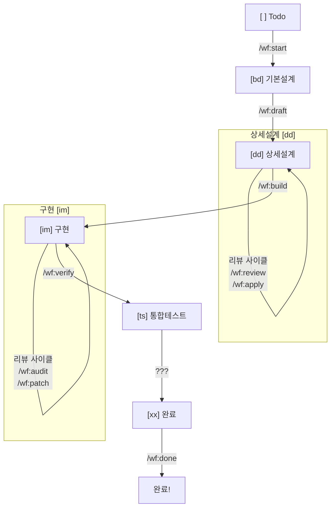
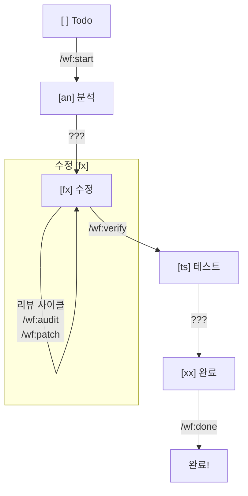
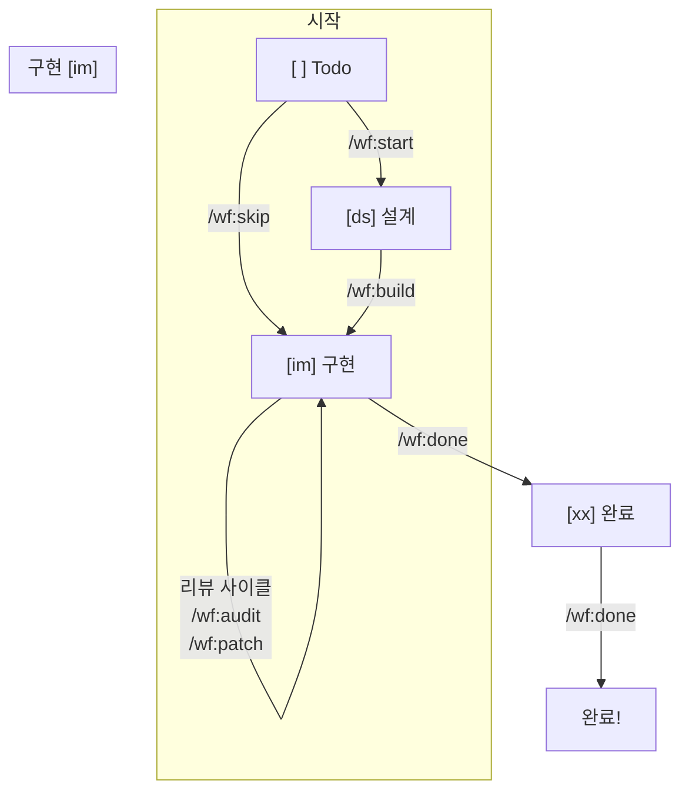

# Workflow Commands (wf:*)

> Task 워크플로우 상태 전환 및 계획/설계/테스트를 위한 명령어 모음

## 명령어 요약

### 1. 계획 및 설정 명령어

| 명령어 | 설명 | Category |
| --- | --- | --- |
| `/wf:wbs` | PRD를 분석하여 WBS(작업 분업 구조) 문서를 생성합니다. | planning |
| `/wf:init-json` | `wbs.md`를 파싱하여 폴더 구조와 `task.json` 파일을 생성합니다. | planning |
| `/wf:tech-stack` | 프로젝트 요구사항에 맞는 기술 스택을 결정하고 `TRD.md`를 생성합니다. | planning |

### 2. 워크플로우 명령어

| 명령어 | 설명 | 상태 전환 | 적용 Category |
| --- | --- | --- | --- |
| `/wf:start` | Task를 시작합니다. | `[ ]` → `[bd]`, `[an]`, `[ds]` | all |
| `/wf:ui` | 화면설계 문서(`011-ui-design.md`)와 SVG 에셋을 생성합니다. | 상태 변경 없음 (`[bd]`에서 실행) | development |
| `/wf:draft` | 기본설계를 바탕으로 상세설계 문서를 생성합니다. | `[bd]` → `[dd]` | development |
| `/wf:review` | 상세설계 문서(`020-detail-design.md`)에 대한 LLM 리뷰를 실행합니다. | 상태 변경 없음 (`[dd]`에서 실행) | development |
| `/wf:apply` | 설계 리뷰 내용을 상세설계 문서에 반영합니다. | 상태 변경 없음 (`[dd]`에서 실행) | development |
| `/wf:build` | 상세설계 또는 기술설계를 바탕으로 구현을 시작합니다. | `[dd]` → `[im]`, `[ds]` → `[im]` | development, infra |
| `/wf:skip` | `infrastructure` Task의 설계를 생략하고 바로 구현을 시작합니다. | `[ ]` → `[im]` | infrastructure |
| `/wf:audit` | 구현 코드에 대한 LLM 코드 리뷰를 실행합니다. | 상태 변경 없음 (`[im]`, `[fx]`에서 실행) | all |
| `/wf:patch` | 코드 리뷰 내용을 소스 코드에 반영합니다. | 상태 변경 없음 (`[im]`, `[fx]`에서 실행) | all |
| `/wf:test` | TDD 단위 테스트 및 E2E 테스트를 독립적으로 실행합니다. | 상태 변경 없음 (주로 `[im]`에서 실행) | development |
| `/wf:verify` | 구현/수정 완료 후 통합/회귀 테스트를 시작합니다. | `[im]` → `[ts]`, `[fx]` → `[ts]` | development, defect |
| `/wf:done` | Task를 최종 완료 처리하고 관련 산출물을 정리합니다. | `[xx]` 상태에서 최종 정리 | all |

---

## 워크플로우 다이어그램 (v2)

### development (8단계)


> **참고**: `[ts]` → `[xx]`로 전환하는 명시적인 명령어가 현재 없습니다. `/wf:done`은 `[xx]` 상태의 Task를 최종 정리하는 역할을 합니다.

### defect (5단계)


> **참고**: `[an]` → `[fx]` 및 `[ts]` → `[xx]`로 전환하는 명시적인 명령어가 현재 없습니다.

### infrastructure (4단계)


> **참고**: `/wf:build`가 `[ds]` → `[im]` 전환을 담당합니다. `/wf:done`이 `[im]` → `[xx]` 전환 및 최종 완료를 처리하는 것으로 해석됩니다.

---

## 상태 기호 참조

| 기호 | 상태 | category | 설명 |
| --- | --- | --- | --- |
| `[ ]` | Todo | 공통 | 대기 중 |
| `[bd]` | 기본설계 | development | PRD 분석, 비즈니스 중심 설계 |
| `[dd]` | 상세설계 | development | 기술 중심 설계, 리뷰 및 개선 |
| `[an]` | 분석 | defect | 원인 분석 |
| `[fx]` | 수정 | defect | 버그 수정 및 코드 개선 |
| `[ds]` | 설계 | infrastructure | 기술 설계 |
| `[im]` | 구현 | 공통 | 코드 작성 및 코드 리뷰/개선 |
| `[ts]` | 테스트 | development, defect | 통합/회귀 테스트 |
| `[xx]` | 완료 | 공통 | 모든 단계가 완료된 상태 |

---

## 파일 목록

```
.claude/commands/wf/
├── README.mds        # 이 문서
├── apply.md          # [신규] 설계 리뷰 내용 반영
├── audit.md          # 코드 개선 요청 (리뷰 실행)
├── build.md          # 구현 시작
├── done.md           # 작업 최종 완료
├── draft.md          # 상세설계 시작
├── init-json.md      # [신규] WBS 기반 폴더/JSON 생성
├── patch.md          # 코드 재검토 요청 (리뷰 반영)
├── review.md         # [신규] 설계 개선 요청 (리뷰 실행)
├── skip.md           # 설계 생략 (infra)
├── start.md          # 워크플로우 시작
├── tech-stack.md     # [신규] 기술 스택 결정
├── test.md           # [신규] TDD/E2E 테스트 실행
├── ui.md             # [신규] 화면설계 문서/SVG 생성
├── verify.md         # 통합/회귀 테스트 시작
└── wbs.md            # [신규] PRD 기반 WBS 생성
```

---

<!--
jjiban 프로젝트 - Workflow Command Documentation
Version: 2.0
-->