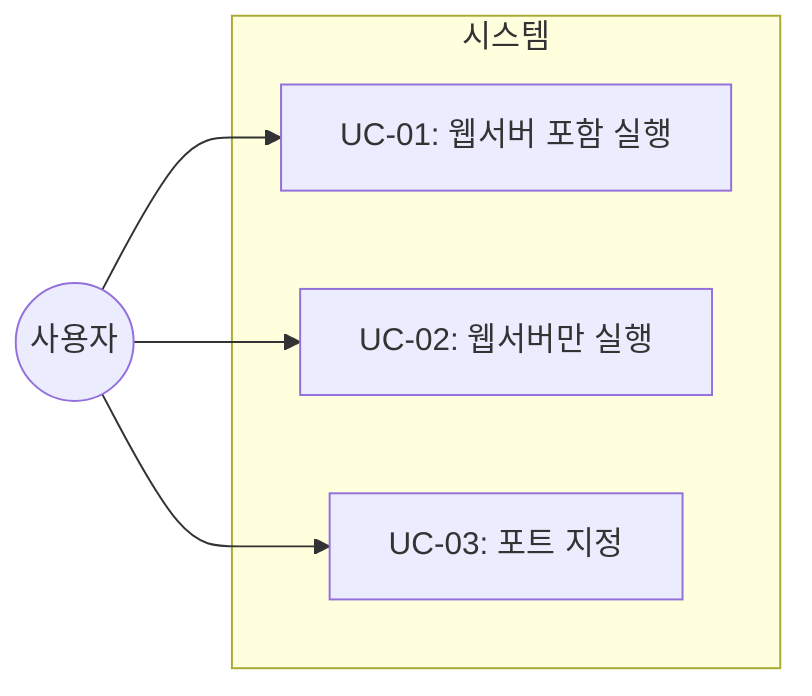

# TSK-01-03 - CLI 옵션 및 서버 통합 설계 문서

## 문서 정보

| 항목 | 내용 |
|------|------|
| Task ID | TSK-01-03 |
| 문서 버전 | 1.0 |
| 작성일 | 2025-12-28 |
| 상태 | 작성중 |
| 카테고리 | development |

---

## 1. 개요

### 1.1 배경 및 문제 정의

**현재 상황:**
- orchay 스케줄러는 TUI 기반으로만 동작
- 웹 모니터링 UI를 제공하기 위해 FastAPI 서버를 추가해야 함
- CLI에서 웹서버 실행 여부와 포트를 제어할 수 있어야 함

**해결하려는 문제:**
- 웹서버를 선택적으로 실행할 수 있는 CLI 옵션 필요
- Orchestrator 스케줄링과 웹서버를 병렬로 실행해야 함
- 웹서버만 단독 실행하는 모드도 필요

### 1.2 목적 및 기대 효과

**목적:**
- CLI에 `--web`, `--web-only`, `--port` 옵션 추가
- asyncio.gather를 활용한 병렬 실행 구현
- uvicorn.Server를 비동기로 실행하여 이벤트 루프 통합

**기대 효과:**
- 사용자가 터미널에서 간편하게 웹 모니터링 활성화
- TUI와 웹 UI를 동시에 사용 가능
- 포트 충돌 시 다른 포트로 변경 가능

### 1.3 범위

**포함:**
- argparse CLI 옵션 확장 (`--web`, `--web-only`, `--port`)
- uvicorn.Server 비동기 실행 통합
- Orchestrator.run()과 웹서버 병렬 실행 (asyncio.gather)
- 기존 CLI 구조(`cli.py`)와의 통합

**제외:**
- FastAPI 앱 생성 (TSK-01-01에서 담당)
- Jinja2 템플릿 구조 (TSK-01-02에서 담당)
- 웹서버 라우트 정의 (TSK-01-01에서 담당)

### 1.4 참조 문서

| 문서 | 경로 | 관련 섹션 |
|------|------|----------|
| PRD | `.jjiban/projects/orchay_web/prd.md` | 3.4 CLI 옵션 |
| TRD | `.jjiban/projects/orchay_web/trd.md` | 통합 방법 |

---

## 2. 사용자 분석

### 2.1 대상 사용자

| 사용자 유형 | 특성 | 주요 니즈 |
|------------|------|----------|
| 개발자 | CLI 사용에 익숙, 터미널 환경 선호 | 한 줄 명령어로 웹 모니터링 활성화 |
| 운영자 | 브라우저로 상태 확인 필요 | 터미널 없이 원격 모니터링 |

### 2.2 사용자 페르소나

**페르소나 1: 개발자**
- 역할: orchay 사용자
- 목표: TUI와 웹 UI를 함께 사용하며 작업 진행 모니터링
- 불만: 별도 명령어로 웹서버를 따로 실행하기 번거로움
- 시나리오: `orchay jjiban --web` 한 줄로 모든 것 시작

**페르소나 2: 모니터링 전용 사용자**
- 역할: 팀원, 매니저
- 목표: 브라우저에서 진행 상황만 확인
- 불만: 터미널 접근 없이 상태 확인 원함
- 시나리오: `orchay jjiban --web-only`로 웹서버만 실행

---

## 3. 유즈케이스

### 3.1 유즈케이스 다이어그램



### 3.2 유즈케이스 상세

#### UC-01: 웹서버 포함 실행

| 항목 | 내용 |
|------|------|
| 액터 | 개발자 |
| 목적 | TUI + 웹서버 동시 실행 |
| 사전 조건 | orchay 설치됨, 프로젝트 존재 |
| 사후 조건 | TUI 실행 + http://localhost:8080 접근 가능 |
| 트리거 | `orchay PROJECT --web` 명령 실행 |

**기본 흐름:**
1. 사용자가 `orchay jjiban --web` 명령을 실행한다
2. 시스템이 Orchestrator를 초기화한다
3. 시스템이 FastAPI 앱을 생성하고 Orchestrator 참조를 주입한다
4. 시스템이 uvicorn.Server를 생성한다 (포트 8080)
5. 시스템이 asyncio.gather로 Orchestrator.run()과 server.serve()를 병렬 실행한다
6. TUI가 표시되고 웹서버가 요청 대기 상태가 된다

**대안 흐름:**
- 5a. 포트가 사용 중이면:
  - 에러 메시지 "Port 8080 already in use" 출력
  - 사용자에게 `--port` 옵션 안내

#### UC-02: 웹서버만 실행

| 항목 | 내용 |
|------|------|
| 액터 | 운영자, 모니터링 사용자 |
| 목적 | 스케줄링 없이 웹 모니터링만 |
| 사전 조건 | orchay 설치됨, 프로젝트 존재 |
| 사후 조건 | http://localhost:8080만 접근 가능, TUI 없음 |
| 트리거 | `orchay PROJECT --web-only` 명령 실행 |

**기본 흐름:**
1. 사용자가 `orchay jjiban --web-only` 명령을 실행한다
2. 시스템이 Orchestrator를 초기화한다 (스케줄링 비활성화)
3. 시스템이 FastAPI 앱을 생성한다
4. 시스템이 uvicorn.Server.serve()만 실행한다
5. 웹서버가 요청 대기 상태가 된다 (TUI 없음)

#### UC-03: 포트 지정

| 항목 | 내용 |
|------|------|
| 액터 | 개발자 |
| 목적 | 기본 포트 대신 다른 포트 사용 |
| 사전 조건 | 포트 충돌 또는 사용자 선호 |
| 사후 조건 | 지정 포트로 서버 바인딩 |
| 트리거 | `--port PORT` 옵션 사용 |

**기본 흐름:**
1. 사용자가 `orchay jjiban --web --port 3000` 명령을 실행한다
2. 시스템이 포트 3000으로 uvicorn.Server를 생성한다
3. http://localhost:3000으로 접근 가능

---

## 4. 사용자 시나리오

### 4.1 시나리오 1: 기본 웹 모니터링

**상황 설명:**
개발자가 orchay 스케줄러를 실행하면서 브라우저에서도 진행 상황을 확인하고 싶다.

**단계별 진행:**

| 단계 | 사용자 행동 | 시스템 반응 | 사용자 기대 |
|------|-----------|------------|------------|
| 1 | `orchay jjiban --web` 입력 | CLI 파싱 시작 | 명령어 실행 |
| 2 | 엔터 키 입력 | TUI 화면 표시 + "Web server started at http://localhost:8080" 로그 | 서버 시작 확인 |
| 3 | 브라우저에서 localhost:8080 접속 | WBS 트리 + Worker 상태 표시 | 웹 UI 확인 |

**성공 조건:**
- TUI가 정상 동작
- 웹서버가 8080 포트에서 응답
- Ctrl+C로 둘 다 종료됨

### 4.2 시나리오 2: 포트 충돌 해결

**상황 설명:**
8080 포트가 다른 서비스에서 사용 중이다.

**단계별 진행:**

| 단계 | 사용자 행동 | 시스템 반응 | 복구 방법 |
|------|-----------|------------|----------|
| 1 | `orchay jjiban --web` 실행 | "Port 8080 already in use" 에러 | 다른 포트 사용 |
| 2 | `orchay jjiban --web --port 3000` 실행 | 포트 3000으로 서버 시작 | 정상 접속 |

### 4.3 시나리오 3: 웹서버 전용 모드

**상황 설명:**
운영자가 스케줄링 없이 현재 상태만 웹에서 확인하려 한다.

**단계별 진행:**

| 단계 | 사용자 행동 | 시스템 반응 | 사용자 기대 |
|------|-----------|------------|------------|
| 1 | `orchay jjiban --web-only` 입력 | 웹서버만 시작, TUI 없음 | 터미널 점유 없음 |
| 2 | 브라우저 접속 | WBS 상태 표시 (읽기 전용) | 상태 확인 |

---

## 5. 화면 설계

### 5.1 CLI 출력

**`--web` 옵션 사용 시:**
```
$ orchay jjiban --web
[INFO] Initializing Orchestrator...
[INFO] Starting web server at http://127.0.0.1:8080
[INFO] Press Ctrl+C to stop

┌─ orchay - jjiban ─────────────────────────┐
│  TUI 화면...                              │
└───────────────────────────────────────────┘
```

**`--web-only` 옵션 사용 시:**
```
$ orchay jjiban --web-only
[INFO] Initializing Orchestrator (scheduling disabled)...
[INFO] Starting web server at http://127.0.0.1:8080
[INFO] Press Ctrl+C to stop
```

### 5.2 도움말 출력

```
$ orchay --help
Usage: orchay [OPTIONS] PROJECT

Options:
  -m, --mode MODE      Execution mode (design, quick, develop, force)
  --dry-run            Status only, no dispatch
  --web                Enable web server (default port: 8080)
  --web-only           Run web server only (no scheduling)
  --port PORT          Web server port (default: 8080)
  --no-web             Disable web server (default)
  -h, --help           Show this help message
```

---

## 6. 인터랙션 설계

### 6.1 CLI 옵션 조합

| 옵션 조합 | TUI | 스케줄링 | 웹서버 | 유효 |
|----------|-----|---------|--------|------|
| (없음) | O | O | X | O |
| `--web` | O | O | O | O |
| `--web-only` | X | X | O | O |
| `--web --web-only` | - | - | - | X (충돌) |
| `--no-web` | O | O | X | O |
| `--web --port 3000` | O | O | O (3000) | O |

### 6.2 시그널 처리

| 시그널 | 동작 |
|--------|------|
| Ctrl+C (SIGINT) | TUI 종료 + 웹서버 graceful shutdown |
| SIGTERM | 동일 |

---

## 7. 데이터 요구사항

### 7.1 필요한 데이터

| 데이터 | 설명 | 출처 | 용도 |
|--------|------|------|------|
| args.web | 웹서버 활성화 플래그 | CLI 파싱 | 웹서버 실행 여부 결정 |
| args.web_only | 웹서버 전용 플래그 | CLI 파싱 | 스케줄링 비활성화 여부 |
| args.port | 웹서버 포트 | CLI 파싱 (기본 8080) | uvicorn 설정 |
| orchestrator | Orchestrator 인스턴스 | main.py | FastAPI 앱에 주입 |

### 7.2 CLI 옵션 스키마

```python
@dataclass
class WebConfig:
    enabled: bool = False      # --web
    web_only: bool = False     # --web-only
    port: int = 8080           # --port
    host: str = "127.0.0.1"    # 기본값 (보안)
```

---

## 8. 비즈니스 규칙

### 8.1 핵심 규칙

| 규칙 ID | 규칙 설명 | 적용 상황 | 예외 |
|---------|----------|----------|------|
| BR-01 | `--web`과 `--web-only`는 상호 배타적 | CLI 파싱 시 | 없음 |
| BR-02 | `--port`는 `--web` 또는 `--web-only`와 함께만 유효 | CLI 파싱 시 | 단독 사용 시 경고 |
| BR-03 | 웹서버는 localhost만 바인딩 (보안) | uvicorn 설정 | `--host` 옵션 추가 시 (향후) |

### 8.2 규칙 상세 설명

**BR-01: 옵션 상호 배타성**

설명: `--web`은 TUI + 웹서버, `--web-only`는 웹서버만 실행한다. 두 옵션을 동시에 사용하면 의미가 모호하므로 에러로 처리한다.

예시:
- `orchay jjiban --web` → 유효
- `orchay jjiban --web-only` → 유효
- `orchay jjiban --web --web-only` → 에러: "Cannot use --web and --web-only together"

**BR-02: --port 의존성**

설명: `--port`는 웹서버 관련 옵션이므로 `--web` 또는 `--web-only` 없이 사용하면 경고만 출력하고 무시한다.

---

## 9. 에러 처리

### 9.1 예상 에러 상황

| 상황 | 원인 | 사용자 메시지 | 복구 방법 |
|------|------|--------------|----------|
| 포트 사용 중 | 다른 프로세스가 점유 | "Port {port} already in use" | `--port` 옵션으로 다른 포트 지정 |
| 옵션 충돌 | `--web` + `--web-only` | "Cannot use --web and --web-only together" | 하나만 선택 |
| 무효 포트 | 범위 초과 (1-65535) | "Invalid port number: {port}" | 유효 범위 포트 사용 |
| FastAPI 미설치 | 의존성 누락 | "FastAPI not installed. Run: pip install fastapi uvicorn" | 의존성 설치 |

### 9.2 에러 표시 방식

| 에러 유형 | 표시 방법 |
|----------|----------|
| CLI 파싱 에러 | stderr + exit code 1 |
| 런타임 에러 | Rich console 에러 메시지 + 스택 트레이스 (debug 모드) |

---

## 10. 연관 문서

| 문서 | 경로 | 용도 |
|------|------|------|
| 요구사항 추적 매트릭스 | `025-traceability-matrix.md` | PRD → 설계 → 테스트 추적 |
| 테스트 명세서 | `026-test-specification.md` | 단위/E2E 테스트 정의 |

---

## 11. 구현 범위

### 11.1 영향받는 영역

| 영역 | 변경 내용 | 영향도 |
|------|----------|--------|
| `orchay/src/orchay/cli.py` | `--web`, `--web-only`, `--port` 옵션 추가 | 높음 |
| `orchay/src/orchay/main.py` | 웹서버 병렬 실행 로직 추가 | 높음 |
| `orchay/src/orchay/models/config.py` | WebConfig 데이터클래스 추가 | 중간 |

### 11.2 의존성

| 의존 항목 | 이유 | 상태 |
|----------|------|------|
| TSK-01-01 (FastAPI 앱) | create_app() 함수 필요 | 대기 |
| fastapi, uvicorn 패키지 | 웹서버 실행에 필요 | TSK-04-01에서 추가 |

### 11.3 제약 사항

| 제약 | 설명 | 대응 방안 |
|------|------|----------|
| 비동기 실행 필수 | orchay가 asyncio 기반 | uvicorn.Server.serve() 사용 |
| 기존 CLI 호환성 | 기존 옵션과 충돌 금지 | argparse mutually_exclusive_group 사용 |

---

## 12. 체크리스트

### 12.1 설계 완료 확인

- [x] 문제 정의 및 목적 명확화
- [x] 사용자 분석 완료
- [x] 유즈케이스 정의 완료
- [x] 사용자 시나리오 작성 완료
- [x] 화면 설계 완료 (CLI 출력)
- [x] 인터랙션 설계 완료
- [x] 데이터 요구사항 정의 완료
- [x] 비즈니스 규칙 정의 완료
- [x] 에러 처리 정의 완료

### 12.2 연관 문서 작성

- [ ] 요구사항 추적 매트릭스 작성 (→ `025-traceability-matrix.md`)
- [ ] 테스트 명세서 작성 (→ `026-test-specification.md`)

### 12.3 구현 준비

- [x] 구현 우선순위 결정
- [x] 의존성 확인 완료
- [x] 제약 사항 검토 완료

---

## 변경 이력

| 버전 | 일자 | 작성자 | 변경 내용 |
|------|------|--------|----------|
| 1.0 | 2025-12-28 | Claude | 최초 작성 |
