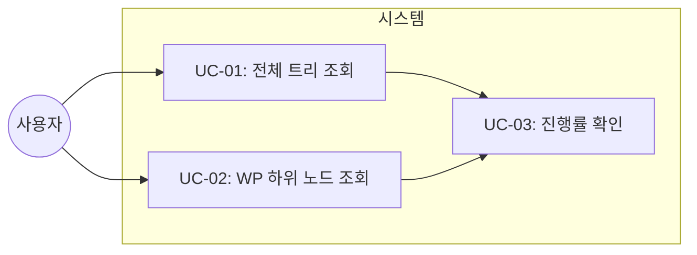
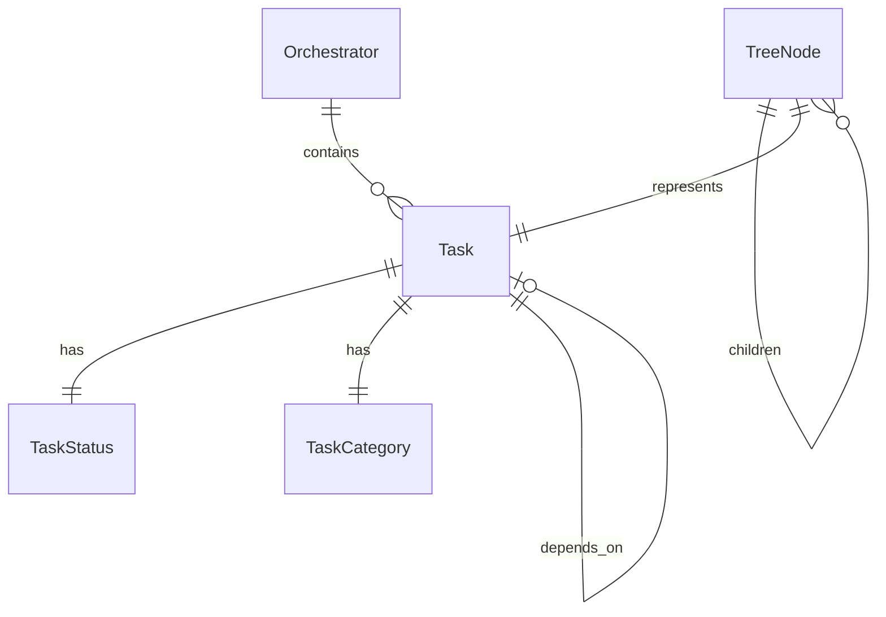

# TSK-02-01 - 트리 데이터 API 설계 문서

## 문서 정보

| 항목 | 내용 |
|------|------|
| Task ID | TSK-02-01 |
| 문서 버전 | 1.0 |
| 작성일 | 2025-12-28 |
| 상태 | 작성중 |
| 카테고리 | development |

---

## 1. 개요

### 1.1 배경 및 문제 정의

**현재 상황:**
- orchay 스케줄러는 WBS 데이터를 메모리(Orchestrator.tasks)에 파싱하여 보유
- TUI에서는 이 데이터를 직접 렌더링하지만, 웹 UI는 API를 통해 접근 필요
- 현재 WBS 트리 구조를 웹으로 제공하는 API가 없음

**해결하려는 문제:**
- 웹 브라우저에서 WBS 트리 구조를 시각화할 API 엔드포인트 필요
- Task를 WP/ACT 계층으로 그룹화하는 로직 필요
- 각 노드의 진행률을 계산하여 제공해야 함

### 1.2 목적 및 기대 효과

**목적:**
- WBS 트리 구조를 JSON/HTML로 제공하는 API 구현
- HTMX 부분 업데이트를 지원하는 파셜 HTML 응답 제공
- 트리 노드 확장/축소를 위한 하위 노드 조회 지원

**기대 효과:**
- 브라우저에서 WBS 트리 구조 확인 가능
- 5초 주기 자동 갱신으로 실시간 상태 모니터링
- 확장/축소로 대규모 WBS도 효율적으로 탐색

### 1.3 범위

**포함:**
- `/api/tree` 엔드포인트 (전체 트리)
- `/api/tree/{wp_id}` 엔드포인트 (WP 하위 노드)
- WP/ACT/TSK 계층 그룹화 로직
- 노드별 진행률 계산 로직
- HTMX 호환 HTML 파셜 응답

**제외:**
- tree.html 템플릿 구현 (TSK-02-02에서 처리)
- 트리 인터랙션 (TSK-02-03에서 처리)
- Task 상세 정보 API (TSK-03-01에서 처리)

### 1.4 참조 문서

| 문서 | 경로 | 관련 섹션 |
|------|------|----------|
| PRD | `.orchay/projects/orchay_web/prd.md` | 3.1 WBS 트리 |
| TRD | `.orchay/projects/orchay_web/trd.md` | API 설계, 아키텍처 |

---

## 2. 사용자 분석

### 2.1 대상 사용자

| 사용자 유형 | 특성 | 주요 니즈 |
|------------|------|----------|
| 프로젝트 관리자 | WBS 전체 구조 파악 필요 | 진행률, 상태 한눈에 확인 |
| 개발자 | 자신의 Task 상태 확인 | 빠른 Task 검색, 상세 확인 |

### 2.2 사용자 페르소나

**페르소나 1: PM 김철수**
- 역할: 프로젝트 관리자
- 목표: 전체 프로젝트 진행률과 병목 파악
- 불만: 터미널 접근 없이 상태 확인하고 싶음
- 시나리오: 브라우저로 WBS 트리를 열고 WP별 진행률 확인

**페르소나 2: 개발자 박영희**
- 역할: 백엔드 개발자
- 목표: 자신에게 할당된 Task 진행 상태 확인
- 불만: 터미널 TUI가 불편함
- 시나리오: 브라우저에서 트리 확장하여 자신의 Task 클릭

---

## 3. 유즈케이스

### 3.1 유즈케이스 다이어그램



### 3.2 유즈케이스 상세

#### UC-01: 전체 트리 조회

| 항목 | 내용 |
|------|------|
| 액터 | 프로젝트 관리자, 개발자 |
| 목적 | WBS 전체 트리 구조를 웹에서 확인 |
| 사전 조건 | 웹서버 실행 중, Orchestrator에 tasks 로드됨 |
| 사후 조건 | 브라우저에 WBS 트리 표시됨 |
| 트리거 | 페이지 로드 또는 5초 자동 갱신 |

**기본 흐름:**
1. HTMX가 `/api/tree`에 GET 요청을 보낸다
2. 서버가 Orchestrator.tasks에서 전체 Task 목록을 가져온다
3. Task ID를 파싱하여 WP/ACT/TSK 계층 구조로 그룹화한다
4. 각 WP/ACT의 진행률을 계산한다
5. tree.html 파셜을 렌더링하여 HTML로 응답한다
6. HTMX가 트리 영역을 업데이트한다

**대안 흐름:**
- 2a. Task 목록이 비어있으면:
  - 빈 트리 상태 HTML을 반환한다
  - "등록된 Task가 없습니다" 메시지 표시

**예외 흐름:**
- 3a. Task ID 형식이 비정상이면:
  - 해당 Task는 최상위 레벨에 표시
  - 경고 로그 출력

#### UC-02: WP 하위 노드 조회

| 항목 | 내용 |
|------|------|
| 액터 | 프로젝트 관리자, 개발자 |
| 목적 | 특정 WP의 하위 ACT/TSK만 조회 |
| 사전 조건 | 전체 트리가 로드된 상태 |
| 사후 조건 | 해당 WP의 하위 노드만 표시됨 |
| 트리거 | WP 노드 클릭 (확장) |

**기본 흐름:**
1. 사용자가 WP 노드를 클릭한다
2. HTMX가 `/api/tree/{wp_id}`에 GET 요청을 보낸다
3. 서버가 해당 WP에 속한 ACT/TSK만 필터링한다
4. 하위 노드의 HTML 조각을 반환한다
5. HTMX가 해당 WP 아래에 노드를 삽입한다

**예외 흐름:**
- 3a. 해당 WP가 존재하지 않으면:
  - 404 상태와 에러 메시지 반환

---

## 4. 사용자 시나리오

### 4.1 시나리오 1: 페이지 첫 로드

**상황 설명:**
PM 김철수가 브라우저에서 orchay 모니터링 페이지를 처음 열 때

**단계별 진행:**

| 단계 | 사용자 행동 | 시스템 반응 | 사용자 기대 |
|------|-----------|------------|------------|
| 1 | URL 접속 | index.html 로드 | 페이지 로딩 |
| 2 | 페이지 로드 완료 | HTMX가 /api/tree 요청 | 트리 데이터 로드 |
| 3 | - | 트리 HTML 수신 및 렌더링 | WBS 트리 표시 |
| 4 | 트리 확인 | WP/ACT/TSK 계층 표시 | 진행률 확인 가능 |

**성공 조건:**
- 모든 WP가 축소된 상태로 표시됨
- 각 WP 옆에 진행률 표시됨
- 1초 이내 렌더링 완료

### 4.2 시나리오 2: WP 확장

**상황 설명:**
개발자 박영희가 WP-02를 클릭하여 하위 Task 확인

**단계별 진행:**

| 단계 | 사용자 행동 | 시스템 반응 | 사용자 기대 |
|------|-----------|------------|------------|
| 1 | WP-02 클릭 | 확장 아이콘 변경 (▶→▼) | 클릭 피드백 |
| 2 | - | /api/tree/WP-02 요청 | 하위 노드 로드 |
| 3 | - | 하위 ACT/TSK HTML 삽입 | 하위 노드 표시 |
| 4 | Task 확인 | TSK-02-01, TSK-02-02 등 표시 | 상태별 색상 구분 |

**성공 조건:**
- 0.3초 이내 확장 애니메이션
- 하위 노드 들여쓰기 표시
- 상태 기호 색상 정확히 표시

### 4.3 시나리오 3: 자동 갱신

**상황 설명:**
페이지를 열어둔 상태에서 Task 상태가 변경될 때

**단계별 진행:**

| 단계 | 사용자 행동 | 시스템 반응 | 사용자 기대 |
|------|-----------|------------|------------|
| 1 | 페이지 열어둠 | 5초마다 /api/tree 요청 | 자동 갱신 |
| 2 | 다른 작업 중 | 트리 HTML 조용히 업데이트 | 깜빡임 없이 갱신 |
| 3 | 상태 변경 확인 | 새 상태 색상 표시 | 변경 사항 인지 |

**성공 조건:**
- 깜빡임 없는 부드러운 업데이트
- 스크롤 위치 유지
- 확장된 노드 상태 유지

---

## 5. 화면 설계

### 5.1 화면 흐름도

```mermaid
flowchart LR
    A[index.html<br/>전체 레이아웃] --> B[/api/tree<br/>트리 로드]
    B --> C[tree.html<br/>트리 표시]
    C --> D[/api/tree/WP-XX<br/>하위 확장]
    D --> C
    C --> E[/api/detail/TSK-XX<br/>상세 로드]
```

### 5.2 트리 영역 상세

#### 화면 1: WBS 트리 패널

**화면 목적:**
WBS 계층 구조를 시각화하고 확장/축소/선택 인터랙션 제공

**진입 경로:**
- 페이지 로드 시 자동으로 좌측 패널에 표시
- 5초마다 자동 갱신

**와이어프레임:**
```
┌──────────────────────────────────────────────────────┐
│  WBS Tree                                            │
├──────────────────────────────────────────────────────┤
│  ▶ WP-01: 웹서버 기본 구조                    (0%)   │
│  ▼ WP-02: WBS 트리 UI                         (25%)  │
│     ├ TSK-02-01 [bd] 트리 데이터 API        ←선택   │
│     ├ TSK-02-02 [ ] 트리 템플릿 구현                 │
│     └ TSK-02-03 [ ] 트리 인터랙션 구현               │
│  ▶ WP-03: Task 상세 및 Worker 상태            (0%)   │
│  ▶ WP-04: 마무리 및 테스트                    (0%)   │
│                                                      │
│                                                      │
│                                                      │
└──────────────────────────────────────────────────────┘
```

**화면 요소 설명:**

| 영역 | 설명 | 사용자 인터랙션 |
|------|------|----------------|
| 확장 아이콘 (▶/▼) | WP/ACT 확장 상태 | 클릭 시 토글 |
| WP 노드 | Work Package 제목 + 진행률 | 클릭 시 확장 |
| TSK 노드 | Task 상태 기호 + 제목 | 클릭 시 상세 패널 로드 |
| 선택 표시 | 현재 선택된 Task 하이라이트 | - |
| 진행률 (%) | 해당 WP의 완료 비율 | - |

**트리 노드 구조:**
```html
<div class="tree-node wp" data-id="WP-02">
  <span class="toggle">▼</span>
  <span class="icon">WP</span>
  <span class="title">WBS 트리 UI</span>
  <span class="progress">(25%)</span>
</div>
<div class="children open">
  <div class="tree-node task" data-id="TSK-02-01">
    <span class="indent pl-4"></span>
    <span class="status bg-blue-500">[bd]</span>
    <span class="title">트리 데이터 API</span>
  </div>
  ...
</div>
```

### 5.3 반응형 동작

| 화면 크기 | 레이아웃 변화 | 사용자 경험 |
|----------|--------------|------------|
| 데스크톱 (1024px+) | 50% 너비, 고정 위치 | 트리 + 상세 동시 확인 |
| 태블릿 (768-1023px) | 40% 너비 | 공간 효율적 배치 |
| 모바일 (767px-) | 전체 너비, 탭 전환 | 트리/상세 전환 |

---

## 6. 인터랙션 설계

### 6.1 사용자 액션과 피드백

| 사용자 액션 | 즉각 피드백 | 결과 피드백 | 에러 피드백 |
|------------|-----------|------------|------------|
| WP 클릭 (확장) | ▶→▼ 아이콘 전환 | 하위 노드 슬라이드 표시 | 로드 실패 메시지 |
| WP 클릭 (축소) | ▼→▶ 아이콘 전환 | 하위 노드 슬라이드 숨김 | - |
| Task 클릭 | 배경색 하이라이트 | 상세 패널 로드 | 로드 실패 메시지 |
| 자동 갱신 | - | 부드러운 내용 교체 | 연결 끊김 표시 |

### 6.2 상태별 화면 변화

| 상태 | 화면 표시 | 사용자 안내 |
|------|----------|------------|
| 초기 로딩 | 트리 영역 스켈레톤 | "트리 불러오는 중..." |
| 데이터 없음 | 빈 트리 아이콘 | "등록된 Task가 없습니다" |
| 에러 발생 | 에러 아이콘 + 재시도 | "트리 로드 실패. 재시도" |
| 연결 끊김 | 연결 상태 표시기 | "오프라인 - 마지막 업데이트: 10초 전" |

### 6.3 HTMX 속성

| 요소 | HTMX 속성 | 동작 |
|------|----------|------|
| 트리 컨테이너 | `hx-get="/api/tree" hx-trigger="load, every 5s"` | 초기 로드 + 자동 갱신 |
| WP 노드 | `hx-get="/api/tree/{wp_id}" hx-trigger="click" hx-target="next .children"` | 하위 노드 확장 |
| Task 노드 | `hx-get="/api/detail/{task_id}" hx-trigger="click" hx-target="#detail-panel"` | 상세 로드 |

---

## 7. 데이터 요구사항

### 7.1 필요한 데이터

| 데이터 | 설명 | 출처 | 용도 |
|--------|------|------|------|
| Task 목록 | 전체 WBS Task 리스트 | Orchestrator.tasks | 트리 노드 생성 |
| Task ID | TSK-XX-XX 형식 ID | Task.id | 계층 구분 |
| Task 상태 | `[ ]`, `[bd]`, `[dd]` 등 | Task.status | 상태 색상 표시 |
| Task 제목 | Task 이름 | Task.title | 노드 레이블 |
| Task 카테고리 | development, defect 등 | Task.category | 아이콘 표시 |

### 7.2 데이터 관계



**관계 설명:**
- Orchestrator는 여러 Task를 포함한다 (1:N)
- Task는 정확히 하나의 Status를 가진다 (1:1)
- Task는 다른 Task에 의존할 수 있다 (N:M)
- TreeNode는 Task를 표현하며 계층 구조를 형성한다

### 7.3 트리 구조 변환 로직

```python
# Task ID 파싱 예시
# TSK-02-01 → WP-02 / TSK-02-01
# TSK-01-01-01 → WP-01 / ACT-01-01 / TSK-01-01-01

def parse_task_hierarchy(task_id: str) -> dict:
    """Task ID를 WP/ACT/TSK 계층으로 파싱"""
    parts = task_id.replace("TSK-", "").split("-")
    if len(parts) == 2:
        # 3레벨: WP > TSK
        wp = f"WP-{parts[0]}"
        return {"wp": wp, "act": None, "task": task_id}
    elif len(parts) == 3:
        # 4레벨: WP > ACT > TSK
        wp = f"WP-{parts[0]}"
        act = f"ACT-{parts[0]}-{parts[1]}"
        return {"wp": wp, "act": act, "task": task_id}
```

### 7.4 진행률 계산 로직

```python
def calculate_progress(tasks: list[Task]) -> float:
    """완료된 Task 비율 계산"""
    if not tasks:
        return 0.0
    completed = sum(1 for t in tasks if t.status.code == "[xx]")
    return (completed / len(tasks)) * 100
```

### 7.5 데이터 유효성 규칙

| 데이터 필드 | 규칙 | 위반 시 처리 |
|------------|------|-------------|
| Task ID | TSK-XX-XX 또는 TSK-XX-XX-XX 형식 | 최상위 레벨에 표시 |
| Task 상태 | 유효한 상태 코드 | `[ ]` 기본값 사용 |
| WP ID | WP-XX 형식 | 404 반환 |

---

## 8. 비즈니스 규칙

### 8.1 핵심 규칙

| 규칙 ID | 규칙 설명 | 적용 상황 | 예외 |
|---------|----------|----------|------|
| BR-01 | WP 진행률은 하위 TSK 완료 비율 | 트리 렌더링 시 | 하위 TSK 없으면 0% |
| BR-02 | ACT 진행률은 하위 TSK 완료 비율 | 4레벨 구조일 때 | 하위 TSK 없으면 0% |
| BR-03 | 상태 색상은 workflows.json 기준 | 모든 상태 표시 | - |
| BR-04 | 5초 주기 자동 갱신 | 트리 컨테이너 | 페이지 비활성화 시 중단 |

### 8.2 규칙 상세 설명

**BR-01: WP 진행률 계산**

설명: WP 노드의 진행률은 해당 WP에 속한 모든 Task 중 완료([xx])된 비율로 계산

예시:
- WP-02에 4개 Task, 1개 완료 → 25%
- WP-02에 4개 Task, 4개 완료 → 100%
- WP-02에 0개 Task → 0%

**BR-03: 상태 색상 매핑**

설명: workflows.json에 정의된 상태별 색상을 Tailwind 클래스로 변환

| 상태 | Tailwind 클래스 | 표시 |
|------|----------------|------|
| `[ ]` | `bg-gray-500` | Todo |
| `[bd]` | `bg-blue-500` | 기본설계 |
| `[dd]` | `bg-purple-500` | 상세설계 |
| `[ap]` | `bg-green-500` | 승인 |
| `[im]` | `bg-yellow-500` | 구현 |
| `[xx]` | `bg-emerald-500` | 완료 |

---

## 9. 에러 처리

### 9.1 예상 에러 상황

| 상황 | 원인 | 사용자 메시지 | 복구 방법 |
|------|------|--------------|----------|
| 트리 로드 실패 | 서버 다운 | "트리를 불러올 수 없습니다" | 재시도 버튼 |
| WP 없음 | 잘못된 WP ID | "해당 WP를 찾을 수 없습니다" | 전체 트리 다시 로드 |
| Task 파싱 오류 | 비정상 ID 형식 | (내부 처리) | 최상위에 표시 |
| 연결 끊김 | 네트워크 오류 | "연결 끊김" | 자동 재연결 시도 |

### 9.2 에러 표시 방식

| 에러 유형 | 표시 위치 | 표시 방법 |
|----------|----------|----------|
| 초기 로드 실패 | 트리 영역 전체 | 에러 아이콘 + 재시도 버튼 |
| 노드 확장 실패 | 해당 노드 하위 | 인라인 에러 메시지 |
| 자동 갱신 실패 | 헤더 영역 | 연결 상태 표시기 |

### 9.3 HTTP 상태 코드

| 상황 | 상태 코드 | 응답 |
|------|----------|------|
| 정상 | 200 | HTML 조각 |
| WP 없음 | 404 | 에러 메시지 HTML |
| 서버 오류 | 500 | 에러 페이지 |

---

## 10. 연관 문서

> 상세 테스트 명세 및 요구사항 추적은 별도 문서에서 관리합니다.

| 문서 | 경로 | 용도 |
|------|------|------|
| 요구사항 추적 매트릭스 | `025-traceability-matrix.md` | PRD → 설계 → 테스트 양방향 추적 |
| 테스트 명세서 | `026-test-specification.md` | 단위/E2E/매뉴얼 테스트 상세 정의 |

---

## 11. 구현 범위

### 11.1 영향받는 영역

| 영역 | 변경 내용 | 영향도 |
|------|----------|--------|
| orchay/web/server.py | 트리 API 라우트 추가 | 높음 |
| orchay/web/tree.py (신규) | 트리 구조 변환 로직 | 높음 |
| orchay/web/templates/partials/tree.html | 트리 HTML 템플릿 | 중간 |

### 11.2 의존성

| 의존 항목 | 이유 | 상태 |
|----------|------|------|
| TSK-01-01 (FastAPI 앱) | 웹서버 기본 구조 필요 | 대기 |
| Orchestrator.tasks | 트리 데이터 소스 | 완료 (기존) |
| workflows.json | 상태 색상 정의 | 완료 (기존) |

### 11.3 제약 사항

| 제약 | 설명 | 대응 방안 |
|------|------|----------|
| SSR만 사용 | 클라이언트 JS 프레임워크 금지 | HTMX + Jinja2 |
| 메모리 직접 참조 | 추가 파일 I/O 없음 | Orchestrator 의존성 주입 |

---

## 12. API 상세 설계

### 12.1 엔드포인트 정의

#### GET /api/tree

**설명:** 전체 WBS 트리 구조 반환

**요청:**
```http
GET /api/tree HTTP/1.1
Host: localhost:8080
Accept: text/html
```

**응답:**
```html
<!-- 200 OK -->
<div class="tree-root">
  <div class="tree-node wp" data-id="WP-01">...</div>
  <div class="tree-node wp" data-id="WP-02">...</div>
  ...
</div>
```

**응답 헤더:**
```http
Content-Type: text/html; charset=utf-8
```

#### GET /api/tree/{wp_id}

**설명:** 특정 WP의 하위 노드 반환

**요청:**
```http
GET /api/tree/WP-02 HTTP/1.1
Host: localhost:8080
Accept: text/html
```

**응답 (성공):**
```html
<!-- 200 OK -->
<div class="tree-node task" data-id="TSK-02-01">...</div>
<div class="tree-node task" data-id="TSK-02-02">...</div>
```

**응답 (실패):**
```html
<!-- 404 Not Found -->
<div class="error">WP-99를 찾을 수 없습니다</div>
```

### 12.2 데이터 모델

```python
from dataclasses import dataclass
from typing import Optional

@dataclass
class TreeNode:
    """트리 노드 데이터"""
    id: str                      # WP-01, ACT-01-01, TSK-01-01
    type: str                    # "wp", "act", "task"
    title: str                   # 노드 제목
    status: Optional[str]        # Task인 경우 상태 코드
    progress: float              # WP/ACT인 경우 진행률 (0.0-100.0)
    children: list["TreeNode"]   # 하위 노드
    level: int                   # 들여쓰기 레벨 (0, 1, 2)
```

### 12.3 서비스 함수

```python
async def build_tree(orchestrator: Orchestrator) -> list[TreeNode]:
    """Orchestrator.tasks를 트리 구조로 변환"""
    ...

async def get_wp_children(orchestrator: Orchestrator, wp_id: str) -> list[TreeNode]:
    """특정 WP의 하위 노드 반환"""
    ...

def calculate_wp_progress(tasks: list[Task]) -> float:
    """WP 진행률 계산"""
    ...
```

---

## 13. 체크리스트

### 13.1 설계 완료 확인

- [x] 문제 정의 및 목적 명확화
- [x] 사용자 분석 완료
- [x] 유즈케이스 정의 완료
- [x] 사용자 시나리오 작성 완료
- [x] 화면 설계 완료 (와이어프레임)
- [x] 인터랙션 설계 완료
- [x] 데이터 요구사항 정의 완료
- [x] 비즈니스 규칙 정의 완료
- [x] 에러 처리 정의 완료
- [x] API 상세 설계 완료

### 13.2 연관 문서 작성

- [ ] 요구사항 추적 매트릭스 작성 (→ `025-traceability-matrix.md`)
- [ ] 테스트 명세서 작성 (→ `026-test-specification.md`)

### 13.3 구현 준비

- [x] 구현 우선순위 결정
- [x] 의존성 확인 완료
- [x] 제약 사항 검토 완료

---

## 변경 이력

| 버전 | 일자 | 작성자 | 변경 내용 |
|------|------|--------|----------|
| 1.0 | 2025-12-28 | Claude | 최초 작성 |
