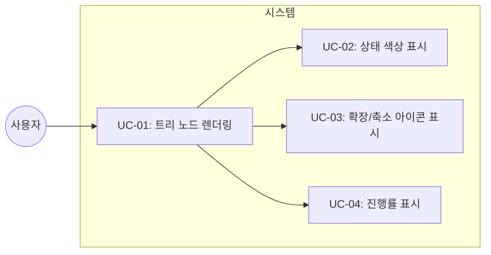
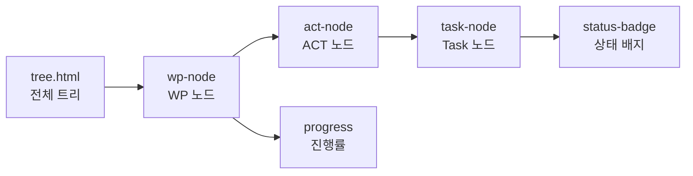

# TSK-02-02 - 트리 템플릿 구현 설계 문서

## 문서 정보

| 항목 | 내용 |
|------|------|
| Task ID | TSK-02-02 |
| 문서 버전 | 1.0 |
| 작성일 | 2025-12-28 |
| 상태 | 작성중 |
| 카테고리 | development |

---

## 1. 개요

### 1.1 배경 및 문제 정의

**현재 상황:**
- TSK-02-01에서 트리 데이터 API가 설계되어 `/api/tree` 엔드포인트가 트리 구조 데이터를 반환
- API는 HTML 파셜을 반환하지만 실제 렌더링할 템플릿(tree.html)이 아직 없음
- 트리 노드의 시각적 표현(들여쓰기, 아이콘, 색상)이 정의되지 않음

**해결하려는 문제:**
- WBS 트리 구조를 HTML로 시각화하는 Jinja2 템플릿 필요
- 상태별 색상, 계층별 들여쓰기, 확장/축소 아이콘 구현 필요
- HTMX와 연동되는 인터랙티브 요소 포함

### 1.2 목적 및 기대 효과

**목적:**
- tree.html 파셜 템플릿 구현
- 계층 구조 시각화 (WP > ACT > TSK)
- 상태별 색상 코딩 시스템 적용
- 확장/축소 가능한 트리 노드 UI

**기대 효과:**
- WBS 구조를 직관적으로 파악 가능
- 상태별 색상으로 진행 상황 즉시 인지
- 클릭으로 하위 노드 확장/축소하여 대규모 WBS 효율적 탐색

### 1.3 범위

**포함:**
- `tree.html` 파셜 템플릿 파일 구조
- WP/ACT/TSK 노드별 HTML 구조 정의
- 상태별 Tailwind 색상 클래스 매핑
- 계층별 들여쓰기 규칙 (pl-0, pl-4, pl-8)
- 확장/축소 아이콘 (▶/▼) 표시 규칙
- 트리 노드 호버/선택 상태 스타일

**제외:**
- 트리 데이터 API 로직 (TSK-02-01에서 완료)
- HTMX 인터랙션 구현 (TSK-02-03에서 처리)
- Task 상세 패널 (TSK-03-01에서 처리)

### 1.4 참조 문서

| 문서 | 경로 | 관련 섹션 |
|------|------|----------|
| PRD | `.jjiban/projects/orchay_web/prd.md` | 3.1 WBS 트리 |
| TRD | `.jjiban/projects/orchay_web/trd.md` | 트리 UI 구현, CSS 애니메이션 |
| 트리 API 설계 | `tasks/TSK-02-01/010-design.md` | 5.2 트리 영역 상세 |

---

## 2. 사용자 분석

### 2.1 대상 사용자

| 사용자 유형 | 특성 | 주요 니즈 |
|------------|------|----------|
| 프로젝트 관리자 | WBS 전체 구조 파악 필요 | 한눈에 진행률 확인, 상태별 구분 |
| 개발자 | 자신의 Task 상태 확인 | 빠른 Task 식별, 클릭으로 상세 이동 |

### 2.2 사용자 페르소나

**페르소나 1: PM 김철수**
- 역할: 프로젝트 관리자
- 목표: WP별 진행률 확인 및 병목 파악
- 불만: 텍스트만으로는 상태 구분이 어려움
- 시나리오: 색상으로 상태를 즉시 파악하고, WP 클릭으로 하위 Task 확인

**페르소나 2: 개발자 박영희**
- 역할: 프론트엔드 개발자
- 목표: 자신에게 할당된 Task 빠르게 찾기
- 불만: 트리가 너무 깊으면 찾기 어려움
- 시나리오: WP 확장/축소로 관심 영역만 펼쳐서 Task 선택

---

## 3. 유즈케이스

### 3.1 유즈케이스 다이어그램



### 3.2 유즈케이스 상세

#### UC-01: 트리 노드 렌더링

| 항목 | 내용 |
|------|------|
| 액터 | 웹 브라우저 (HTMX) |
| 목적 | 트리 노드 데이터를 HTML로 변환하여 표시 |
| 사전 조건 | /api/tree 응답으로 TreeNode 데이터 수신 |
| 사후 조건 | 계층 구조가 반영된 HTML 트리 표시 |
| 트리거 | 페이지 로드 또는 5초 자동 갱신 |

**기본 흐름:**
1. HTMX가 /api/tree 응답 HTML을 수신한다
2. tree.html 템플릿이 TreeNode 목록을 순회한다
3. 각 노드 타입(wp, act, task)에 따라 적절한 HTML 구조를 생성한다
4. 계층 레벨에 따라 들여쓰기 클래스를 적용한다
5. 브라우저가 렌더링된 HTML을 표시한다

**대안 흐름:**
- 2a. 노드 목록이 비어있으면:
  - 빈 상태 메시지 HTML을 표시한다
  - "등록된 Task가 없습니다" 문구 표시

#### UC-02: 상태 색상 표시

| 항목 | 내용 |
|------|------|
| 액터 | 템플릿 엔진 (Jinja2) |
| 목적 | Task 상태에 따른 색상 배지 표시 |
| 사전 조건 | 노드에 status 속성 존재 |
| 사후 조건 | 상태별 Tailwind 색상 클래스 적용 |
| 트리거 | 노드 렌더링 시 |

**기본 흐름:**
1. 템플릿이 노드의 status 값을 확인한다
2. STATUS_COLORS 매핑에서 해당 상태의 Tailwind 클래스를 조회한다
3. 상태 배지 요소에 색상 클래스를 적용한다
4. 상태 코드([bd], [dd] 등)를 배지 내 텍스트로 표시한다

---

## 4. 사용자 시나리오

### 4.1 시나리오 1: 전체 트리 표시

**상황 설명:**
사용자가 orchay 웹 모니터링 페이지를 열면 WBS 트리가 좌측 패널에 표시

**단계별 진행:**

| 단계 | 사용자 행동 | 시스템 반응 | 사용자 기대 |
|------|-----------|------------|------------|
| 1 | 페이지 접속 | /api/tree 요청 발생 | 트리 로딩 |
| 2 | - | tree.html로 HTML 렌더링 | 트리 표시 |
| 3 | 트리 확인 | WP 노드들이 나열됨 | WP별 진행률 확인 |
| 4 | 상태 확인 | 색상 배지로 상태 구분 | 시각적 구분 명확 |

**성공 조건:**
- 모든 WP 노드가 축소된 상태로 표시
- 각 WP 옆에 진행률(%)이 표시
- 상태별 색상 정확히 구분됨

### 4.2 시나리오 2: 하위 노드 확인

**상황 설명:**
사용자가 WP-02를 클릭하여 하위 Task들을 확인

**단계별 진행:**

| 단계 | 사용자 행동 | 시스템 반응 | 사용자 기대 |
|------|-----------|------------|------------|
| 1 | WP-02 클릭 | ▶ → ▼ 아이콘 전환 | 확장 표시 |
| 2 | - | 하위 노드 HTML 삽입 | Task 목록 표시 |
| 3 | Task 확인 | 들여쓰기된 TSK 노드 | 계층 구조 명확 |
| 4 | 상태 확인 | TSK 옆 상태 배지 | 각 Task 상태 확인 |

**성공 조건:**
- 하위 Task가 들여쓰기되어 표시 (pl-4)
- 각 Task의 상태 배지 표시
- Task 클릭 가능 상태 표시

---

## 5. 화면 설계

### 5.1 화면 흐름도



### 5.2 트리 노드 구조

#### 화면 1: WBS 트리 파셜

**화면 목적:**
WBS 계층 구조를 시각화하고 각 노드의 상태/진행률을 표시

**와이어프레임:**
```
┌──────────────────────────────────────────────────────┐
│  <div class="tree-root">                             │
│  ┌────────────────────────────────────────────────┐  │
│  │ ▶ [WP] WP-01: 웹서버 기본 구조          (0%)  │  │
│  └────────────────────────────────────────────────┘  │
│  ┌────────────────────────────────────────────────┐  │
│  │ ▼ [WP] WP-02: WBS 트리 UI              (25%)  │  │
│  │   ┌──────────────────────────────────────────┐ │  │
│  │   │   [bd] TSK-02-01: 트리 데이터 API       │ │  │
│  │   └──────────────────────────────────────────┘ │  │
│  │   ┌──────────────────────────────────────────┐ │  │
│  │   │   [ ] TSK-02-02: 트리 템플릿 구현 ←선택 │ │  │
│  │   └──────────────────────────────────────────┘ │  │
│  │   ┌──────────────────────────────────────────┐ │  │
│  │   │   [ ] TSK-02-03: 트리 인터랙션 구현     │ │  │
│  │   └──────────────────────────────────────────┘ │  │
│  └────────────────────────────────────────────────┘  │
│  ┌────────────────────────────────────────────────┐  │
│  │ ▶ [WP] WP-03: Task 상세 및 Worker 상태  (0%)  │  │
│  └────────────────────────────────────────────────┘  │
│  </div>                                              │
└──────────────────────────────────────────────────────┘
```

**화면 요소 설명:**

| 영역 | 설명 | 스타일 |
|------|------|--------|
| 확장 아이콘 (▶/▼) | WP/ACT 확장 상태 표시 | `text-gray-400` |
| 타입 아이콘 [WP] | 노드 타입 표시 | `text-xs font-bold` |
| 노드 ID | WP-XX, TSK-XX-XX | `font-medium` |
| 노드 제목 | 작업 설명 | `truncate` |
| 진행률 | WP/ACT의 완료율 | `text-gray-400 text-sm` |
| 상태 배지 | [bd], [dd] 등 | 색상별 `bg-{color}-500` |

### 5.3 노드별 HTML 구조

#### WP 노드

```html
<div class="tree-node wp group flex items-center py-1 px-2 rounded hover:bg-gray-800 cursor-pointer"
     data-id="WP-01"
     data-expanded="false">
  <span class="toggle w-4 text-gray-400">▶</span>
  <span class="icon text-xs font-bold text-blue-400 ml-1">WP</span>
  <span class="title ml-2 font-medium text-gray-200 truncate">웹서버 기본 구조</span>
  <span class="progress ml-auto text-sm text-gray-400">(0%)</span>
</div>
<div class="children pl-4 hidden">
  <!-- 하위 노드 -->
</div>
```

#### TSK 노드

```html
<div class="tree-node task flex items-center py-1 px-2 rounded hover:bg-gray-800 cursor-pointer"
     data-id="TSK-02-01">
  <span class="indent w-4"></span>
  <span class="status px-1 text-xs rounded bg-blue-500 text-white">[bd]</span>
  <span class="title ml-2 text-gray-300 truncate">트리 데이터 API</span>
</div>
```

### 5.4 상태별 색상 매핑

| 상태 코드 | 상태명 | Tailwind 클래스 | 색상 |
|----------|--------|-----------------|------|
| `[ ]` | Todo | `bg-gray-500` | #6b7280 |
| `[bd]` | 기본설계 | `bg-blue-500` | #3b82f6 |
| `[dd]` | 상세설계 | `bg-purple-500` | #a855f7 |
| `[an]` | 분석 | `bg-indigo-500` | #6366f1 |
| `[ds]` | 설계 | `bg-cyan-500` | #06b6d4 |
| `[ap]` | 승인 | `bg-green-500` | #22c55e |
| `[im]` | 구현 | `bg-yellow-500` | #f59e0b |
| `[fx]` | 수정 | `bg-orange-500` | #f97316 |
| `[vf]` | 검증 | `bg-teal-500` | #14b8a6 |
| `[xx]` | 완료 | `bg-emerald-500` | #10b981 |

### 5.5 들여쓰기 규칙

| 레벨 | 노드 타입 | Tailwind 클래스 | 픽셀 |
|------|----------|-----------------|------|
| 0 | WP | `pl-0` | 0px |
| 1 | ACT / TSK (직접) | `pl-4` | 16px |
| 2 | TSK (ACT 하위) | `pl-8` | 32px |

---

## 6. 인터랙션 설계

### 6.1 사용자 액션과 피드백

| 사용자 액션 | 즉각 피드백 | 결과 피드백 |
|------------|-----------|------------|
| 트리 로드 | 스켈레톤 표시 | 트리 렌더링 완료 |
| 노드 호버 | 배경색 `bg-gray-800` | - |
| Task 클릭 | 배경색 `bg-gray-700` | 우측 패널 업데이트 |
| WP 확장 | ▶→▼ 전환 | 하위 노드 표시 |
| WP 축소 | ▼→▶ 전환 | 하위 노드 숨김 |

### 6.2 상태별 화면 변화

| 상태 | 화면 표시 | 사용자 안내 |
|------|----------|------------|
| 초기 로딩 | 스켈레톤 애니메이션 | "트리 불러오는 중..." |
| 데이터 없음 | 빈 상태 아이콘 | "등록된 Task가 없습니다" |
| 노드 선택됨 | `ring-2 ring-blue-500` | 시각적 선택 표시 |
| 갱신 중 | 투명도 50% | 조용한 업데이트 |

### 6.3 CSS 클래스 정의

```css
/* 기본 트리 스타일 */
.tree-root {
  @apply space-y-0.5;
}

.tree-node {
  @apply transition-colors duration-150;
}

.tree-node:hover {
  @apply bg-gray-800;
}

.tree-node.selected {
  @apply bg-gray-700 ring-2 ring-blue-500;
}

/* 확장/축소 애니메이션 */
.children {
  @apply overflow-hidden transition-all duration-300 ease-in-out;
}

.children.hidden {
  @apply max-h-0 opacity-0;
}

.children.open {
  @apply max-h-[2000px] opacity-100;
}

/* 상태 배지 */
.status {
  @apply inline-flex items-center justify-center min-w-[32px];
}
```

---

## 7. 데이터 요구사항

### 7.1 필요한 데이터

| 데이터 | 설명 | 출처 | 용도 |
|--------|------|------|------|
| TreeNode.id | 노드 ID | API | data-id 속성 |
| TreeNode.type | "wp", "act", "task" | API | 노드 스타일 결정 |
| TreeNode.title | 노드 제목 | API | 표시 텍스트 |
| TreeNode.status | 상태 코드 | API | 상태 배지 색상 |
| TreeNode.progress | 진행률 (0-100) | API | WP/ACT 진행률 표시 |
| TreeNode.level | 들여쓰기 레벨 | API | pl-X 클래스 결정 |
| TreeNode.children | 하위 노드 목록 | API | 재귀 렌더링 |

### 7.2 Jinja2 컨텍스트

```python
# 템플릿에 전달되는 컨텍스트
{
    "nodes": [TreeNode, ...],  # 트리 노드 목록
    "status_colors": {         # 상태별 색상 매핑
        "[ ]": "bg-gray-500",
        "[bd]": "bg-blue-500",
        ...
    },
    "selected_id": str | None  # 현재 선택된 노드 ID
}
```

### 7.3 데이터 유효성 규칙

| 데이터 필드 | 규칙 | 위반 시 처리 |
|------------|------|-------------|
| type | "wp", "act", "task" 중 하나 | "task" 기본값 |
| status | 유효한 상태 코드 | `bg-gray-500` 기본값 |
| progress | 0-100 범위 | 0 기본값 |
| level | 0-2 범위 | 0 기본값 |

---

## 8. 비즈니스 규칙

### 8.1 핵심 규칙

| 규칙 ID | 규칙 설명 | 적용 상황 | 예외 |
|---------|----------|----------|------|
| BR-01 | WP/ACT 노드는 확장/축소 가능 | 하위 노드 있을 때 | 하위 없으면 토글 숨김 |
| BR-02 | TSK 노드는 클릭 시 상세 로드 | 항상 | - |
| BR-03 | 상태 색상은 workflows.json 기준 | 모든 상태 표시 | 미정의 상태는 gray |
| BR-04 | 선택된 노드는 시각적 강조 | Task 선택 시 | - |
| BR-05 | 진행률은 WP/ACT에만 표시 | WP/ACT 렌더링 시 | TSK는 진행률 없음 |

### 8.2 규칙 상세 설명

**BR-01: 확장/축소 토글**

설명: WP와 ACT 노드는 하위 노드가 있을 경우 ▶/▼ 아이콘을 표시하고 클릭으로 토글

예시:
- WP-02에 3개 Task 있음 → ▶ 아이콘 표시, 클릭 시 ▼로 전환
- WP-05에 하위 없음 → 토글 아이콘 숨김

**BR-03: 상태 색상 매핑**

설명: 상태 코드별로 정의된 Tailwind 색상 클래스 적용

```jinja2

<span class="status {{ color }}">{{ node.status }}</span>
```

---

## 9. 에러 처리

### 9.1 예상 에러 상황

| 상황 | 원인 | 표시 방법 | 복구 방법 |
|------|------|----------|----------|
| 빈 트리 | Task 없음 | 빈 상태 메시지 | 새로고침 안내 |
| 알 수 없는 상태 | 새 상태 코드 | 기본 gray 색상 | - |
| 알 수 없는 타입 | 잘못된 노드 타입 | task로 렌더링 | - |

### 9.2 에러 표시 방식

```html
<!-- 빈 트리 상태 -->
<div class="empty-tree flex flex-col items-center justify-center h-64 text-gray-500">
  <svg class="w-16 h-16 mb-4" fill="none" stroke="currentColor">
    <!-- 트리 아이콘 -->
  </svg>
  <p class="text-lg">등록된 Task가 없습니다</p>
  <p class="text-sm mt-2">WBS 파일을 확인해주세요</p>
</div>
```

---

## 10. 연관 문서

| 문서 | 경로 | 용도 |
|------|------|------|
| 요구사항 추적 매트릭스 | `025-traceability-matrix.md` | PRD → 설계 → 테스트 추적 |
| 테스트 명세서 | `026-test-specification.md` | 단위/E2E/매뉴얼 테스트 정의 |

---

## 11. 구현 범위

### 11.1 영향받는 영역

| 영역 | 변경 내용 | 영향도 |
|------|----------|--------|
| orchay/web/templates/partials/tree.html | 신규 파일 생성 | 높음 |
| orchay/web/static/style.css | 트리 관련 CSS 추가 | 중간 |

### 11.2 의존성

| 의존 항목 | 이유 | 상태 |
|----------|------|------|
| TSK-02-01 (트리 API) | TreeNode 데이터 구조 정의 | 설계완료 |
| TSK-01-02 (템플릿 기본 구조) | base.html 레이아웃 | 대기 |
| TRD (상태 색상) | workflows.json 색상 정의 | 완료 |

### 11.3 제약 사항

| 제약 | 설명 | 대응 방안 |
|------|------|----------|
| JavaScript 프레임워크 금지 | React/Vue 사용 불가 | HTMX + Jinja2 |
| CDN 사용 | 로컬 빌드 없음 | Tailwind CDN |
| SSR 전용 | 클라이언트 렌더링 금지 | Jinja2 템플릿 |

---

## 12. 템플릿 상세 설계

### 12.1 tree.html 파셜 템플릿

```jinja2
{# orchay/web/templates/partials/tree.html #}
{# 트리 노드 재귀 매크로 #}

  
    {{ render_wp_node(node, selected_id) }}
  
    {{ render_act_node(node, selected_id) }}
  
    {{ render_task_node(node, selected_id) }}
  


{# WP 노드 매크로 #}

<div class="tree-node wp group flex items-center py-1 px-2 rounded hover:bg-gray-800 cursor-pointer"
     data-id="{{ node.id }}"
     data-type="wp"
     hx-get="/api/tree/{{ node.id }}"
     hx-trigger="click"
     hx-target="next .children"
     hx-swap="innerHTML">
  <span class="toggle w-4 text-gray-400 transition-transform" data-expanded="false">▶</span>
  <span class="icon text-xs font-bold text-blue-400 ml-1">WP</span>
  <span class="title ml-2 font-medium text-gray-200 truncate">{{ node.title }}</span>
  <span class="progress ml-auto text-sm text-gray-400">({{ node.progress|round|int }}%)</span>
</div>
<div class="children pl-4 overflow-hidden max-h-0 opacity-0 transition-all duration-300">
  {# 하위 노드는 HTMX로 로드 #}
</div>


{# Task 노드 매크로 #}



<div class="tree-node task flex items-center py-1 px-2 rounded hover:bg-gray-800 cursor-pointer {{ 'bg-gray-700 ring-2 ring-blue-500' if is_selected else '' }}"
     data-id="{{ node.id }}"
     data-type="task"
     hx-get="/api/detail/{{ node.id }}"
     hx-trigger="click"
     hx-target="#detail-panel">
  <span class="indent" style="width: {{ node.level * 16 }}px"></span>
  <span class="status px-1 text-xs rounded {{ color }} text-white">{{ node.status }}</span>
  <span class="title ml-2 text-gray-300 truncate">{{ node.title }}</span>
</div>


{# 메인 트리 렌더링 #}

<div class="tree-root space-y-0.5">
  
    {{ render_node(node, selected_id) }}
  
</div>

<div class="empty-tree flex flex-col items-center justify-center h-64 text-gray-500">
  <svg class="w-16 h-16 mb-4" fill="none" stroke="currentColor" viewBox="0 0 24 24">
    <path stroke-linecap="round" stroke-linejoin="round" stroke-width="2"
          d="M3 7v10a2 2 0 002 2h14a2 2 0 002-2V9a2 2 0 00-2-2h-6l-2-2H5a2 2 0 00-2 2z"></path>
  </svg>
  <p class="text-lg">등록된 Task가 없습니다</p>
  <p class="text-sm mt-2">WBS 파일을 확인해주세요</p>
</div>

```

### 12.2 CSS 확장 (style.css)

```css
/* 트리 노드 애니메이션 */
.tree-node {
  transition: background-color 0.15s ease-in-out;
}

.tree-node:hover {
  background-color: rgb(31 41 55); /* gray-800 */
}

.tree-node.selected {
  background-color: rgb(55 65 81); /* gray-700 */
}

/* 토글 아이콘 회전 */
.toggle[data-expanded="true"] {
  transform: rotate(90deg);
}

/* 하위 노드 확장 애니메이션 */
.children.open {
  max-height: 2000px;
  opacity: 1;
}

/* 상태 배지 */
.status {
  min-width: 32px;
  text-align: center;
}

/* 스켈레톤 로딩 */
.skeleton {
  animation: pulse 2s cubic-bezier(0.4, 0, 0.6, 1) infinite;
}

@keyframes pulse {
  0%, 100% { opacity: 1; }
  50% { opacity: 0.5; }
}
```

---

## 13. 체크리스트

### 13.1 설계 완료 확인

- [x] 문제 정의 및 목적 명확화
- [x] 사용자 분석 완료
- [x] 유즈케이스 정의 완료
- [x] 사용자 시나리오 작성 완료
- [x] 화면 설계 완료 (와이어프레임)
- [x] 인터랙션 설계 완료
- [x] 데이터 요구사항 정의 완료
- [x] 비즈니스 규칙 정의 완료
- [x] 에러 처리 정의 완료
- [x] 템플릿 상세 설계 완료

### 13.2 연관 문서 작성

- [ ] 요구사항 추적 매트릭스 작성 (→ `025-traceability-matrix.md`)
- [ ] 테스트 명세서 작성 (→ `026-test-specification.md`)

### 13.3 구현 준비

- [x] 구현 우선순위 결정
- [x] 의존성 확인 완료
- [x] 제약 사항 검토 완료

---

## 변경 이력

| 버전 | 일자 | 작성자 | 변경 내용 |
|------|------|--------|----------|
| 1.0 | 2025-12-28 | Claude | 최초 작성 |
