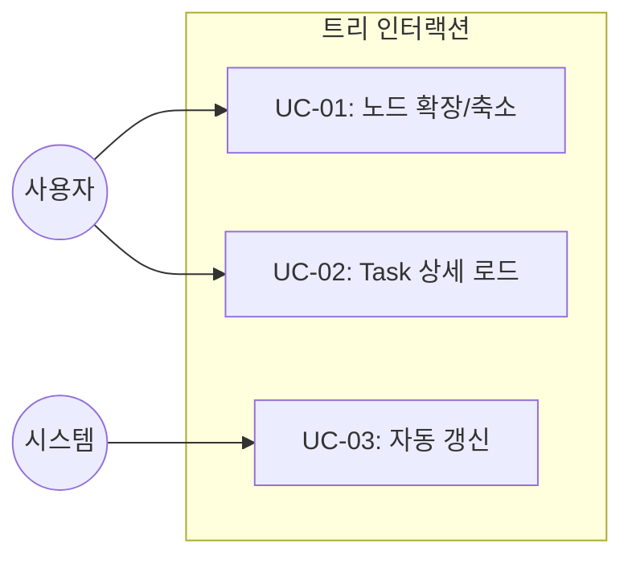
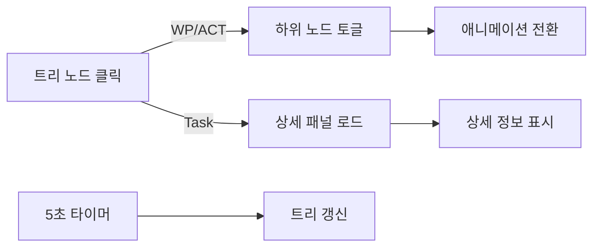

# TSK-02-03 - 트리 인터랙션 구현 설계 문서

## 문서 정보

| 항목 | 내용 |
|------|------|
| Task ID | TSK-02-03 |
| 문서 버전 | 1.0 |
| 작성일 | 2025-12-28 |
| 상태 | 작성중 |
| 카테고리 | development |

---

## 1. 개요

### 1.1 배경 및 문제 정의

**현재 상황:**
- TSK-02-02에서 WBS 트리 템플릿이 구현되어 계층 구조가 표시됨
- 정적인 HTML로만 렌더링되어 사용자 인터랙션이 불가능
- Task 클릭 시 상세 정보를 볼 수 없음

**해결하려는 문제:**
- 트리 노드 확장/축소가 불가능하여 대규모 WBS 탐색이 어려움
- Task 선택 시 상세 패널이 업데이트되지 않음
- 데이터가 정적이어서 실시간 상태 변화 반영 불가

### 1.2 목적 및 기대 효과

**목적:**
- HTMX를 활용한 동적 트리 인터랙션 구현
- Task 선택 시 상세 패널 연동
- 5초마다 자동 갱신으로 실시간 상태 반영

**기대 효과:**
- 사용자가 원하는 WP/ACT만 확장하여 효율적 탐색
- 클릭 한 번으로 Task 상세 정보 확인
- 페이지 새로고침 없이 최신 상태 확인

### 1.3 범위

**포함:**
- 노드 확장/축소 토글 기능
- Task 클릭 시 상세 패널 로드 (hx-target="#detail-panel")
- 5초마다 트리 자동 갱신
- 부드러운 애니메이션 전환 (0.3초)

**제외:**
- Task 상세 API 구현 (TSK-03-01에서 담당)
- Worker 상태 바 자동 갱신 (TSK-03-03에서 담당)
- 드래그 앤 드롭, 멀티 선택 등 고급 기능

### 1.4 참조 문서

| 문서 | 경로 | 관련 섹션 |
|------|------|----------|
| PRD | `.jjiban/projects/orchay_web/prd.md` | PRD 3.1 WBS 트리 |
| TRD | `.jjiban/projects/orchay_web/trd.md` | HTMX 패턴, 트리 UI 구현 |
| 트리 템플릿 | TSK-02-02 | 트리 HTML 구조 |

---

## 2. 사용자 분석

### 2.1 대상 사용자

| 사용자 유형 | 특성 | 주요 니즈 |
|------------|------|----------|
| 프로젝트 관리자 | 전체 WBS 조망 필요 | 빠른 트리 탐색, 진행률 확인 |
| 개발자 | 자신의 Task 집중 | 특정 Task 상세 정보 빠른 접근 |

### 2.2 사용자 페르소나

**페르소나 1: 관리자 김철수**
- 역할: 프로젝트 리드
- 목표: 전체 진행 상황 한눈에 파악
- 불만: 모든 노드가 펼쳐져 있으면 스크롤이 너무 길어짐
- 시나리오: WP별로 접었다 펴면서 진행률 확인

**페르소나 2: 개발자 이영희**
- 역할: 백엔드 개발자
- 목표: 담당 Task 상세 정보 빠르게 확인
- 불만: 페이지 이동 없이 Task 정보 보고 싶음
- 시나리오: WP-02 펼쳐서 TSK-02-03 클릭, 우측에 상세 정보 표시

---

## 3. 유즈케이스

### 3.1 유즈케이스 다이어그램



### 3.2 유즈케이스 상세

#### UC-01: 노드 확장/축소

| 항목 | 내용 |
|------|------|
| 액터 | 사용자 |
| 목적 | WP/ACT 하위 노드를 보거나 숨김 |
| 사전 조건 | 트리가 렌더링되어 있음 |
| 사후 조건 | 해당 노드의 하위 요소가 표시/숨김 |
| 트리거 | WP 또는 ACT 노드 클릭 |

**기본 흐름:**
1. 사용자가 접힌 노드(▶)를 클릭한다
2. 시스템이 HTMX로 하위 노드를 요청한다 (hx-get="/api/tree/{wp_id}")
3. 서버가 하위 노드 HTML을 반환한다
4. 시스템이 하위 영역에 HTML을 삽입한다 (hx-swap="innerHTML")
5. 아이콘이 ▼로 변경되고 애니메이션으로 펼쳐진다

**대안 흐름:**
- 2a. 이미 펼쳐진 노드(▼)를 클릭하면:
  - 하위 영역을 숨김 (CSS max-height: 0)
  - 아이콘이 ▶로 변경됨

#### UC-02: Task 상세 로드

| 항목 | 내용 |
|------|------|
| 액터 | 사용자 |
| 목적 | Task의 상세 정보를 우측 패널에 표시 |
| 사전 조건 | 트리가 렌더링되어 있고 Task 노드가 보임 |
| 사후 조건 | 우측 상세 패널에 해당 Task 정보 표시 |
| 트리거 | Task 노드 클릭 |

**기본 흐름:**
1. 사용자가 Task 노드(TSK-XX-XX)를 클릭한다
2. 시스템이 HTMX로 상세 정보를 요청한다 (hx-get="/api/detail/{task_id}")
3. 서버가 상세 HTML을 반환한다
4. 시스템이 상세 패널에 HTML을 삽입한다 (hx-target="#detail-panel")
5. 선택된 Task에 하이라이트 스타일 적용

**예외 흐름:**
- 3a. Task가 존재하지 않으면:
  - 404 응답
  - 상세 패널에 "Task를 찾을 수 없습니다" 메시지 표시

#### UC-03: 자동 갱신

| 항목 | 내용 |
|------|------|
| 액터 | 시스템 (타이머) |
| 목적 | 최신 WBS 상태 반영 |
| 사전 조건 | 페이지가 열려 있음 |
| 사후 조건 | 트리 데이터가 최신 상태로 갱신 |
| 트리거 | 5초마다 자동 (hx-trigger="every 5s") |

**기본 흐름:**
1. 5초 타이머가 만료된다
2. HTMX가 /api/tree를 요청한다
3. 서버가 최신 트리 HTML을 반환한다
4. 시스템이 트리 영역을 교체한다

---

## 4. 사용자 시나리오

### 4.1 시나리오 1: 트리 탐색 및 Task 확인

**상황 설명:**
관리자가 WP-02의 진행 상황을 확인하고 TSK-02-03의 상세 정보를 보려고 한다.

**단계별 진행:**

| 단계 | 사용자 행동 | 시스템 반응 | 사용자 기대 |
|------|-----------|------------|------------|
| 1 | WP-02 노드 클릭 | 하위 ACT/Task가 애니메이션으로 펼쳐짐 | 부드럽게 열림 |
| 2 | TSK-02-03 클릭 | 우측 패널에 상세 정보 로드 | 상세 정보 표시 |
| 3 | 5초 대기 | 트리 자동 갱신 (상태 업데이트 반영) | 최신 상태 표시 |
| 4 | WP-02 다시 클릭 | 하위 노드가 애니메이션으로 접힘 | 부드럽게 닫힘 |

**성공 조건:**
- 확장/축소 애니메이션이 0.3초 내에 완료
- 상세 패널 로드가 1초 내에 완료
- 자동 갱신 시 선택 상태 유지

### 4.2 시나리오 2: 네트워크 오류 상황

**상황 설명:**
사용자가 Task를 클릭했으나 네트워크 오류로 상세 정보를 가져오지 못함.

**단계별 진행:**

| 단계 | 사용자 행동 | 시스템 반응 | 복구 방법 |
|------|-----------|------------|----------|
| 1 | TSK-02-01 클릭 | 로딩 표시 후 에러 메시지 | 다시 클릭하여 재시도 |

---

## 5. 화면 설계

### 5.1 화면 흐름도



### 5.2 화면별 상세

#### 트리 인터랙션 영역

**화면 목적:**
WBS 계층 구조를 탐색하고 Task를 선택하는 영역

**인터랙션 와이어프레임:**
```
┌─────────────────────────────────────────────────────────────┐
│  WBS Tree (좌측 50%)           │  Task Detail (우측 50%)    │
├─────────────────────────────────┼───────────────────────────┤
│                                 │                           │
│  ▼ WP-02: WBS 트리 UI (25%)    │  TSK-02-03               │
│    │                           │  ──────────────────────── │
│    ├─ ▶ ACT-02-01 (0%)         │  Status: [ ] Todo        │
│    │                           │  Category: development    │
│    └─ ▼ ACT-02-02 (50%)        │  Priority: medium         │
│        ├─ TSK-02-01 [dd] ✓     │  Depends: TSK-02-02       │
│        ├─ TSK-02-02 [dd] ✓     │  ──────────────────────── │
│        └─ TSK-02-03 [ ] ← 선택 │  Documents:               │
│                                │  (문서 아직 없음)          │
│  ▶ WP-03: Task 상세 (0%)       │                           │
│                                │                           │
└─────────────────────────────────┴───────────────────────────┘

[인터랙션 상태]
• WP-02: 펼침 (▼), 클릭하면 접힘 (▶)
• TSK-02-03: 선택됨 (배경 하이라이트)
• 5초마다 자동 갱신
```

**화면 요소 설명:**

| 영역 | 설명 | 사용자 인터랙션 |
|------|------|----------------|
| 접힘 아이콘 (▶) | 하위 노드 숨김 | 클릭 시 펼침 |
| 펼침 아이콘 (▼) | 하위 노드 표시 | 클릭 시 접힘 |
| Task 노드 | Task ID + 상태 | 클릭 시 상세 로드 |
| 선택 표시 | 배경색 하이라이트 | 현재 선택된 Task |

### 5.3 HTMX 속성 설계

**트리 자동 갱신:**
```html
<div id="tree-container"
     hx-get="/api/tree"
     hx-trigger="every 5s"
     hx-swap="innerHTML">
  <!-- 트리 내용 -->
</div>
```

**WP/ACT 노드 토글:**
```html
<div class="tree-node wp-node"
     hx-get="/api/tree/WP-02"
     hx-trigger="click"
     hx-target="#WP-02-children"
     hx-swap="innerHTML"
     hx-indicator=".loading"
     onclick="this.querySelector('.toggle-icon').classList.toggle('expanded')">
  <span class="toggle-icon">▶</span> WP-02: WBS 트리 UI
</div>
<div id="WP-02-children" class="children">
  <!-- 하위 노드가 여기에 삽입됨 -->
</div>
```

**Task 노드 상세 로드:**
```html
<div class="tree-node task-node"
     hx-get="/api/detail/TSK-02-03"
     hx-trigger="click"
     hx-target="#detail-panel"
     hx-swap="innerHTML">
  <span class="status-badge status-todo">[ ]</span> TSK-02-03: 트리 인터랙션 구현
</div>
```

---

## 6. 인터랙션 설계

### 6.1 사용자 액션과 피드백

| 사용자 액션 | 즉각 피드백 | 결과 피드백 | 에러 피드백 |
|------------|-----------|------------|------------|
| WP 노드 클릭 | 아이콘 회전 시작 | 하위 노드 펼침 | 로드 실패 시 에러 토스트 |
| Task 노드 클릭 | 노드 하이라이트 | 상세 패널 업데이트 | "로드 실패" 메시지 |
| 마우스 호버 | 배경색 변화 | - | - |

### 6.2 상태별 화면 변화

| 상태 | 화면 표시 | 사용자 안내 |
|------|----------|------------|
| 노드 로딩 중 | 로딩 스피너 | htmx-request 클래스 적용 |
| 노드 접힘 | ▶ 아이콘, 하위 숨김 | max-height: 0 |
| 노드 펼침 | ▼ 아이콘, 하위 표시 | max-height: 2000px |
| Task 선택됨 | 배경 하이라이트 | bg-blue-500/20 |

### 6.3 애니메이션 사양

```css
/* 노드 확장/축소 애니메이션 */
.children {
  max-height: 0;
  overflow: hidden;
  transition: max-height 0.3s ease-out;
}

.children.open {
  max-height: 2000px;
}

/* 토글 아이콘 회전 */
.toggle-icon {
  display: inline-block;
  transition: transform 0.3s ease;
}

.toggle-icon.expanded {
  transform: rotate(90deg);
}

/* 호버 효과 */
.tree-node {
  transition: background-color 0.15s ease;
}

.tree-node:hover {
  background-color: rgba(59, 130, 246, 0.1);
}

/* HTMX 로딩 상태 */
.htmx-request .loading {
  display: inline-block;
}

.loading {
  display: none;
}
```

---

## 7. 데이터 요구사항

### 7.1 필요한 데이터

| 데이터 | 설명 | 출처 | 용도 |
|--------|------|------|------|
| 트리 구조 | WP/ACT/Task 계층 | /api/tree | 트리 렌더링 |
| 노드 상태 | 확장/축소 여부 | 클라이언트 상태 | 토글 UI |
| Task 상세 | Task 전체 정보 | /api/detail/{id} | 상세 패널 |

### 7.2 API 엔드포인트

| 메서드 | 경로 | 응답 | 사용 시점 |
|--------|------|------|----------|
| GET | /api/tree | HTML (전체 트리) | 초기 로드, 자동 갱신 |
| GET | /api/tree/{wp_id} | HTML (하위 노드) | WP 펼침 |
| GET | /api/detail/{task_id} | HTML (상세 패널) | Task 클릭 |

### 7.3 데이터 유효성 규칙

| 데이터 필드 | 규칙 | 위반 시 동작 |
|------------|------|-------------|
| wp_id | WP-XX 형식 | 404 반환 |
| task_id | TSK-XX-XX 형식 | 404 반환 |

---

## 8. 비즈니스 규칙

### 8.1 핵심 규칙

| 규칙 ID | 규칙 설명 | 적용 상황 | 예외 |
|---------|----------|----------|------|
| BR-01 | 자동 갱신 주기는 5초 | 트리 전체 | 없음 |
| BR-02 | 선택된 Task는 갱신 후에도 유지 | 자동 갱신 시 | 해당 Task 삭제 시 해제 |
| BR-03 | 펼침/접힘 상태는 클라이언트에서 관리 | 노드 토글 | 페이지 새로고침 시 초기화 |

### 8.2 규칙 상세 설명

**BR-01: 자동 갱신 주기**

Orchestrator의 스케줄링 간격(5초)과 동일하게 설정하여 상태 동기화

**BR-02: 선택 상태 유지**

자동 갱신 시 현재 선택된 Task ID를 localStorage 또는 data 속성으로 저장하여 갱신 후 재적용

---

## 9. 에러 처리

### 9.1 예상 에러 상황

| 상황 | 원인 | 사용자 메시지 | 복구 방법 |
|------|------|--------------|----------|
| 네트워크 오류 | 서버 연결 실패 | "연결 실패. 재시도 중..." | 자동 재시도 (10초 후) |
| 404 Not Found | Task 삭제됨 | "Task를 찾을 수 없습니다" | 트리 갱신 후 선택 해제 |
| 500 Server Error | 서버 오류 | "서버 오류가 발생했습니다" | 관리자 확인 안내 |

### 9.2 에러 표시 방식

| 에러 유형 | 표시 위치 | 표시 방법 |
|----------|----------|----------|
| 네트워크 오류 | 상단 토스트 | 빨간색 배경 + 재시도 버튼 |
| 404 오류 | 상세 패널 | "Task를 찾을 수 없습니다" 메시지 |
| 서버 오류 | 상단 토스트 | 빨간색 경고 메시지 |

---

## 10. 연관 문서

| 문서 | 경로 | 용도 |
|------|------|------|
| 요구사항 추적 매트릭스 | `025-traceability-matrix.md` | PRD → 설계 → 테스트 추적 |
| 테스트 명세서 | `026-test-specification.md` | 단위/E2E 테스트 정의 |

---

## 11. 구현 범위

### 11.1 영향받는 영역

| 영역 | 변경 내용 | 영향도 |
|------|----------|--------|
| tree.html | HTMX 속성 추가 | 높음 |
| index.html | 상세 패널 hx-target 설정 | 중간 |
| static/style.css | 애니메이션 CSS 추가 | 중간 |
| server.py | /api/tree/{wp_id} 라우트 추가 | 중간 |

### 11.2 의존성

| 의존 항목 | 이유 | 상태 |
|----------|------|------|
| TSK-02-02 트리 템플릿 | 기본 HTML 구조 필요 | 완료 ([dd]) |
| TSK-02-01 트리 데이터 API | /api/tree 엔드포인트 필요 | 완료 ([dd]) |

### 11.3 제약 사항

| 제약 | 설명 | 대응 방안 |
|------|------|----------|
| JavaScript 최소화 | HTMX만으로 구현 권장 | 간단한 토글은 인라인 onclick 사용 |
| CDN 의존성 | HTMX 2.0 CDN | 오프라인 시 기능 제한 |

---

## 12. 체크리스트

### 12.1 설계 완료 확인

- [x] 문제 정의 및 목적 명확화
- [x] 사용자 분석 완료
- [x] 유즈케이스 정의 완료
- [x] 사용자 시나리오 작성 완료
- [x] 화면 설계 완료 (HTMX 속성 포함)
- [x] 인터랙션 설계 완료 (애니메이션 사양)
- [x] 데이터 요구사항 정의 완료
- [x] 비즈니스 규칙 정의 완료
- [x] 에러 처리 정의 완료

### 12.2 연관 문서 작성

- [ ] 요구사항 추적 매트릭스 작성 (→ `025-traceability-matrix.md`)
- [ ] 테스트 명세서 작성 (→ `026-test-specification.md`)

### 12.3 구현 준비

- [x] 구현 우선순위 결정: HTMX 속성 → CSS 애니메이션 → 자동 갱신
- [x] 의존성 확인 완료: TSK-02-01, TSK-02-02 모두 [dd] 상태
- [x] 제약 사항 검토 완료

---

## 변경 이력

| 버전 | 일자 | 작성자 | 변경 내용 |
|------|------|--------|----------|
| 1.0 | 2025-12-28 | Claude | 최초 작성 |
