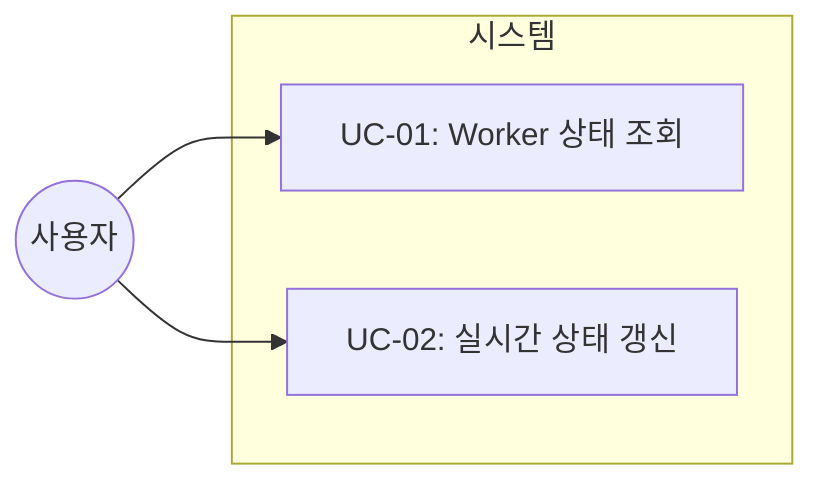
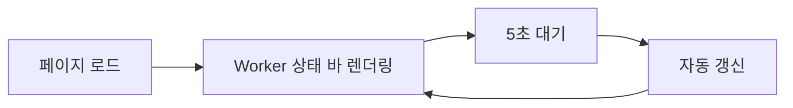
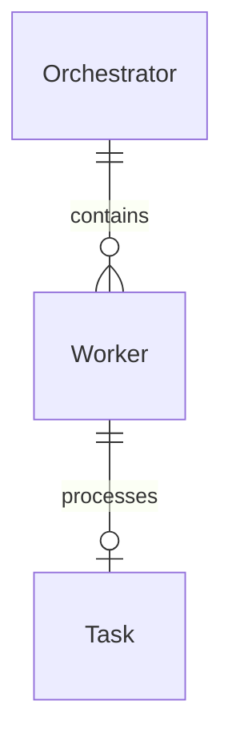

# TSK-03-02 - Worker 상태 바 구현 설계 문서

## 문서 정보

| 항목 | 내용 |
|------|------|
| Task ID | TSK-03-02 |
| 문서 버전 | 1.0 |
| 작성일 | 2025-12-28 |
| 상태 | 작성중 |
| 카테고리 | development |

---

## 1. 개요

### 1.1 배경 및 문제 정의

**현재 상황:**
- orchay 스케줄러는 터미널 TUI에서만 Worker 상태 확인 가능
- 여러 Worker가 동시에 작업할 때 상태 파악이 어려움
- 실시간 모니터링 시 터미널을 계속 확인해야 함

**해결하려는 문제:**
- 브라우저에서 Worker 상태를 직관적으로 확인 필요
- 각 Worker의 현재 상태, 작업 중인 Task 한눈에 파악
- 실시간 자동 갱신으로 모니터링 편의성 향상

### 1.2 목적 및 기대 효과

**목적:**
- 웹 UI에서 모든 Worker의 상태를 시각적으로 표시하는 상태 바 구현

**기대 효과:**
- 터미널 없이 브라우저에서 Worker 상태 확인
- 상태별 색상/아이콘으로 빠른 상태 파악
- 현재 작업 중인 Task ID 즉시 확인

### 1.3 범위

**포함:**
- Worker 상태 바 API 엔드포인트 (`/api/workers`)
- workers.html 파셜 템플릿
- 상태별 아이콘 및 색상 표시
- 현재 작업 중인 Task 표시
- HTMX를 통한 5초 자동 갱신

**제외:**
- Worker 제어 기능 (시작/중지)
- Worker 로그 상세 보기
- Worker 히스토리 기록

### 1.4 참조 문서

| 문서 | 경로 | 관련 섹션 |
|------|------|----------|
| PRD | `.orchay/projects/orchay_web/prd.md` | 3.3 Worker 상태 표시 |
| TRD | `.orchay/projects/orchay_web/trd.md` | 아키텍처, API 설계 |

---

## 2. 사용자 분석

### 2.1 대상 사용자

| 사용자 유형 | 특성 | 주요 니즈 |
|------------|------|----------|
| 개발자 | orchay 스케줄러 사용자 | 작업 진행 상황 모니터링 |
| 팀 리더 | 프로젝트 관리자 | 전체 워크플로우 상태 파악 |

### 2.2 사용자 페르소나

**페르소나 1: 개발자 김철수**
- 역할: 백엔드 개발자
- 목표: 여러 Worker가 처리 중인 Task 상태 한눈에 파악
- 불만: 터미널을 매번 확인하기 번거로움
- 시나리오: 브라우저 탭을 열어놓고 작업하면서 Worker 상태 확인

---

## 3. 유즈케이스

### 3.1 유즈케이스 다이어그램



### 3.2 유즈케이스 상세

#### UC-01: Worker 상태 조회

| 항목 | 내용 |
|------|------|
| 액터 | 개발자/관리자 |
| 목적 | 모든 Worker의 현재 상태 확인 |
| 사전 조건 | 웹서버 실행 중, Orchestrator 활성화 |
| 사후 조건 | Worker 상태 정보 화면에 표시 |
| 트리거 | 페이지 로드 또는 5초 자동 갱신 |

**기본 흐름:**
1. 사용자가 웹 페이지에 접속한다
2. 시스템이 `/api/workers` API를 호출한다
3. 서버가 Orchestrator에서 Worker 목록을 조회한다
4. 각 Worker의 상태 정보를 HTML로 렌더링한다
5. 사용자에게 상태 바가 표시된다

**대안 흐름:**
- 3a. Worker가 없는 경우:
  - 시스템이 "No workers" 메시지를 표시한다

**예외 흐름:**
- 3b. Orchestrator 연결 실패:
  - 시스템이 에러 메시지를 표시한다
  - 5초 후 자동 재시도

#### UC-02: 실시간 상태 갱신

| 항목 | 내용 |
|------|------|
| 액터 | 시스템 (HTMX) |
| 목적 | Worker 상태 실시간 업데이트 |
| 사전 조건 | 페이지 렌더링 완료 |
| 사후 조건 | 상태 바 내용 갱신 |
| 트리거 | 5초 타이머 |

**기본 흐름:**
1. HTMX가 5초마다 `/api/workers` 요청
2. 서버가 현재 Worker 상태 반환
3. HTMX가 상태 바 영역 innerHTML 교체
4. 깜빡임 없이 부드럽게 갱신

---

## 4. 사용자 시나리오

### 4.1 시나리오 1: Worker 상태 모니터링

**상황 설명:**
개발자가 여러 Task를 배치 실행하고 브라우저에서 진행 상황을 확인하고자 함

**단계별 진행:**

| 단계 | 사용자 행동 | 시스템 반응 | 사용자 기대 |
|------|-----------|------------|------------|
| 1 | 웹 페이지 접속 | Worker 상태 바 렌더링 | 모든 Worker 상태 표시 |
| 2 | 화면 관찰 | 5초마다 자동 갱신 | 최신 상태 유지 |
| 3 | busy Worker 확인 | 작업 중 Task ID 표시 | 어떤 Task 처리 중인지 파악 |

**성공 조건:**
- 모든 Worker 상태가 정확히 표시됨
- 실시간 갱신으로 상태 변화 반영

### 4.2 시나리오 2: 에러 상태 확인

**상황 설명:**
Worker 중 하나가 에러 상태에 빠졌을 때 즉시 인지

**단계별 진행:**

| 단계 | 사용자 행동 | 시스템 반응 | 복구 방법 |
|------|-----------|------------|----------|
| 1 | 상태 바 확인 | 🔴 에러 아이콘 표시 | 에러 Worker 식별 |
| 2 | 에러 Worker 확인 | 빨간 배경색 강조 | 터미널에서 상세 확인 |

---

## 5. 화면 설계

### 5.1 화면 흐름도



### 5.2 화면별 상세

#### Worker 상태 바

**화면 목적:**
헤더 영역에 모든 Worker의 현재 상태를 가로 배열로 표시

**진입 경로:**
- 메인 페이지 헤더 하단에 고정 위치

**와이어프레임:**
```
┌─────────────────────────────────────────────────────────────────┐
│  Workers:  🟢 W1       🟡 W2 (TSK-01-01)    🟡 W3 (TSK-02-01)   │
│           idle        busy                  busy                │
└─────────────────────────────────────────────────────────────────┘
```

**화면 요소 설명:**

| 영역 | 설명 | 사용자 인터랙션 |
|------|------|----------------|
| Worker 아이콘 | 상태별 색상 아이콘 | - |
| Worker ID | W1, W2, W3 형식 | - |
| 현재 Task | busy 시 Task ID 표시 | 클릭 시 상세 패널 이동 가능 |
| 상태 라벨 | idle, busy, error 등 | - |

**상태별 표시:**

| 상태 | 아이콘 | 배경색 (Tailwind) | 텍스트 |
|------|--------|------------------|--------|
| idle | 🟢 | `bg-green-500/20` | idle |
| busy | 🟡 | `bg-yellow-500/20` | busy |
| paused | ⏸️ | `bg-purple-500/20` | paused |
| error | 🔴 | `bg-red-500/20` | error |
| blocked | ⊘ | `bg-gray-500/20` | blocked |
| dead | 💀 | `bg-gray-700/20` | dead |
| done | ✅ | `bg-emerald-500/20` | done |

### 5.3 반응형 동작

| 화면 크기 | 레이아웃 변화 | 사용자 경험 |
|----------|--------------|------------|
| 데스크톱 (1024px+) | 가로 배열, 모든 Worker 표시 | 전체 상태 한눈에 |
| 태블릿 (768-1023px) | 가로 배열, 축약 표시 | Task ID 축약 |
| 모바일 (767px-) | 2열 그리드 | 스크롤 가능 |

---

## 6. 인터랙션 설계

### 6.1 사용자 액션과 피드백

| 사용자 액션 | 즉각 피드백 | 결과 피드백 | 에러 피드백 |
|------------|-----------|------------|------------|
| 페이지 로드 | 로딩 스켈레톤 | 상태 바 표시 | 에러 메시지 |
| 자동 갱신 | - (깜빡임 없음) | 상태 업데이트 | 재시도 |
| Worker 클릭 | 호버 효과 | 상세 패널 표시 | - |

### 6.2 상태별 화면 변화

| 상태 | 화면 표시 | 사용자 안내 |
|------|----------|------------|
| 초기 로딩 | 스켈레톤 애니메이션 | - |
| Worker 없음 | "No workers available" | 스케줄러 실행 안내 |
| 갱신 오류 | 마지막 상태 유지 | 재시도 중... |

### 6.3 HTMX 자동 갱신

```html
<div id="workers-bar"
     hx-get="/api/workers"
     hx-trigger="every 5s"
     hx-swap="innerHTML">
  <!-- Worker 상태 표시 -->
</div>
```

---

## 7. 데이터 요구사항

### 7.1 필요한 데이터

| 데이터 | 설명 | 출처 | 용도 |
|--------|------|------|------|
| Worker.id | Worker 번호 | Orchestrator.workers | 식별 표시 |
| Worker.state | 현재 상태 | Orchestrator.workers | 아이콘/색상 결정 |
| Worker.current_task | 작업 중 Task ID | Orchestrator.workers | Task ID 표시 |
| Worker.pane_id | WezTerm 패널 ID | Orchestrator.workers | 디버깅 정보 |

### 7.2 데이터 관계



**관계 설명:**
- Orchestrator는 여러 개의 Worker를 관리
- 각 Worker는 최대 1개의 Task를 처리 중

### 7.3 데이터 유효성 규칙

| 데이터 필드 | 규칙 | 위반 시 처리 |
|------------|------|--------------|
| Worker.id | 1 이상 정수 | 기본값 1 |
| Worker.state | WorkerState enum 값 | IDLE 기본값 |
| Worker.current_task | Task ID 형식 또는 None | None 표시 |

---

## 8. 비즈니스 규칙

### 8.1 핵심 규칙

| 규칙 ID | 규칙 설명 | 적용 상황 | 예외 |
|---------|----------|----------|------|
| BR-01 | busy 상태 Worker는 current_task 표시 필수 | busy 상태일 때 | - |
| BR-02 | error 상태는 빨간색 강조 | error 상태일 때 | - |
| BR-03 | 5초마다 자동 갱신 | 페이지 활성 시 | 탭 비활성화 시 중단 |

### 8.2 규칙 상세 설명

**BR-01: busy Worker Task 표시**

설명: Worker가 busy 상태일 때는 반드시 어떤 Task를 처리 중인지 표시

예시:
- busy 상태 + current_task 있음: "🟡 W2 (TSK-01-01)"
- busy 상태 + current_task 없음: "🟡 W2 (unknown)" (비정상)

**BR-02: error 상태 강조**

설명: 에러 상태 Worker는 즉시 주의를 끌 수 있도록 빨간색 배경 적용

---

## 9. 에러 처리

### 9.1 예상 에러 상황

| 상황 | 원인 | 사용자 메시지 | 복구 방법 |
|------|------|--------------|----------|
| API 호출 실패 | 네트워크 오류 | 마지막 상태 유지 | 5초 후 재시도 |
| Orchestrator 미실행 | 서버 오류 | "Orchestrator not running" | 스케줄러 실행 안내 |
| Worker 없음 | 초기 상태 | "No workers available" | 정상 상태 안내 |

### 9.2 에러 표시 방식

| 에러 유형 | 표시 위치 | 표시 방법 |
|----------|----------|----------|
| API 오류 | 상태 바 영역 | 경고 배경색 + 재시도 메시지 |
| Worker 없음 | 상태 바 영역 | 회색 안내 텍스트 |

---

## 10. 연관 문서

> 상세 테스트 명세 및 요구사항 추적은 별도 문서에서 관리합니다.

| 문서 | 경로 | 용도 |
|------|------|------|
| 요구사항 추적 매트릭스 | `025-traceability-matrix.md` | PRD → 설계 → 테스트 양방향 추적 |
| 테스트 명세서 | `026-test-specification.md` | 단위/E2E/매뉴얼 테스트 상세 정의 |

---

## 11. 구현 범위

### 11.1 영향받는 영역

| 영역 | 변경 내용 | 영향도 |
|------|----------|--------|
| orchay/web/server.py | `/api/workers` 라우트 추가 | 높음 |
| orchay/web/templates/partials/workers.html | Worker 상태 바 템플릿 | 높음 |
| orchay/web/templates/index.html | 상태 바 영역 추가 | 중간 |

### 11.2 파일 구조

```
orchay/src/orchay/web/
├── server.py                    # FastAPI 앱 (라우트 추가)
└── templates/
    ├── index.html              # 메인 페이지 (상태 바 영역)
    └── partials/
        └── workers.html        # Worker 상태 바 파셜 (신규)
```

### 11.3 API 엔드포인트

```python
@app.get("/api/workers")
async def get_workers() -> HTMLResponse:
    """Worker 상태 바 HTML 파셜 반환."""
    workers = orchestrator.workers
    return templates.TemplateResponse(
        "partials/workers.html",
        {"request": request, "workers": workers}
    )
```

### 11.4 템플릿 구조

**workers.html:**
```html

<div class="flex items-center gap-2 px-3 py-2 rounded-lg {{ worker.state | status_bg }}">
  <span class="text-xl">{{ worker.state | status_icon }}</span>
  <div class="flex flex-col">
    <span class="font-medium">W{{ worker.id }}</span>
    
    <span class="text-xs text-gray-400">({{ worker.current_task }})</span>
    
  </div>
  <span class="text-xs text-gray-500">{{ worker.state.value }}</span>
</div>

<div class="text-gray-500">No workers available</div>

```

### 11.5 Jinja2 필터

```python
def status_icon(state: WorkerState) -> str:
    icons = {
        WorkerState.IDLE: "🟢",
        WorkerState.BUSY: "🟡",
        WorkerState.PAUSED: "⏸️",
        WorkerState.ERROR: "🔴",
        WorkerState.BLOCKED: "⊘",
        WorkerState.DEAD: "💀",
        WorkerState.DONE: "✅",
    }
    return icons.get(state, "❓")

def status_bg(state: WorkerState) -> str:
    colors = {
        WorkerState.IDLE: "bg-green-500/20",
        WorkerState.BUSY: "bg-yellow-500/20",
        WorkerState.PAUSED: "bg-purple-500/20",
        WorkerState.ERROR: "bg-red-500/20",
        WorkerState.BLOCKED: "bg-gray-500/20",
        WorkerState.DEAD: "bg-gray-700/20",
        WorkerState.DONE: "bg-emerald-500/20",
    }
    return colors.get(state, "bg-gray-500/20")
```

### 11.6 의존성

| 의존 항목 | 이유 | 상태 |
|----------|------|------|
| TSK-01-02 | Jinja2 템플릿 기본 구조 (base.html) | [dd] 상세설계 |
| Orchestrator | Worker 목록 데이터 소스 | 완료 |
| WorkerState enum | 상태 정의 | 완료 |

### 11.7 제약 사항

| 제약 | 설명 | 대응 방안 |
|------|------|----------|
| 빌드 도구 없음 | npm 사용 불가 | Tailwind CDN 사용 |
| 동기 블로킹 금지 | FastAPI async 필수 | async 함수로 구현 |
| JS 프레임워크 금지 | React/Vue 사용 불가 | HTMX + Jinja2 활용 |

---

## 12. 체크리스트

### 12.1 설계 완료 확인

- [x] 문제 정의 및 목적 명확화
- [x] 사용자 분석 완료
- [x] 유즈케이스 정의 완료
- [x] 사용자 시나리오 작성 완료
- [x] 화면 설계 완료 (와이어프레임)
- [x] 인터랙션 설계 완료
- [x] 데이터 요구사항 정의 완료
- [x] 비즈니스 규칙 정의 완료
- [x] 에러 처리 정의 완료

### 12.2 연관 문서 작성

- [ ] 요구사항 추적 매트릭스 작성 (→ `025-traceability-matrix.md`)
- [ ] 테스트 명세서 작성 (→ `026-test-specification.md`)

### 12.3 구현 준비

- [x] 구현 우선순위 결정
- [x] 의존성 확인 완료
- [x] 제약 사항 검토 완료

---

## 변경 이력

| 버전 | 일자 | 작성자 | 변경 내용 |
|------|------|--------|----------|
| 1.0 | 2025-12-28 | Claude | 최초 작성 |
