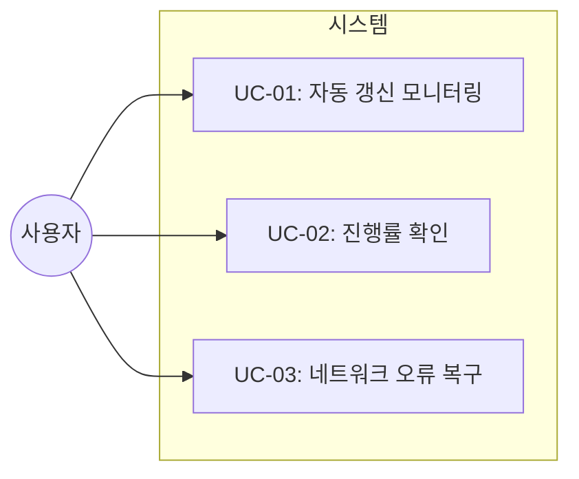
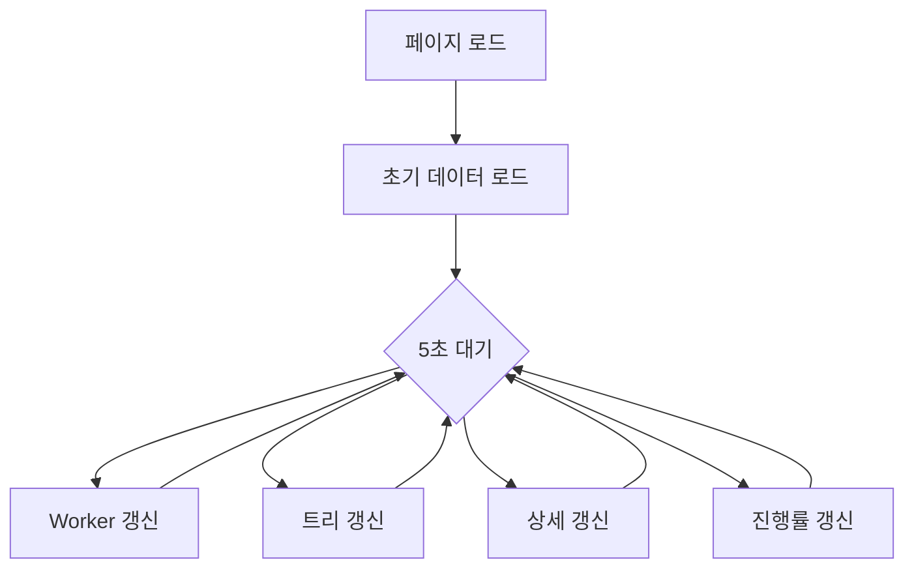

# TSK-03-03 - 실시간 자동 갱신 설계 문서

## 문서 정보

| 항목 | 내용 |
|------|------|
| Task ID | TSK-03-03 |
| 문서 버전 | 1.0 |
| 작성일 | 2025-12-28 |
| 상태 | 작성중 |
| 카테고리 | development |

---

## 1. 개요

### 1.1 배경 및 문제 정의

**현재 상황:**
- index.html에서 Worker 상태 바와 WBS 트리는 5초마다 갱신됨 (`hx-trigger="load, every 5s"`)
- 선택된 Task 상세 정보는 클릭 시에만 로드되고 자동 갱신되지 않음
- 전체 진행률 표시가 없음
- 갱신 시 전체 영역이 교체되어 깜빡임 발생 가능
- 네트워크 오류 시 별도 처리 없음

**해결하려는 문제:**
- Task 상세 정보가 실시간으로 반영되지 않아 수동 새로고침 필요
- 전체 진행률을 한눈에 파악하기 어려움
- 갱신 시 UX 저하 (깜빡임)
- 네트워크 문제 시 사용자에게 피드백 없음

### 1.2 목적 및 기대 효과

**목적:**
- 모든 동적 영역의 5초 주기 자동 갱신 구현
- 사용자 경험 개선 (깜빡임 최소화, 오류 처리)

**기대 효과:**
- 실시간 모니터링 경험 향상
- 수동 새로고침 불필요
- 안정적인 네트워크 오류 대응

### 1.3 범위

**포함:**
- 선택된 Task 상세 5초 자동 갱신
- 전체 진행률 표시 및 갱신
- HTMX 깜빡임 최소화 설정
- 네트워크 오류 graceful 처리

**제외:**
- WebSocket/SSE 실시간 푸시 (향후 과제)
- 갱신 주기 사용자 설정 (향후 과제)

### 1.4 참조 문서

| 문서 | 경로 | 관련 섹션 |
|------|------|----------|
| PRD | `.jjiban/projects/orchay_web/prd.md` | 2.3 실시간 갱신 |
| TRD | `.jjiban/projects/orchay_web/trd.md` | HTMX 패턴, API 설계 |

---

## 2. 사용자 분석

### 2.1 대상 사용자

| 사용자 유형 | 특성 | 주요 니즈 |
|------------|------|----------|
| 개발자 | orchay 스케줄러 운영자 | 실시간 Task 진행 상황 모니터링 |
| PM/관리자 | 프로젝트 상황 확인 | 전체 진행률 한눈에 파악 |

### 2.2 사용자 페르소나

**페르소나 1: 개발자 김개발**
- 역할: 스케줄러 운영 및 모니터링
- 목표: 여러 Worker의 작업 상태를 실시간으로 확인
- 불만: Task 상세 정보가 자동 갱신되지 않아 수동 클릭 필요
- 시나리오: 웹 모니터링 화면을 띄워놓고 작업하며 가끔씩 확인

---

## 3. 유즈케이스

### 3.1 유즈케이스 다이어그램



### 3.2 유즈케이스 상세

#### UC-01: 자동 갱신 모니터링

| 항목 | 내용 |
|------|------|
| 액터 | 개발자/관리자 |
| 목적 | 실시간으로 Task 상태 변화를 모니터링 |
| 사전 조건 | 웹 모니터 페이지 접속 완료 |
| 사후 조건 | 5초마다 최신 데이터 반영 |
| 트리거 | 페이지 로드 |

**기본 흐름:**
1. 사용자가 페이지에 접속한다
2. Worker 상태 바가 5초마다 자동 갱신된다
3. WBS 트리가 5초마다 자동 갱신된다
4. 선택된 Task 상세가 5초마다 자동 갱신된다
5. 전체 진행률이 5초마다 자동 갱신된다

**대안 흐름:**
- 2a. Task를 선택하지 않은 경우:
  - Task 상세 영역은 빈 상태 유지
  - 갱신 불필요

#### UC-02: 진행률 확인

| 항목 | 내용 |
|------|------|
| 액터 | 개발자/관리자 |
| 목적 | 전체 프로젝트 진행률을 한눈에 확인 |
| 사전 조건 | 페이지 접속 |
| 사후 조건 | 진행률 바 표시 |
| 트리거 | 페이지 로드 |

**기본 흐름:**
1. 페이지 로드 시 Worker Bar에 전체 진행률 표시
2. 완료된 Task 수 / 전체 Task 수 형태로 표시
3. 프로그레스 바로 시각화

#### UC-03: 네트워크 오류 복구

| 항목 | 내용 |
|------|------|
| 액터 | 시스템 |
| 목적 | 네트워크 문제 시 사용자에게 피드백 제공 |
| 사전 조건 | 자동 갱신 중 네트워크 오류 발생 |
| 사후 조건 | 오류 메시지 표시 후 자동 재시도 |
| 트리거 | HTTP 요청 실패 |

**기본 흐름:**
1. HTMX 요청이 실패한다
2. 해당 영역에 "연결 오류" 메시지 표시
3. 다음 갱신 주기에 자동 재시도
4. 성공 시 정상 콘텐츠로 복구

---

## 4. 사용자 시나리오

### 4.1 시나리오 1: 실시간 모니터링

**상황 설명:**
개발자가 orchay 웹 모니터를 띄워놓고 Worker들의 작업 진행 상황을 모니터링한다.

**단계별 진행:**

| 단계 | 사용자 행동 | 시스템 반응 | 사용자 기대 |
|------|-----------|------------|------------|
| 1 | 페이지 접속 | 전체 레이아웃 로드 | 빠른 초기 로딩 |
| 2 | Task 클릭 | 상세 패널 표시 | 즉시 정보 확인 |
| 3 | 대기 | 5초마다 자동 갱신 | 깜빡임 없는 갱신 |
| 4 | Worker 상태 변경 감지 | 색상 변경 표시 | 실시간 반영 |

**성공 조건:**
- 모든 영역이 5초 내 최신 상태 반영
- 깜빡임 없이 부드러운 갱신

### 4.2 시나리오 2: 네트워크 오류 상황

**상황 설명:**
일시적 네트워크 문제로 갱신 요청이 실패한다.

**단계별 진행:**

| 단계 | 사용자 행동 | 시스템 반응 | 복구 방법 |
|------|-----------|------------|----------|
| 1 | 모니터링 중 | 갱신 요청 실패 | 오류 표시 |
| 2 | 대기 | 5초 후 자동 재시도 | 자동 복구 |
| 3 | 대기 | 성공 시 정상 콘텐츠 복구 | 자동 |

---

## 5. 화면 설계

### 5.1 화면 흐름도



### 5.2 화면별 상세

#### 화면 1: 메인 페이지 (index.html) 변경사항

**변경 목적:**
- Worker Bar에 전체 진행률 추가
- Task 상세 영역에 자동 갱신 추가
- 깜빡임 방지 및 오류 처리 HTMX 설정

**변경된 와이어프레임:**
```
┌─────────────────────────────────────────────────────────────┐
│  orchay - Project Monitor                    [MODE: quick]  │
├─────────────────────────────────────────────────────────────┤
│  Workers: 🟢W1 🟡W2 🟡W3     Progress: ████░░░░░░ 4/10 (40%) │  ← 진행률 추가
├───────────────────────────────┬─────────────────────────────┤
│  WBS Tree                     │  Task Detail                │
│  ▼ WP-08 (25%)               │  TSK-08-01                  │
│    • TSK-08-01 [bd] ←선택    │  ─────────────────────────  │
│    • TSK-08-02 [dd]          │  Status: [bd] 기본설계      │
│    • TSK-08-03 [dd]          │  ...                        │
│                              │                             │
│                              │  [자동 갱신: 5초]          │  ← 자동 갱신
└───────────────────────────────┴─────────────────────────────┘
```

**화면 요소 변경:**

| 영역 | 변경 내용 | HTMX 속성 |
|------|----------|----------|
| Worker Bar | 진행률 표시 추가 | 기존 유지 |
| Task Detail | 자동 갱신 추가 | `hx-trigger="every 5s"` (조건부) |

---

## 6. 인터랙션 설계

### 6.1 사용자 액션과 피드백

| 사용자 액션 | 즉각 피드백 | 결과 피드백 | 에러 피드백 |
|------------|-----------|------------|------------|
| 페이지 로드 | 로딩 표시 | 전체 렌더링 | 오류 메시지 |
| Task 클릭 | 하이라이트 | 상세 로드 | 404 메시지 |
| 자동 갱신 | 없음 (silent) | 콘텐츠 갱신 | 연결 오류 표시 |

### 6.2 상태별 화면 변화

| 상태 | 화면 표시 | 사용자 안내 |
|------|----------|------------|
| 초기 로딩 | "불러오는 중..." | 회색 텍스트 |
| 정상 | 데이터 표시 | - |
| 갱신 중 | 변경 없음 (swap) | - |
| 오류 | "연결 오류" | 재시도 안내 |
| Task 미선택 | "Task를 선택하세요" | 안내 메시지 |

### 6.3 깜빡임 방지 전략

| 전략 | 구현 방법 |
|------|----------|
| innerHTML swap | `hx-swap="innerHTML"` (전체 교체 대신 내부만) |
| settle 시간 | `hx-swap="innerHTML settle:100ms"` |
| 조건부 갱신 | 선택된 Task 없으면 갱신 스킵 |
| CSS transition | 없음 (내용 변경만) |

---

## 7. 데이터 요구사항

### 7.1 필요한 데이터

| 데이터 | 설명 | 출처 | 용도 |
|--------|------|------|------|
| 전체 Task 수 | 프로젝트 총 Task | Orchestrator.tasks | 진행률 계산 |
| 완료 Task 수 | status == [xx] | Orchestrator.tasks | 진행률 계산 |
| 선택된 Task ID | 현재 상세 표시 중 | 클라이언트 상태 | 조건부 갱신 |

### 7.2 API 변경

#### GET /api/workers (수정)

**응답 추가 데이터:**
```python
{
    "workers": [...],
    "progress": {
        "total": 10,
        "done": 4,
        "percentage": 40
    }
}
```

#### GET /api/progress (신규)

**용도:** 전체 진행률 HTML 조각

**응답:**
```html
<span>Progress: ████░░░░░░ 4/10 (40%)</span>
```

---

## 8. 비즈니스 규칙

### 8.1 핵심 규칙

| 규칙 ID | 규칙 설명 | 적용 상황 | 예외 |
|---------|----------|----------|------|
| BR-01 | 갱신 주기 5초 | 모든 자동 갱신 | 없음 |
| BR-02 | Task 선택 시에만 상세 갱신 | Task Detail 영역 | 선택 해제 시 스킵 |
| BR-03 | 오류 시 다음 주기 재시도 | 네트워크 오류 | 없음 |

### 8.2 규칙 상세 설명

**BR-01: 갱신 주기 5초**

설명: PRD 2.3에서 정의된 갱신 주기. Orchestrator의 스케줄링 주기(5초)와 동일하게 맞춤.

**BR-02: Task 선택 시에만 상세 갱신**

설명: 선택된 Task가 없는 경우 불필요한 API 요청 방지. JavaScript로 선택 상태 관리.

구현:
```html
<div id="task-detail"
     hx-get="/api/detail/{selected_task_id}"
     hx-trigger="every 5s [selectedTaskId]">
```

또는:
```html
<!-- 상세 영역에 조건부 polling -->
<div id="task-detail" data-task-id="">
    <!-- JS로 task-id 있을 때만 hx-get 활성화 -->
</div>
```

---

## 9. 에러 처리

### 9.1 예상 에러 상황

| 상황 | 원인 | 사용자 메시지 | 복구 방법 |
|------|------|--------------|----------|
| 갱신 실패 | 네트워크 오류 | "연결 오류. 자동 재시도 중..." | 다음 주기 재시도 |
| 서버 오류 | 500 에러 | "서버 오류" | 재시도 |
| Task 없음 | 404 | "Task를 찾을 수 없습니다" | 다른 Task 선택 |

### 9.2 에러 표시 방식

| 에러 유형 | 표시 위치 | 표시 방법 |
|----------|----------|----------|
| 갱신 오류 | 해당 영역 내부 | 회색 텍스트 + 재시도 안내 |
| 404 | Task Detail | 경고 박스 |

### 9.3 HTMX 에러 처리 설정

```html
<script>
document.body.addEventListener('htmx:responseError', function(evt) {
    evt.detail.target.innerHTML =
        '<div class="text-red-400 text-sm">연결 오류. 자동 재시도 중...</div>';
});
</script>
```

---

## 10. 연관 문서

| 문서 | 경로 | 용도 |
|------|------|------|
| 요구사항 추적 매트릭스 | `025-traceability-matrix.md` | PRD → 설계 → 테스트 추적 |
| 테스트 명세서 | `026-test-specification.md` | 자동 갱신 테스트 케이스 |

---

## 11. 구현 범위

### 11.1 영향받는 영역

| 영역 | 변경 내용 | 영향도 |
|------|----------|--------|
| `index.html` | Task Detail 자동 갱신, 진행률 영역, HTMX 설정 추가 | 중간 |
| `server.py` | `/api/progress` 엔드포인트 추가, `/api/workers` 수정 | 중간 |
| `partials/workers.html` | 진행률 표시 추가 | 낮음 |
| `partials/progress.html` | 신규 파셜 템플릿 | 낮음 |

### 11.2 의존성

| 의존 항목 | 이유 | 상태 |
|----------|------|------|
| TSK-03-01 (Task 상세 API) | 상세 갱신 API 사용 | 완료 |
| TSK-03-02 (Worker 상태 바) | 진행률 표시 추가 위치 | 완료 |

### 11.3 제약 사항

| 제약 | 설명 | 대응 방안 |
|------|------|----------|
| HTMX 조건부 트리거 | 선택 상태 관리 복잡 | JavaScript 보조 사용 |
| 깜빡임 완전 제거 불가 | DOM 교체 시 불가피 | settle 시간으로 완화 |

---

## 12. 상세 구현 명세

### 12.1 index.html 변경

**추가할 HTMX 설정 (head):**
```html
<script>
    // 선택된 Task ID 전역 관리
    let selectedTaskId = null;

    // Task 선택 시 호출
    function selectTask(taskId) {
        selectedTaskId = taskId;
        const detailDiv = document.getElementById('task-detail');
        detailDiv.setAttribute('hx-get', '/api/detail/' + taskId);
        htmx.process(detailDiv);
    }

    // 에러 핸들링
    document.body.addEventListener('htmx:responseError', function(evt) {
        if (evt.detail.xhr.status === 0) {
            evt.detail.target.innerHTML =
                '<div class="text-red-400 text-sm p-2">연결 오류. 자동 재시도 중...</div>';
        }
    });
</script>
```

**Worker Bar 영역 수정:**
```html
<div id="workers-bar"
     class="bg-orchay-card border-b border-orchay-border px-4 py-2 flex items-center justify-between"
     hx-get="/api/workers"
     hx-trigger="load, every 5s"
     hx-swap="innerHTML settle:100ms">
    <div class="text-orchay-muted text-sm">불러오는 중...</div>
</div>
```

**Task Detail 영역 수정:**
```html
<div id="task-detail"
     hx-trigger="every 5s"
     hx-swap="innerHTML settle:100ms">
    <div class="text-orchay-muted text-sm">Task를 선택하세요</div>
</div>
```

### 12.2 server.py 변경

**진행률 계산 함수 추가:**
```python
def _calculate_progress(tasks: list[Task]) -> dict[str, int]:
    """전체 진행률 계산."""
    total = len(tasks)
    done = sum(1 for t in tasks if t.status.value == "[xx]")
    percentage = int((done / total) * 100) if total > 0 else 0
    return {"total": total, "done": done, "percentage": percentage}
```

**/api/workers 응답에 진행률 포함:**
```python
@app.get("/api/workers", response_class=HTMLResponse)
async def _get_workers(request: Request) -> HTMLResponse:
    workers = orchestrator.workers
    progress = _calculate_progress(orchestrator.tasks)
    return templates.TemplateResponse(
        request,
        "partials/workers.html",
        {"workers": workers, "progress": progress},
    )
```

### 12.3 partials/workers.html 변경

**진행률 표시 추가:**
```html
<div class="flex items-center justify-between w-full">
    <div class="flex items-center gap-4">
        <span class="text-orchay-muted text-sm">Workers:</span>
        <!-- 기존 Worker 상태 표시 -->
        ...
    </div>

    <!-- 진행률 표시 -->
    <div class="flex items-center gap-2">
        <span class="text-orchay-muted text-sm">Progress:</span>
        <div class="w-32 h-2 bg-orchay-bg rounded-full overflow-hidden">
            <div class="h-full bg-green-500 transition-all duration-300"
                 style="width: {{ progress.percentage }}%"></div>
        </div>
        <span class="text-sm">{{ progress.done }}/{{ progress.total }} ({{ progress.percentage }}%)</span>
    </div>
</div>
```

### 12.4 tree.html Task 클릭 수정

**onclick 추가로 선택 상태 관리:**
```html
<div class="ml-4 flex items-center gap-2 py-1 cursor-pointer hover:bg-orchay-card rounded px-2"
     hx-get="/api/detail/{{ task.id }}"
     hx-target="#task-detail"
     hx-swap="innerHTML settle:100ms"
     onclick="selectTask('{{ task.id }}')">
```

---

## 13. 체크리스트

### 13.1 설계 완료 확인

- [x] 문제 정의 및 목적 명확화
- [x] 사용자 분석 완료
- [x] 유즈케이스 정의 완료
- [x] 사용자 시나리오 작성 완료
- [x] 화면 설계 완료 (변경사항)
- [x] 인터랙션 설계 완료
- [x] 데이터 요구사항 정의 완료
- [x] 비즈니스 규칙 정의 완료
- [x] 에러 처리 정의 완료
- [x] 상세 구현 명세 작성

### 13.2 연관 문서 작성

- [ ] 요구사항 추적 매트릭스 작성 (→ `025-traceability-matrix.md`)
- [ ] 테스트 명세서 작성 (→ `026-test-specification.md`)

### 13.3 구현 준비

- [x] 구현 우선순위 결정 (1. server.py → 2. workers.html → 3. index.html → 4. tree.html)
- [x] 의존성 확인 완료 (TSK-03-01, TSK-03-02 완료)
- [x] 제약 사항 검토 완료

---

## 변경 이력

| 버전 | 일자 | 작성자 | 변경 내용 |
|------|------|--------|----------|
| 1.0 | 2025-12-28 | Claude | 최초 작성 |
