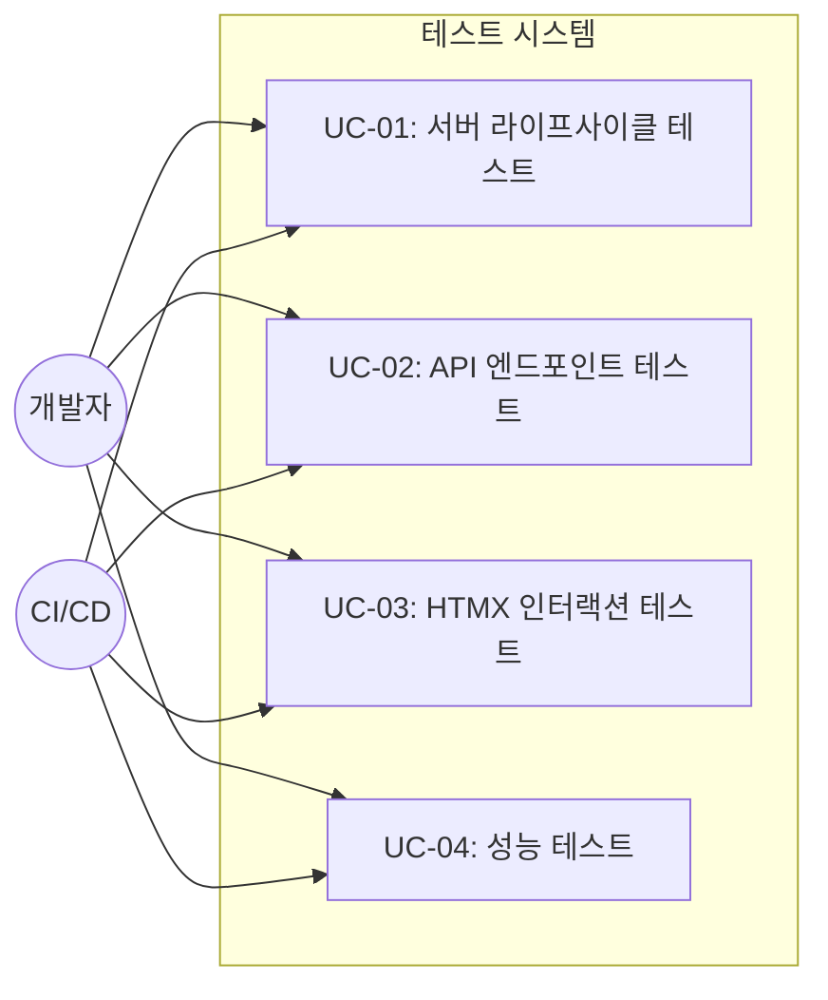

# TSK-04-02 - 통합 테스트 설계 문서

## 문서 정보

| 항목 | 내용 |
|------|------|
| Task ID | TSK-04-02 |
| 문서 버전 | 1.0 |
| 작성일 | 2025-12-28 |
| 상태 | 작성중 |
| 카테고리 | development |
| 도메인 | test |

---

## 1. 개요

### 1.1 배경 및 문제 정의

**현재 상황:**
- orchay_web 웹 모니터링 UI가 구현됨 (TSK-01 ~ TSK-03)
- FastAPI 서버, HTMX 트리 UI, Worker 상태 표시 기능이 완료됨
- 그러나 통합적인 테스트가 없어 신뢰성 검증이 불가능함

**해결하려는 문제:**
- 웹서버 시작/종료 동작 검증 필요
- API 엔드포인트 응답 정확성 검증 필요
- HTMX 인터랙션(트리 확장/축소, Task 선택) 동작 검증 필요
- 성능 요구사항(페이지 로드 < 1초) 준수 확인 필요

### 1.2 목적 및 기대 효과

**목적:**
- orchay_web 모든 기능의 통합 테스트 구현
- 자동화된 품질 검증 체계 구축

**기대 효과:**
- 회귀 테스트를 통한 안정성 확보
- CI/CD 파이프라인 통합 가능
- 성능 기준 충족 여부 객관적 검증

### 1.3 범위

**포함:**
- 웹서버 라이프사이클 테스트 (시작/종료)
- API 엔드포인트 응답 테스트
- HTMX 인터랙션 테스트
- 성능 테스트 (페이지 로드 시간)

**제외:**
- 부하 테스트 (대규모 동시 사용자)
- 브라우저 호환성 테스트 (Chrome, Firefox, Safari 각각)
- 보안 취약점 테스트

### 1.4 참조 문서

| 문서 | 경로 | 관련 섹션 |
|------|------|----------|
| PRD | `.jjiban/projects/orchay_web/prd.md` | 4. 비기능 요구사항 |
| TRD | `.jjiban/projects/orchay_web/trd.md` | API 설계, 아키텍처 |
| WBS | `.jjiban/projects/orchay_web/wbs.md` | TSK-04-02 |

---

## 2. 사용자 분석

### 2.1 대상 사용자

| 사용자 유형 | 특성 | 주요 니즈 |
|------------|------|----------|
| 개발자 | orchay 개발/유지보수 담당 | 코드 변경 시 빠른 회귀 검증 |
| QA 엔지니어 | 품질 검증 담당 | 자동화된 테스트 리포트 |
| CI/CD 시스템 | 자동화 파이프라인 | 테스트 통과/실패 판정 |

### 2.2 사용자 페르소나

**페르소나 1: 개발자**
- 역할: orchay 기능 개발자
- 목표: 코드 변경 후 기존 기능 정상 동작 확인
- 불만: 수동 테스트는 시간이 오래 걸리고 누락될 수 있음
- 시나리오: PR 제출 전 `pytest` 실행으로 통합 테스트 검증

---

## 3. 유즈케이스

### 3.1 유즈케이스 다이어그램



### 3.2 유즈케이스 상세

#### UC-01: 서버 라이프사이클 테스트

| 항목 | 내용 |
|------|------|
| 액터 | 개발자, CI/CD |
| 목적 | FastAPI 서버 시작/종료 정상 동작 검증 |
| 사전 조건 | 테스트 환경 준비 (pytest, httpx) |
| 사후 조건 | 서버 정상 종료, 리소스 정리 |
| 트리거 | `pytest tests/test_web/` 실행 |

**기본 흐름:**
1. 테스트 픽스처가 FastAPI 앱 인스턴스 생성
2. TestClient로 서버 시작
3. 루트 경로(`/`) 접근 가능 확인
4. 서버 종료
5. 리소스 정리 확인

**예외 흐름:**
- 1a. 포트 충돌 시: 다른 포트로 재시도

#### UC-02: API 엔드포인트 테스트

| 항목 | 내용 |
|------|------|
| 액터 | 개발자, CI/CD |
| 목적 | 모든 API 엔드포인트 응답 정확성 검증 |
| 사전 조건 | Mock Orchestrator 데이터 준비 |
| 사후 조건 | 모든 엔드포인트 200 OK 응답 |
| 트리거 | pytest 실행 |

**기본 흐름:**
1. GET `/` - 메인 페이지 HTML 반환
2. GET `/api/tree` - WBS 트리 HTML 조각 반환
3. GET `/api/tree/{wp_id}` - WP 하위 노드 반환
4. GET `/api/detail/{task_id}` - Task 상세 반환
5. GET `/api/workers` - Worker 상태 바 반환
6. GET `/api/progress` - 전체 진행률 반환

**예외 흐름:**
- 3a. 존재하지 않는 wp_id: 404 응답 또는 빈 결과

#### UC-03: HTMX 인터랙션 테스트

| 항목 | 내용 |
|------|------|
| 액터 | 개발자, CI/CD |
| 목적 | HTMX 동적 UI 동작 검증 |
| 사전 조건 | 테스트 데이터(WBS, Task) 준비 |
| 사후 조건 | HTMX 속성 및 응답 형식 정확 |
| 트리거 | pytest 실행 |

**기본 흐름:**
1. 메인 페이지에 HTMX 속성 포함 확인
2. `/api/tree` 응답에 `hx-get`, `hx-trigger` 속성 포함 확인
3. `/api/detail/{id}` 응답에 Task 정보 포함 확인
4. `/api/workers` 응답에 Worker 상태 아이콘 포함 확인

#### UC-04: 성능 테스트

| 항목 | 내용 |
|------|------|
| 액터 | 개발자, CI/CD |
| 목적 | 페이지 로드 < 1초 성능 요구사항 검증 |
| 사전 조건 | 표준 테스트 데이터 (WP 5개, Task 20개) |
| 사후 조건 | 모든 엔드포인트 응답 시간 < 1초 |
| 트리거 | pytest 실행 |

**기본 흐름:**
1. 응답 시간 측정 시작
2. 엔드포인트 호출
3. 응답 시간 측정 종료
4. 1초 미만 여부 검증

---

## 4. 사용자 시나리오

### 4.1 시나리오 1: 개발자 회귀 테스트

**상황 설명:**
개발자가 트리 UI 코드를 수정한 후 기존 기능이 정상 동작하는지 확인

**단계별 진행:**

| 단계 | 사용자 행동 | 시스템 반응 | 사용자 기대 |
|------|-----------|------------|------------|
| 1 | `cd orchay && pytest tests/test_web/` 실행 | 테스트 실행 시작 | 테스트 진행 상황 표시 |
| 2 | 테스트 결과 대기 | 각 테스트 케이스 PASS/FAIL 출력 | 모든 테스트 통과 |
| 3 | 최종 결과 확인 | 테스트 요약 출력 | 100% 통과 |

**성공 조건:**
- 모든 테스트 케이스 PASS
- 성능 테스트 1초 미만

### 4.2 시나리오 2: CI/CD 자동 테스트

**상황 설명:**
PR 생성 시 GitHub Actions에서 자동으로 통합 테스트 실행

**단계별 진행:**

| 단계 | 사용자 행동 | 시스템 반응 | 복구 방법 |
|------|-----------|------------|----------|
| 1 | PR 생성 | CI 트리거 | - |
| 2 | - | pytest 자동 실행 | - |
| 3 | 결과 확인 | PASS/FAIL 상태 업데이트 | 실패 시 로그 확인 |

---

## 5. 화면 설계

### 5.1 테스트 실행 화면 (CLI)

**목적:**
테스트 실행 결과를 개발자에게 명확하게 전달

**출력 형식:**
```
========================= test session starts ==========================
platform win32 -- Python 3.10.x, pytest-8.x
collected 12 items

tests/test_web/test_server.py::test_server_starts ✓
tests/test_web/test_server.py::test_server_stops ✓
tests/test_web/test_api.py::test_root_endpoint ✓
tests/test_web/test_api.py::test_tree_endpoint ✓
tests/test_web/test_api.py::test_tree_expand_endpoint ✓
tests/test_web/test_api.py::test_detail_endpoint ✓
tests/test_web/test_api.py::test_workers_endpoint ✓
tests/test_web/test_api.py::test_progress_endpoint ✓
tests/test_web/test_htmx.py::test_htmx_attributes ✓
tests/test_web/test_htmx.py::test_htmx_partial_responses ✓
tests/test_web/test_performance.py::test_page_load_time ✓
tests/test_web/test_performance.py::test_api_response_time ✓

========================= 12 passed in 2.34s ===========================
```

---

## 6. 인터랙션 설계

### 6.1 테스트 실행 인터랙션

| 사용자 액션 | 즉각 피드백 | 결과 피드백 | 에러 피드백 |
|------------|-----------|------------|------------|
| pytest 실행 | 수집된 테스트 수 표시 | 각 테스트 ✓/✗ | 실패 상세 로그 |
| --verbose 옵션 | 상세 진행 출력 | 파일별 결과 | 스택 트레이스 |
| --cov 옵션 | 커버리지 측정 중 | 커버리지 리포트 | 측정 실패 원인 |

### 6.2 테스트 결과 상태

| 상태 | 표시 | 의미 |
|------|------|------|
| PASSED | ✓ (녹색) | 테스트 성공 |
| FAILED | ✗ (빨간색) | 테스트 실패 |
| SKIPPED | s (노란색) | 조건 미충족으로 건너뜀 |
| ERROR | E (빨간색) | 테스트 실행 자체 오류 |

---

## 7. 데이터 요구사항

### 7.1 필요한 테스트 데이터

| 데이터 | 설명 | 출처 | 용도 |
|--------|------|------|------|
| Mock Orchestrator | 가상 오케스트레이터 인스턴스 | 테스트 픽스처 | 서버에 주입 |
| Mock Tasks | 가상 Task 목록 | 테스트 픽스처 | 트리/상세 테스트 |
| Mock Workers | 가상 Worker 목록 | 테스트 픽스처 | Worker 상태 테스트 |
| WBS 샘플 데이터 | WP > ACT > TSK 계층 | 테스트 픽스처 | 트리 렌더링 테스트 |

### 7.2 Mock 데이터 구조

```python
# Mock Task 데이터
mock_tasks = [
    Task(
        id="TSK-01-01",
        title="기능 구현",
        status=TaskStatus.DETAIL_DESIGN,  # [dd]
        category=TaskCategory.DEVELOPMENT,
        priority=TaskPriority.HIGH,
        depends=[],
    ),
    # ... 추가 Task
]

# Mock Worker 데이터
mock_workers = [
    Worker(id=1, pane_id=1, state=WorkerState.IDLE),
    Worker(id=2, pane_id=2, state=WorkerState.BUSY),
    Worker(id=3, pane_id=3, state=WorkerState.PAUSED),
]

# Mock WBS 계층
mock_wbs = {
    "WP-01": {
        "title": "웹 기능",
        "children": {
            "ACT-01-01": {
                "title": "서버 구현",
                "tasks": ["TSK-01-01", "TSK-01-02"]
            }
        }
    }
}
```

### 7.3 데이터 유효성 규칙

| 데이터 필드 | 규칙 | 테스트 검증 |
|------------|------|-------------|
| Task ID | `TSK-XX-XX` 형식 | 정규식 매칭 |
| Status | 유효한 상태 코드 | Enum 값 검증 |
| Worker State | 유효한 상태 | Enum 값 검증 |

---

## 8. 비즈니스 규칙

### 8.1 핵심 규칙

| 규칙 ID | 규칙 설명 | 적용 상황 | 예외 |
|---------|----------|----------|------|
| BR-01 | 모든 API는 200 OK 반환 | 정상 요청 시 | 잘못된 ID는 404 |
| BR-02 | HTMX 조각은 완전한 HTML | partial 응답 시 | 에러 시 에러 HTML |
| BR-03 | 응답 시간 < 1초 | 모든 엔드포인트 | 대용량 데이터 예외 |

### 8.2 규칙 상세 설명

**BR-01: API 응답 코드**

설명: 정상적인 요청에 대해 모든 API 엔드포인트는 HTTP 200 OK를 반환해야 함

예시:
- `GET /` → 200 OK + HTML
- `GET /api/tree` → 200 OK + HTML 조각
- `GET /api/detail/INVALID` → 404 Not Found

**BR-03: 성능 요구사항**

설명: PRD 4번 비기능 요구사항에 따라 페이지 로드 시간은 1초 미만이어야 함

예시:
- 표준 데이터(WP 5개, Task 20개) 기준 측정
- CI 환경에서도 1초 미만 보장

---

## 9. 에러 처리

### 9.1 예상 에러 상황

| 상황 | 원인 | 테스트 대응 | 복구 방법 |
|------|------|------------|----------|
| 포트 충돌 | 다른 프로세스가 포트 점유 | 동적 포트 할당 | 랜덤 포트 사용 |
| 템플릿 오류 | Jinja2 렌더링 실패 | Mock 데이터 검증 | 템플릿 수정 |
| Orchestrator 없음 | None 참조 | Mock 주입 | 픽스처 확인 |
| 타임아웃 | 응답 지연 | 타임아웃 설정 | 재시도 |

### 9.2 테스트 실패 분류

| 실패 유형 | 표시 | 대응 방법 |
|----------|------|----------|
| 기능 오류 | FAILED | 해당 기능 코드 수정 |
| 픽스처 오류 | ERROR | 테스트 코드 수정 |
| 타이밍 오류 | FAILED | 비동기 대기 추가 |
| 환경 오류 | ERROR | 환경 설정 확인 |

---

## 10. 연관 문서

> 상세 테스트 명세 및 요구사항 추적은 별도 문서에서 관리합니다.

| 문서 | 경로 | 용도 |
|------|------|------|
| 요구사항 추적 매트릭스 | `025-traceability-matrix.md` | PRD → 설계 → 테스트 양방향 추적 |
| 테스트 명세서 | `026-test-specification.md` | 단위/E2E/매뉴얼 테스트 상세 정의 |

---

## 11. 구현 범위

### 11.1 영향받는 영역

| 영역 | 변경 내용 | 영향도 |
|------|----------|--------|
| `tests/test_web/` | 새 테스트 디렉토리 생성 | 높음 |
| `pyproject.toml` | 테스트 의존성 추가 | 중간 |
| `conftest.py` | 공통 픽스처 정의 | 높음 |

### 11.2 테스트 파일 구조

```
orchay/tests/test_web/
├── __init__.py
├── conftest.py          # 공통 픽스처 (mock_orchestrator 등)
├── test_server.py       # 서버 라이프사이클 테스트
├── test_api.py          # API 엔드포인트 테스트
├── test_htmx.py         # HTMX 인터랙션 테스트
└── test_performance.py  # 성능 테스트
```

### 11.3 의존성

| 의존 항목 | 이유 | 상태 |
|----------|------|------|
| TSK-03-03 (Worker 상태 바) | Worker API 테스트에 필요 | 대기 |
| FastAPI TestClient | 서버 테스트에 필요 | 구현됨 (httpx) |
| pytest-asyncio | 비동기 테스트 지원 | 구현됨 |

### 11.4 제약 사항

| 제약 | 설명 | 대응 방안 |
|------|------|----------|
| 실제 브라우저 불가 | CI에서 headless 필요 | httpx로 HTTP 레벨 테스트 |
| WezTerm 불가 | CI에서 터미널 없음 | Worker 상태 Mock 사용 |

---

## 12. 체크리스트

### 12.1 설계 완료 확인

- [x] 문제 정의 및 목적 명확화
- [x] 사용자 분석 완료
- [x] 유즈케이스 정의 완료
- [x] 사용자 시나리오 작성 완료
- [x] 화면 설계 완료 (CLI 출력)
- [x] 인터랙션 설계 완료
- [x] 데이터 요구사항 정의 완료
- [x] 비즈니스 규칙 정의 완료
- [x] 에러 처리 정의 완료

### 12.2 연관 문서 작성

- [ ] 요구사항 추적 매트릭스 작성 (→ `025-traceability-matrix.md`)
- [ ] 테스트 명세서 작성 (→ `026-test-specification.md`)

### 12.3 구현 준비

- [x] 구현 우선순위 결정
- [x] 의존성 확인 완료 (TSK-03-03)
- [x] 제약 사항 검토 완료

---

## 변경 이력

| 버전 | 일자 | 작성자 | 변경 내용 |
|------|------|--------|----------|
| 1.0 | 2025-12-28 | Claude | 최초 작성 |
