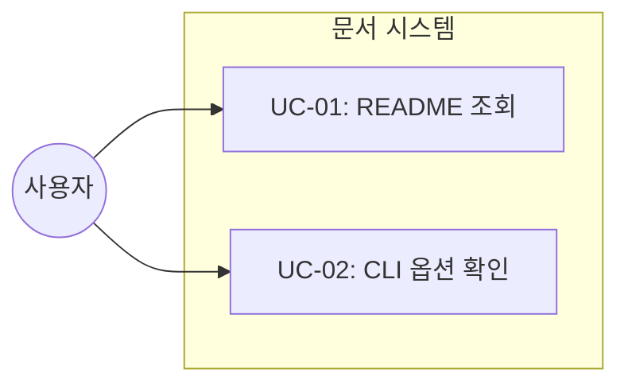

# TSK-04-03 - 문서화 설계 문서

## 문서 정보

| 항목 | 내용 |
|------|------|
| Task ID | TSK-04-03 |
| 문서 버전 | 1.0 |
| 작성일 | 2025-12-28 |
| 상태 | 작성중 |
| 카테고리 | development |

---

## 1. 개요

### 1.1 배경 및 문제 정의

**현재 상황:**
- orchay 프로젝트에 웹 UI 기능이 새롭게 추가됨
- CLI 옵션(`--web`, `--web-only`, `--port`)이 구현되었으나 문서화되지 않음
- 사용자가 새 기능을 사용하는 방법을 알 수 없음

**해결하려는 문제:**
- 웹 UI 기능에 대한 사용법 문서 부재
- CLI 옵션에 대한 설명 부재
- 신규 사용자의 진입 장벽

### 1.2 목적 및 기대 효과

**목적:**
- README.md에 웹 UI 사용법 섹션 추가
- CLI 옵션 완전 문서화
- 선택적으로 스크린샷 추가

**기대 효과:**
- 사용자가 웹 UI 기능을 쉽게 활용 가능
- CLI 옵션을 명확히 이해하고 사용 가능
- 프로젝트 접근성 향상

### 1.3 범위

**포함:**
- README.md 웹 UI 섹션 추가
- CLI 옵션 문서화 (`--web`, `--web-only`, `--port`, `--no-web`)
- 스크린샷 추가 (선택)

**제외:**
- API 문서 (개발자용)
- 내부 아키텍처 문서
- 기여 가이드라인

### 1.4 참조 문서

| 문서 | 경로 | 관련 섹션 |
|------|------|----------|
| PRD | `.jjiban/projects/orchay_web/prd.md` | 3.4 CLI 옵션 |
| TRD | `.jjiban/projects/orchay_web/trd.md` | 전체 |
| 기존 README | `orchay/README.md` | CLI Usage |

---

## 2. 사용자 분석

### 2.1 대상 사용자

| 사용자 유형 | 특성 | 주요 니즈 |
|------------|------|----------|
| orchay 사용자 | CLI 사용 경험 있음, 스케줄러 이미 사용 중 | 웹 UI 활성화 방법 |
| 신규 사용자 | CLI 경험 적음 | 전체 사용법 안내 |
| 관리자 | 원격 모니터링 필요 | 웹 UI 접속 방법 |

### 2.2 사용자 페르소나

**페르소나 1: 기존 orchay 사용자**
- 역할: 개발자
- 목표: 웹 UI를 통해 진행 상황을 브라우저에서 모니터링
- 불만: 터미널을 항상 열어두어야 함
- 시나리오: `orchay --web` 옵션을 추가하여 웹에서 확인

---

## 3. 유즈케이스

### 3.1 유즈케이스 다이어그램



### 3.2 유즈케이스 상세

#### UC-01: README 조회

| 항목 | 내용 |
|------|------|
| 액터 | orchay 사용자 |
| 목적 | 웹 UI 사용법 확인 |
| 사전 조건 | README.md 접근 가능 |
| 사후 조건 | 웹 UI 활성화 방법 이해 |
| 트리거 | README 파일 열기 또는 GitHub 조회 |

**기본 흐름:**
1. 사용자가 README.md를 연다
2. "Web UI" 섹션을 찾는다
3. CLI 옵션과 사용 예시를 확인한다
4. `orchay --web` 명령을 실행한다
5. 브라우저에서 웹 UI에 접속한다

---

## 4. 사용자 시나리오

### 4.1 시나리오 1: 웹 UI 처음 사용

**상황 설명:**
기존 orchay 사용자가 터미널 없이 브라우저에서 진행 상황을 모니터링하고 싶어함

**단계별 진행:**

| 단계 | 사용자 행동 | 시스템 반응 | 사용자 기대 |
|------|-----------|------------|------------|
| 1 | README.md 열기 | 문서 표시 | Web UI 섹션 존재 |
| 2 | Web UI 섹션 확인 | CLI 옵션 설명 표시 | 명확한 사용법 |
| 3 | `orchay jjiban --web` 실행 | 서버 시작 메시지 | 포트 번호 표시 |
| 4 | 브라우저에서 접속 | 웹 UI 화면 | WBS 트리 표시 |

**성공 조건:**
- 사용자가 3분 내에 웹 UI 접속 성공

---

## 5. 화면 설계

### 5.1 문서 구조

```
README.md
├── (기존 섹션들)
├── ## Web UI
│   ├── ### 시작하기
│   ├── ### CLI 옵션
│   ├── ### 스크린샷 (선택)
│   └── ### 주의사항
└── (기존 섹션들)
```

### 5.2 문서 내용 상세

#### Web UI 섹션

**시작하기:**
```markdown
## Web UI

orchay에 내장된 웹서버를 통해 브라우저에서 WBS 진행 상황을 모니터링할 수 있습니다.

### 시작하기

\`\`\`bash
# 스케줄러 + 웹서버 동시 실행
orchay jjiban --web

# 웹서버만 실행 (스케줄링 없음)
orchay jjiban --web-only

# 포트 지정
orchay jjiban --web --port 3000
\`\`\`

→ http://localhost:8080 접속
```

**CLI 옵션:**

| 옵션 | 설명 | 기본값 |
|------|------|--------|
| `--web` | 웹서버 포함 실행 | 비활성화 |
| `--web-only` | 웹서버만 실행 | - |
| `--port PORT` | 웹서버 포트 | 8080 |
| `--no-web` | 웹서버 비활성화 | - |

---

## 6. 인터랙션 설계

문서화 Task이므로 해당 없음.

---

## 7. 데이터 요구사항

### 7.1 필요한 데이터

| 데이터 | 설명 | 출처 | 용도 |
|--------|------|------|------|
| CLI 옵션 목록 | 웹 관련 옵션 | PRD 3.4 | 문서화 |
| 포트 기본값 | 8080 | TRD | 문서화 |
| 스크린샷 | 웹 UI 화면 | 실행 캡처 | 시각화 (선택) |

---

## 8. 비즈니스 규칙

### 8.1 핵심 규칙

| 규칙 ID | 규칙 설명 | 적용 상황 | 예외 |
|---------|----------|----------|------|
| BR-01 | 문서는 영어 또는 한국어로 작성 | README.md | 기존 언어 유지 |
| BR-02 | CLI 옵션은 모두 문서화 | 모든 옵션 | 없음 |

---

## 9. 에러 처리

문서화 Task이므로 해당 없음.

---

## 10. 연관 문서

| 문서 | 경로 | 용도 |
|------|------|------|
| 요구사항 추적 매트릭스 | `025-traceability-matrix.md` | PRD → 문서 추적 |
| 테스트 명세서 | `026-test-specification.md` | 문서 검증 |

---

## 11. 구현 범위

### 11.1 영향받는 영역

| 영역 | 변경 내용 | 영향도 |
|------|----------|--------|
| orchay/README.md | Web UI 섹션 추가 | 중간 |

### 11.2 의존성

| 의존 항목 | 이유 | 상태 |
|----------|------|------|
| TSK-04-02 (통합 테스트) | 테스트 완료 후 문서화 | 진행중 |
| 웹 UI 구현 완료 | 문서화 대상 | 완료 |

### 11.3 제약 사항

| 제약 | 설명 | 대응 방안 |
|------|------|----------|
| 스크린샷 선택사항 | 필수가 아님 | 텍스트 위주 문서화 |

---

## 12. 체크리스트

### 12.1 설계 완료 확인

- [x] 문제 정의 및 목적 명확화
- [x] 사용자 분석 완료
- [x] 유즈케이스 정의 완료
- [x] 사용자 시나리오 작성 완료
- [x] 문서 구조 설계 완료
- [x] 데이터 요구사항 정의 완료

### 12.2 연관 문서 작성

- [ ] 요구사항 추적 매트릭스 작성 (→ `025-traceability-matrix.md`)
- [ ] 테스트 명세서 작성 (→ `026-test-specification.md`)

### 12.3 구현 준비

- [x] 구현 우선순위 결정
- [x] 의존성 확인 완료
- [x] 제약 사항 검토 완료

---

## 변경 이력

| 버전 | 일자 | 작성자 | 변경 내용 |
|------|------|--------|----------|
| 1.0 | 2025-12-28 | Claude | 최초 작성 |
