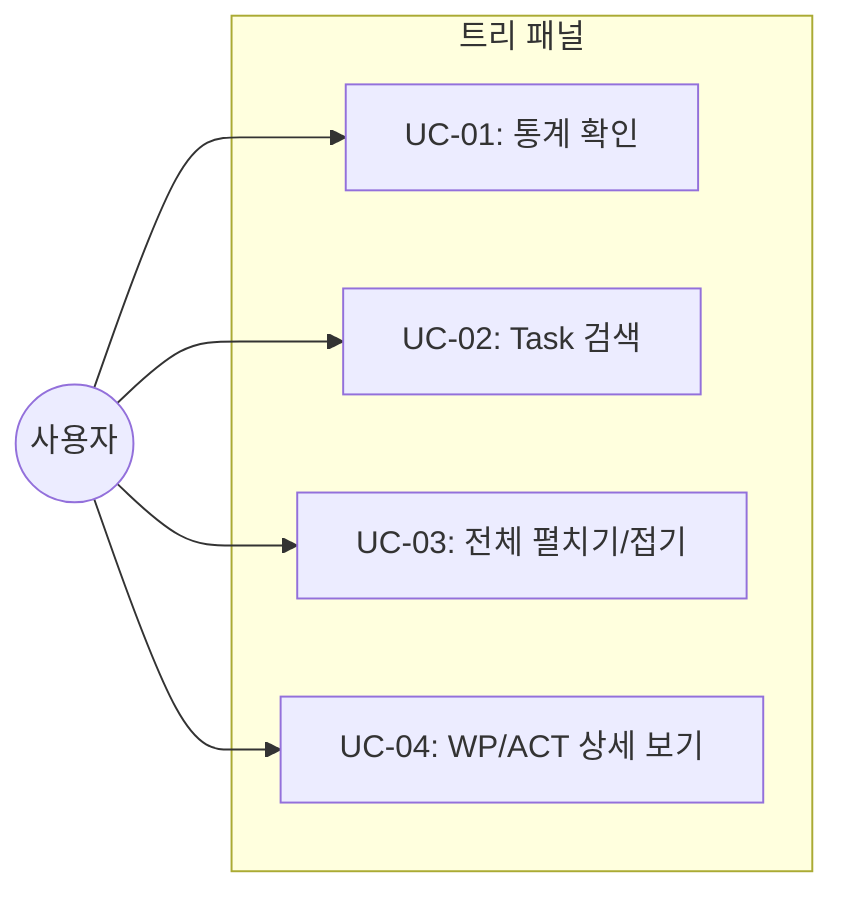
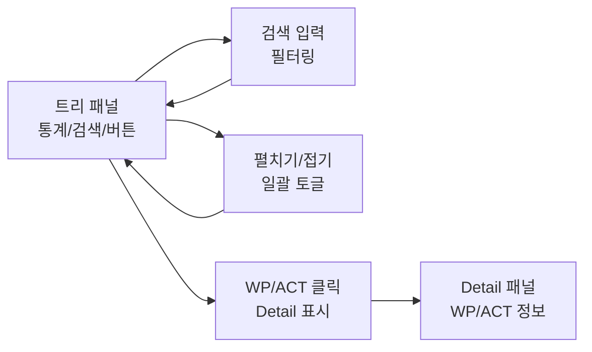

# TSK-06-01 - 트리 패널 개선 설계 문서

## 문서 정보

| 항목 | 내용 |
|------|------|
| Task ID | TSK-06-01 |
| 문서 버전 | 1.0 |
| 작성일 | 2025-12-28 |
| 상태 | 작성중 |
| 카테고리 | development |

---

## 1. 개요

### 1.1 배경 및 문제 정의

**현재 상황:**
- WBS 트리가 단순한 계층 구조만 표시
- 전체 Task 개수, WP/ACT 개수, 진행률 등 통계 정보가 없음
- 특정 Task를 찾기 위해 트리를 일일이 탐색해야 함
- WP/ACT 클릭 시 트리 토글만 되고 상세 정보가 표시되지 않음

**해결하려는 문제:**
- 프로젝트 전체 현황을 한눈에 파악하기 어려움
- 많은 Task 중 원하는 Task를 빠르게 찾을 수 없음
- WP/ACT 수준의 정보 확인이 불편함

### 1.2 목적 및 기대 효과

**목적:**
- 트리 패널에 통계 배지, 검색 기능, 일괄 펼치기/접기 기능 추가
- WP/ACT 클릭 시 Detail 패널에 설명 표시
- 트리 노드의 아이콘과 텍스트 클릭 동작 분리

**기대 효과:**
- 프로젝트 전체 현황을 통계 배지로 즉시 파악
- 검색으로 원하는 Task에 빠르게 접근
- WP/ACT 정보도 Detail 패널에서 확인 가능

### 1.3 범위

**포함:**
- 통계 배지 UI (WP/ACT/TSK 개수, 전체 진행률)
- 검색창 (Task ID/제목 필터링)
- 전체 펼치기/접기 버튼
- WP/ACT 텍스트 클릭 → Detail 패널에 설명 표시
- 아이콘/텍스트 클릭 동작 분리

**제외:**
- Detail 패널 개선 (TSK-06-02에서 처리)
- 문서 테이블 (TSK-06-03에서 처리)

### 1.4 참조 문서

| 문서 | 경로 | 관련 섹션 |
|------|------|----------|
| PRD | `.orchay/projects/orchay_web/prd.md` | 3.6.2 트리 패널 개선, 3.6.3 트리 노드 인터랙션 |
| TRD | `.orchay/projects/orchay_web/trd.md` | UI 스타일링, HTMX 패턴 |

---

## 2. 사용자 분석

### 2.1 대상 사용자

| 사용자 유형 | 특성 | 주요 니즈 |
|------------|------|----------|
| 프로젝트 관리자 | 전체 진행 상황 모니터링 | 통계로 현황 즉시 파악 |
| 개발자 | 특정 Task 확인 | 검색으로 빠른 접근 |
| 스크럼 마스터 | WP/ACT 단위 진행률 확인 | WP/ACT 상세 정보 확인 |

### 2.2 사용자 페르소나

**페르소나 1: 프로젝트 리더**
- 역할: 프로젝트 전체 관리
- 목표: 진행 상황 빠르게 파악
- 불만: 전체 통계를 보려면 WBS 파일을 직접 열어야 함
- 시나리오: 아침에 웹 모니터를 열어 전체 진행률과 남은 Task 개수 확인

---

## 3. 유즈케이스

### 3.1 유즈케이스 다이어그램



### 3.2 유즈케이스 상세

#### UC-01: 통계 확인

| 항목 | 내용 |
|------|------|
| 액터 | 프로젝트 관리자 |
| 목적 | 전체 현황을 숫자로 파악 |
| 사전 조건 | 웹 모니터 페이지 접속 |
| 사후 조건 | 통계 정보 표시됨 |
| 트리거 | 페이지 로드 |

**기본 흐름:**
1. 사용자가 페이지에 접속한다
2. 시스템이 서버에서 통계 정보를 계산한다
3. 통계 배지에 WP/ACT/TSK 개수와 진행률이 표시된다
4. 5초마다 자동으로 갱신된다

#### UC-02: Task 검색

| 항목 | 내용 |
|------|------|
| 액터 | 개발자 |
| 목적 | 특정 Task 빠르게 찾기 |
| 사전 조건 | 트리가 로드된 상태 |
| 사후 조건 | 검색어와 일치하는 Task만 표시 |
| 트리거 | 검색창에 입력 |

**기본 흐름:**
1. 사용자가 검색창에 키워드를 입력한다
2. 시스템이 실시간으로 Task ID와 제목을 필터링한다
3. 일치하는 Task를 포함하는 WP/ACT가 자동 펼쳐진다
4. 일치하지 않는 노드는 숨겨진다

**대안 흐름:**
- 2a. 검색어가 비어있으면 모든 Task가 표시된다

#### UC-03: 전체 펼치기/접기

| 항목 | 내용 |
|------|------|
| 액터 | 사용자 |
| 목적 | 모든 WP를 일괄 펼치기/접기 |
| 사전 조건 | 트리가 로드된 상태 |
| 사후 조건 | 모든 WP가 펼쳐짐/접힘 |
| 트리거 | 펼치기/접기 버튼 클릭 |

**기본 흐름:**
1. 사용자가 "전체 펼치기" 버튼을 클릭한다
2. 모든 WP 노드가 펼쳐진다
3. 버튼 텍스트가 "전체 접기"로 변경된다

#### UC-04: WP/ACT 상세 보기

| 항목 | 내용 |
|------|------|
| 액터 | 스크럼 마스터 |
| 목적 | WP/ACT 수준의 정보 확인 |
| 사전 조건 | 트리가 로드된 상태 |
| 사후 조건 | Detail 패널에 WP/ACT 정보 표시 |
| 트리거 | WP/ACT 텍스트 클릭 |

**기본 흐름:**
1. 사용자가 WP 또는 ACT의 텍스트 부분을 클릭한다
2. Detail 패널에 해당 WP/ACT의 상세 정보가 표시된다
3. 트리의 확장/축소 상태는 유지된다

---

## 4. 사용자 시나리오

### 4.1 시나리오 1: 아침 일일 체크

**상황 설명:**
프로젝트 리더가 아침에 출근하여 전체 진행 상황을 확인하고 싶다.

**단계별 진행:**

| 단계 | 사용자 행동 | 시스템 반응 | 사용자 기대 |
|------|-----------|------------|------------|
| 1 | 웹 모니터 접속 | 페이지 로드 | 빠른 로드 |
| 2 | 통계 배지 확인 | WP 3 / ACT 8 / TSK 16, 진행률 75% 표시 | 현황 즉시 파악 |
| 3 | "TODO" Task 검색 | TODO 상태 Task만 표시 | 남은 작업 확인 |

**성공 조건:**
- 1초 내에 통계 정보가 표시됨
- 검색 결과가 실시간으로 필터링됨

### 4.2 시나리오 2: 특정 Task 찾기

**상황 설명:**
개발자가 작업할 Task를 빠르게 찾고 싶다.

**단계별 진행:**

| 단계 | 사용자 행동 | 시스템 반응 | 사용자 기대 |
|------|-----------|------------|------------|
| 1 | 검색창에 "TSK-06" 입력 | TSK-06-XX Task만 표시 | 빠른 필터링 |
| 2 | TSK-06-01 클릭 | Detail 패널에 상세 표시 | 정확한 정보 |
| 3 | 검색창 비우기 | 전체 트리 복원 | 원상 복구 |

---

## 5. 화면 설계

### 5.1 화면 흐름도



### 5.2 화면별 상세

#### 화면 1: 트리 패널 헤더

**화면 목적:**
트리 패널 상단에 통계 배지, 검색창, 펼치기/접기 버튼 배치

**와이어프레임:**
```
┌─────────────────────────────────────────────────────────────┐
│  ┌──────────────────────────────────────────────────────┐   │
│  │  📊 WP: 6  │  📂 ACT: 12  │  📋 TSK: 24  │  ████ 75%  │   │
│  └──────────────────────────────────────────────────────┘   │
│                                                             │
│  ┌──────────────────────────────────────┐ ┌──────────────┐ │
│  │  🔍 Task 검색...                      │ │ ⏫ 전체 펼치기│ │
│  └──────────────────────────────────────┘ └──────────────┘ │
│                                                             │
│  ▼ WP-01: 웹서버 기본 구조 (100%)                           │
│    ├─ TSK-01-01: FastAPI 앱 [xx]                           │
│    └─ TSK-01-02: 템플릿 구조 [xx]                          │
│  ▶ WP-02: WBS 트리 UI (50%)                                │
│  ▶ WP-03: Task 상세 (0%)                                   │
└─────────────────────────────────────────────────────────────┘
```

**화면 요소 설명:**

| 영역 | 설명 | 사용자 인터랙션 |
|------|------|----------------|
| 통계 배지 | WP/ACT/TSK 개수 + 진행률 | 클릭 없음 (정보 표시) |
| 검색창 | Task ID/제목 필터링 | 입력 시 실시간 필터 |
| 펼치기/접기 버튼 | 모든 WP 일괄 토글 | 클릭 시 상태 전환 |
| WP 노드 아이콘 (▶/▼) | 해당 WP만 펼치기/접기 | 클릭 시 토글 |
| WP 노드 텍스트 | WP 상세 정보 표시 | 클릭 시 Detail 패널 업데이트 |

### 5.3 노드 클릭 영역 분리

```
┌───────────────────────────────────────────────────────────┐
│  ┌───┐  ┌─────────────────────────────────────────────┐   │
│  │ ▶ │  │ WP-01: 웹서버 기본 구조              (100%) │   │
│  └───┘  └─────────────────────────────────────────────┘   │
│   ↑                         ↑                              │
│ 토글                   Detail 표시                         │
└───────────────────────────────────────────────────────────┘
```

| 클릭 영역 | 동작 |
|----------|------|
| 아이콘 (▶/▼) | 트리 펼치기/접기만 |
| 텍스트 (WP-01: ...) | Detail 패널에 WP 정보 표시 |

---

## 6. 인터랙션 설계

### 6.1 사용자 액션과 피드백

| 사용자 액션 | 즉각 피드백 | 결과 피드백 | 에러 피드백 |
|------------|-----------|------------|------------|
| 검색어 입력 | 입력창 포커스 | 필터링된 트리 | 결과 없음 메시지 |
| 펼치기 버튼 클릭 | 버튼 누름 효과 | 모든 WP 펼쳐짐 | - |
| WP 텍스트 클릭 | 하이라이트 | Detail 패널 업데이트 | - |
| 토글 아이콘 클릭 | 아이콘 회전 | 하위 노드 표시/숨김 | - |

### 6.2 상태별 화면 변화

| 상태 | 화면 표시 | 사용자 안내 |
|------|----------|------------|
| 검색 결과 없음 | 빈 트리 + 메시지 | "검색 결과가 없습니다" |
| 전체 펼침 | 모든 WP 열림 | 버튼: "전체 접기" |
| 전체 접힘 | 모든 WP 닫힘 | 버튼: "전체 펼치기" |

### 6.3 키보드/접근성

| 기능 | 키보드 단축키 | 스크린 리더 안내 |
|------|-------------|-----------------|
| 검색창 포커스 | Ctrl+F | "Task 검색" |
| 검색어 지우기 | Esc (검색창 포커스 시) | "검색어 지움" |

---

## 7. 데이터 요구사항

### 7.1 필요한 데이터

| 데이터 | 설명 | 출처 | 용도 |
|--------|------|------|------|
| WP 개수 | Work Package 총 개수 | Task ID 파싱 | 통계 배지 |
| ACT 개수 | Activity 총 개수 | Task ID 파싱 (3단계 시) | 통계 배지 |
| TSK 개수 | Task 총 개수 | Orchestrator.tasks | 통계 배지 |
| 완료 Task 개수 | [xx] 상태 Task | Orchestrator.tasks | 진행률 계산 |
| WP 정보 | WP ID, 제목, 설명 | WBS 파일 파싱 | Detail 패널 |
| ACT 정보 | ACT ID, 제목, 설명 | WBS 파일 파싱 | Detail 패널 |

### 7.2 통계 계산 로직

```python
def calculate_stats(tasks: list[Task]) -> dict:
    """통계 정보 계산."""
    wp_ids = set()
    act_ids = set()

    for task in tasks:
        parts = task.id.split("-")
        if len(parts) >= 2:
            wp_ids.add(f"WP-{parts[1]}")
        if len(parts) >= 3:
            act_ids.add(f"ACT-{parts[1]}-{parts[2]}")

    total = len(tasks)
    done = sum(1 for t in tasks if t.status.value == "[xx]")

    return {
        "wp_count": len(wp_ids),
        "act_count": len(act_ids),
        "tsk_count": total,
        "done_count": done,
        "percentage": int((done / total) * 100) if total > 0 else 0
    }
```

### 7.3 WP/ACT 정보 구조

| 필드 | 타입 | 설명 |
|------|------|------|
| id | string | WP-XX 또는 ACT-XX-XX |
| title | string | 제목 |
| status | string | 상태 (planned, in_progress, done) |
| progress | int | 진행률 (0-100) |
| note | string | 설명/메모 |
| child_count | int | 하위 Task 개수 |
| done_count | int | 완료된 하위 Task 개수 |

---

## 8. 비즈니스 규칙

### 8.1 핵심 규칙

| 규칙 ID | 규칙 설명 | 적용 상황 | 예외 |
|---------|----------|----------|------|
| BR-01 | 검색은 클라이언트 사이드에서 수행 | 검색창 입력 시 | - |
| BR-02 | 검색 시 해당 Task의 상위 WP/ACT 자동 펼침 | 검색 결과 표시 | - |
| BR-03 | WP/ACT 클릭 시 트리 상태 유지 | Detail 표시 | - |
| BR-04 | 통계는 5초마다 서버에서 갱신 | 자동 갱신 | - |

### 8.2 규칙 상세 설명

**BR-01: 클라이언트 사이드 검색**

설명: 서버 요청 없이 브라우저에서 직접 필터링하여 빠른 응답 제공

예시:
- 검색어 입력 → JavaScript로 DOM 필터링
- 네트워크 지연 없음

**BR-02: 자동 펼침**

설명: 검색 결과가 숨겨진 노드에 있으면 자동으로 상위 노드 펼침

예시:
- "TSK-06-01" 검색 → WP-06 자동 펼침

---

## 9. 에러 처리

### 9.1 예상 에러 상황

| 상황 | 원인 | 사용자 메시지 | 복구 방법 |
|------|------|--------------|----------|
| 검색 결과 없음 | 일치하는 Task 없음 | "검색 결과가 없습니다" | 검색어 수정 |
| WP/ACT 정보 없음 | WBS 파싱 오류 | "정보를 불러올 수 없습니다" | 페이지 새로고침 |
| 통계 로드 실패 | 서버 오류 | 기존 통계 유지 | 자동 재시도 |

### 9.2 에러 표시 방식

| 에러 유형 | 표시 위치 | 표시 방법 |
|----------|----------|----------|
| 검색 결과 없음 | 트리 영역 | 안내 메시지 |
| API 오류 | 토스트 | 빨간색 알림 |

---

## 10. 연관 문서

| 문서 | 경로 | 용도 |
|------|------|------|
| 요구사항 추적 매트릭스 | `025-traceability-matrix.md` | PRD → 설계 → 테스트 양방향 추적 |
| 테스트 명세서 | `026-test-specification.md` | 단위/E2E/매뉴얼 테스트 상세 정의 |

---

## 11. 구현 범위

### 11.1 영향받는 영역

| 영역 | 변경 내용 | 영향도 |
|------|----------|--------|
| `server.py` | 통계 API 추가, WP/ACT Detail API 추가 | 높음 |
| `tree.html` | 통계 배지, 검색창, 버튼 UI 추가 | 높음 |
| `index.html` | 검색/펼치기 JavaScript 추가 | 중간 |
| `detail.html` | WP/ACT 정보 표시 템플릿 추가 | 중간 |

### 11.2 의존성

| 의존 항목 | 이유 | 상태 |
|----------|------|------|
| TSK-02-02 (트리 템플릿) | 기존 트리 구조 기반 확장 | 완료 |

### 11.3 제약 사항

| 제약 | 설명 | 대응 방안 |
|------|------|----------|
| 빌드 도구 없음 | npm/webpack 사용 불가 | 순수 JavaScript 사용 |
| CDN만 사용 | 외부 라이브러리는 CDN | Tailwind, HTMX CDN |

---

## 12. 구현 상세

### 12.1 파일별 변경 사항

#### server.py 변경

```python
# 추가 함수: 통계 계산
def calculate_stats(tasks: list[Task]) -> dict:
    wp_ids = set()
    act_ids = set()

    for task in tasks:
        parts = task.id.split("-")
        if len(parts) >= 2:
            wp_ids.add(f"WP-{parts[1]}")
        if len(parts) >= 3:
            act_ids.add(f"ACT-{parts[1]}-{parts[2]}")

    total = len(tasks)
    done = sum(1 for t in tasks if t.status.value == "[xx]")

    return {
        "wp_count": len(wp_ids),
        "act_count": len(act_ids) if act_ids else 0,
        "tsk_count": total,
        "done_count": done,
        "percentage": int((done / total) * 100) if total > 0 else 0
    }

# 추가 라우트: WP/ACT 상세
@app.get("/api/wp-detail/{wp_id}", response_class=HTMLResponse)
async def _get_wp_detail(request: Request, wp_id: str) -> HTMLResponse:
    """WP 상세 정보 HTML 조각."""
    # WP 정보 조회 및 템플릿 렌더링
    ...
```

#### tree.html 변경

트리 패널 상단에 통계 배지, 검색창, 펼치기/접기 버튼 추가:

```html
<!-- 통계 배지 -->
<div class="stats-bar flex gap-4 mb-4 p-3 bg-gray-800 rounded-lg">
    <div class="stat-badge px-3 py-1 bg-blue-900 rounded-full text-sm">
        <span class="text-blue-400">WP</span>
        <span class="text-white font-bold">{{ stats.wp_count }}</span>
    </div>
    <div class="stat-badge px-3 py-1 bg-green-900 rounded-full text-sm">
        <span class="text-green-400">ACT</span>
        <span class="text-white font-bold">{{ stats.act_count }}</span>
    </div>
    <div class="stat-badge px-3 py-1 bg-yellow-900 rounded-full text-sm">
        <span class="text-yellow-400">TSK</span>
        <span class="text-white font-bold">{{ stats.tsk_count }}</span>
    </div>
    <div class="flex-1"></div>
    <div class="progress-badge flex items-center gap-2">
        <div class="w-24 h-2 bg-gray-700 rounded-full overflow-hidden">
            <div class="h-full bg-emerald-500" style="width: {{ stats.percentage }}%"></div>
        </div>
        <span class="text-sm text-gray-400">{{ stats.percentage }}%</span>
    </div>
</div>

<!-- 검색창 및 버튼 -->
<div class="search-bar flex gap-2 mb-4">
    <input type="text"
           id="tree-search"
           class="flex-1 bg-gray-800 border border-gray-700 rounded px-3 py-2 text-sm"
           placeholder="Task 검색 (ID 또는 제목)..."
           oninput="filterTree(this.value)">
    <button id="expand-all-btn"
            class="px-3 py-2 bg-gray-700 hover:bg-gray-600 rounded text-sm"
            onclick="toggleExpandAll()">
        전체 펼치기
    </button>
</div>
```

#### index.html JavaScript 추가

```javascript
// 검색 필터링
function filterTree(query) {
    const q = query.toLowerCase().trim();
    const nodes = document.querySelectorAll('.tree-node');

    if (!q) {
        // 검색어 없으면 전체 표시
        nodes.forEach(n => n.style.display = '');
        return;
    }

    // Task 노드 필터링
    nodes.forEach(node => {
        if (node.dataset.type === 'task') {
            const text = node.textContent.toLowerCase();
            const match = text.includes(q);
            node.style.display = match ? '' : 'none';

            // 상위 WP 펼치기
            if (match) {
                const wp = node.closest('[data-id^="WP-"]');
                if (wp) expandWp(wp.dataset.id);
            }
        }
    });
}

// 전체 펼치기/접기
let allExpanded = false;
function toggleExpandAll() {
    const btn = document.getElementById('expand-all-btn');
    const wps = document.querySelectorAll('.tree-node.wp');

    allExpanded = !allExpanded;
    btn.textContent = allExpanded ? '전체 접기' : '전체 펼치기';

    wps.forEach(wp => {
        if (allExpanded) {
            expandWp(wp.dataset.id);
        } else {
            collapseWp(wp.dataset.id);
        }
    });
}

function expandWp(wpId) {
    const wp = document.querySelector(`.tree-node.wp[data-id="${wpId}"]`);
    if (wp && wp.dataset.expanded === 'false') {
        wp.click();
    }
}

function collapseWp(wpId) {
    const wp = document.querySelector(`.tree-node.wp[data-id="${wpId}"]`);
    if (wp && wp.dataset.expanded === 'true') {
        wp.click();
    }
}
```

### 12.2 API 변경

| 메서드 | 경로 | 변경 내용 |
|--------|------|----------|
| GET | `/api/tree` | 응답에 `stats` 객체 추가 |
| GET | `/api/wp-detail/{wp_id}` | 신규 추가 |
| GET | `/api/act-detail/{act_id}` | 신규 추가 (3단계 WBS 시) |

---

## 13. 체크리스트

### 13.1 설계 완료 확인

- [x] 문제 정의 및 목적 명확화
- [x] 사용자 분석 완료
- [x] 유즈케이스 정의 완료
- [x] 사용자 시나리오 작성 완료
- [x] 화면 설계 완료 (와이어프레임)
- [x] 인터랙션 설계 완료
- [x] 데이터 요구사항 정의 완료
- [x] 비즈니스 규칙 정의 완료
- [x] 에러 처리 정의 완료

### 13.2 연관 문서 작성

- [ ] 요구사항 추적 매트릭스 작성 (→ `025-traceability-matrix.md`)
- [ ] 테스트 명세서 작성 (→ `026-test-specification.md`)

### 13.3 구현 준비

- [x] 구현 우선순위 결정
- [x] 의존성 확인 완료
- [x] 제약 사항 검토 완료

---

## 변경 이력

| 버전 | 일자 | 작성자 | 변경 내용 |
|------|------|--------|----------|
| 1.0 | 2025-12-28 | Claude | 최초 작성 |
