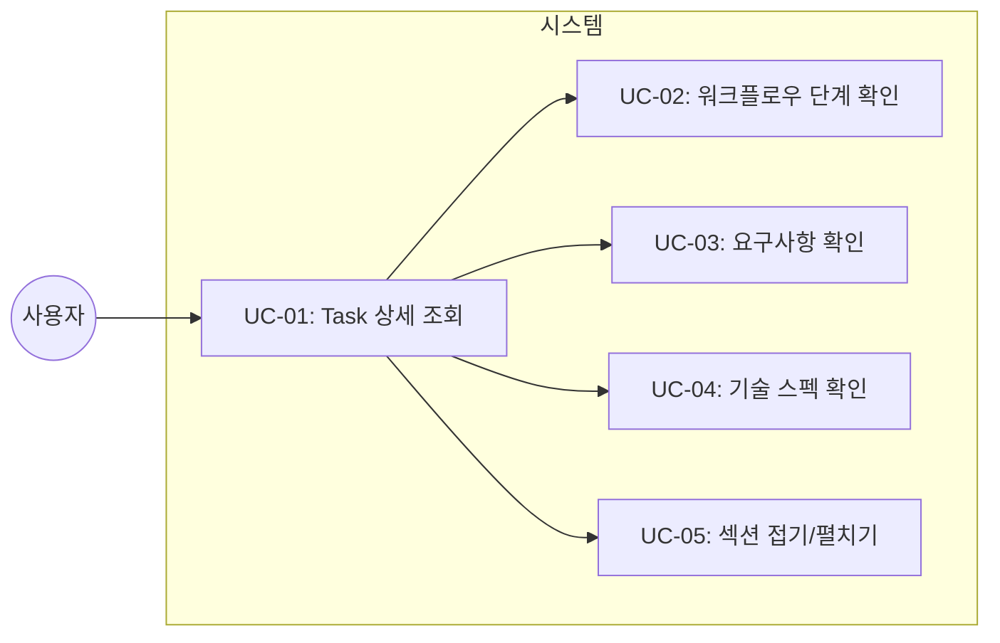
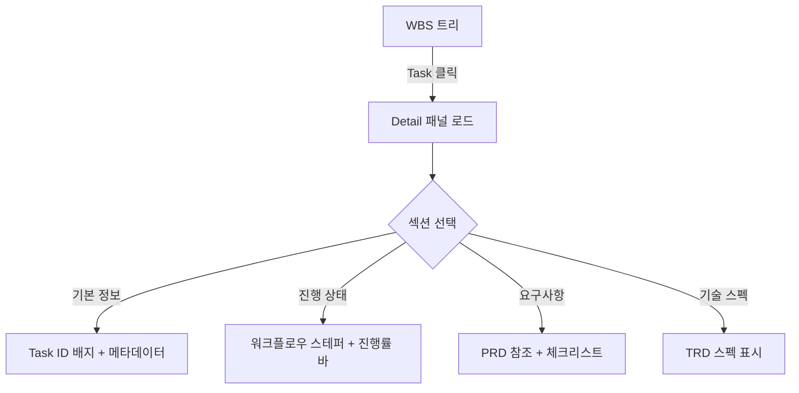
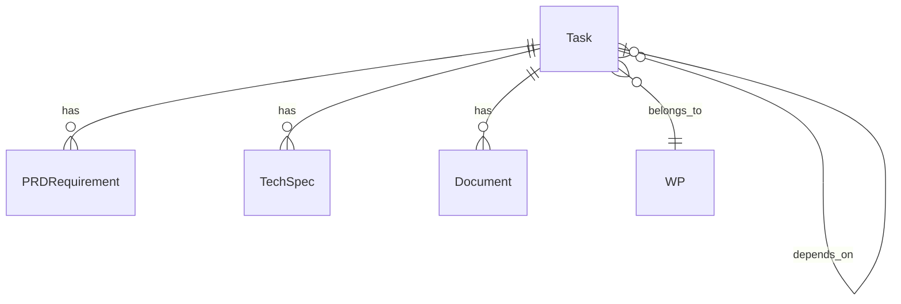

# TSK-06-02 - Task Detail 패널 개선 설계 문서

## 문서 정보

| 항목 | 내용 |
|------|------|
| Task ID | TSK-06-02 |
| 문서 버전 | 1.0 |
| 작성일 | 2025-12-28 |
| 상태 | 작성중 |
| 카테고리 | development |

---

## 1. 개요

### 1.1 배경 및 문제 정의

**현재 상황:**
- 현재 Task Detail 패널은 단순한 정보 나열 형태로 구성되어 있음
- Task ID, 제목, 상태, 카테고리, 우선순위 등 기본 정보만 표시
- 워크플로우 진행 상태를 직관적으로 파악하기 어려움
- PRD 요구사항과 기술 스펙 정보가 표시되지 않음

**해결하려는 문제:**
- 정보의 시각적 그룹화 부재로 가독성 저하
- 워크플로우 단계별 진행 상황 파악 어려움
- Task의 전체 컨텍스트(요구사항, 기술 스펙) 확인을 위해 별도 문서 참조 필요
- Vue WBS 페이지와 비교하여 UX 품질 격차 존재

### 1.2 목적 및 기대 효과

**목적:**
- Task Detail 패널을 카드 기반 섹션으로 재구성하여 정보 가독성 향상
- 워크플로우 스테퍼로 진행 상태 시각화
- PRD/TRD 정보를 패널 내에서 직접 확인 가능하게 함

**기대 효과:**
- 사용자가 Task 상태와 컨텍스트를 한눈에 파악
- 워크플로우 진행 단계를 시각적으로 인지
- 문서 간 이동 없이 필요한 정보 확인 가능
- Vue WBS 페이지 수준의 UI/UX 품질 달성

### 1.3 범위

**포함:**
- 카드 기반 섹션 분리 (기본 정보, 진행 상태, 요구사항, 기술 스펙)
- Task ID 배지 (프로젝트 + 카테고리 + ID)
- 워크플로우 스테퍼 UI
- 진행률 바 표시
- 요구사항/기술 스펙 섹션
- 각 섹션 접기/펼치기 기능

**제외:**
- 문서 테이블 (TSK-06-03에서 구현)
- 이전/다음 Task 네비게이션 (향후 과제)
- 실시간 편집 기능

### 1.4 참조 문서

| 문서 | 경로 | 관련 섹션 |
|------|------|----------|
| PRD | `.jjiban/projects/orchay_web/prd.md` | 3.6.4 Task Detail 패널 개선 |
| TRD | `.jjiban/projects/orchay_web/trd.md` | UI 스타일링 |

---

## 2. 사용자 분석

### 2.1 대상 사용자

| 사용자 유형 | 특성 | 주요 니즈 |
|------------|------|----------|
| 개발자 | Claude Code 사용, Task 진행 모니터링 | 현재 Task 상태와 다음 단계 파악 |
| PM/관리자 | 프로젝트 진행 상황 모니터링 | 전체 진행률과 병목 지점 파악 |

### 2.2 사용자 페르소나

**페르소나 1: 개발자 (김개발)**
- 역할: Claude Code Worker 모니터링
- 목표: 현재 작업 중인 Task의 상세 정보와 요구사항 확인
- 불만: 요구사항 확인을 위해 PRD 문서를 따로 열어봐야 함
- 시나리오: Task 선택 → 요구사항 확인 → 구현 진행

---

## 3. 유즈케이스

### 3.1 유즈케이스 다이어그램



### 3.2 유즈케이스 상세

#### UC-01: Task 상세 조회

| 항목 | 내용 |
|------|------|
| 액터 | 개발자, PM |
| 목적 | Task의 상세 정보를 카드 형태로 조회 |
| 사전 조건 | WBS 트리에서 Task 선택 |
| 사후 조건 | Detail 패널에 카드 기반 UI 표시 |
| 트리거 | Task 클릭 |

**기본 흐름:**
1. 사용자가 WBS 트리에서 Task를 클릭한다
2. 시스템이 HTMX로 `/api/detail/{task_id}` 호출
3. 서버가 Task 정보 + WBS 메타데이터 수집
4. 카드 기반 Detail 패널 렌더링
5. 사용자에게 상세 정보가 표시된다

#### UC-02: 워크플로우 단계 확인

| 항목 | 내용 |
|------|------|
| 액터 | 개발자, PM |
| 목적 | 현재 Task가 워크플로우 어느 단계에 있는지 확인 |
| 사전 조건 | Task 상세 조회 완료 |
| 사후 조건 | 스테퍼에서 현재 단계 하이라이트 |
| 트리거 | Detail 패널 표시 시 자동 |

**기본 흐름:**
1. Task 상세 패널이 로드됨
2. Task 상태(status)에서 워크플로우 단계 파싱
3. 스테퍼 UI에서 해당 단계 활성화 표시
4. 완료된 단계는 체크마크, 현재 단계는 하이라이트

#### UC-05: 섹션 접기/펼치기

| 항목 | 내용 |
|------|------|
| 액터 | 개발자, PM |
| 목적 | 필요한 섹션만 펼쳐서 보기 |
| 사전 조건 | Detail 패널 표시 |
| 사후 조건 | 해당 섹션 토글 |
| 트리거 | 섹션 헤더 클릭 |

**기본 흐름:**
1. 사용자가 섹션 헤더(▼/▶) 클릭
2. CSS transition으로 max-height 변경
3. 섹션 내용 펼치기/접기

---

## 4. 사용자 시나리오

### 4.1 시나리오 1: Task 진행 상태 확인

**상황 설명:**
개발자 김개발이 orchay_web 프로젝트 모니터링 중 TSK-06-02의 진행 상태를 확인하려 한다.

**단계별 진행:**

| 단계 | 사용자 행동 | 시스템 반응 | 사용자 기대 |
|------|-----------|------------|------------|
| 1 | WBS 트리에서 TSK-06-02 클릭 | Detail 패널에 카드 UI 로드 | 상세 정보가 표시됨 |
| 2 | 진행 상태 섹션 확인 | 스테퍼에서 현재 단계 하이라이트 | 현재 "설계" 단계임을 인지 |
| 3 | 진행률 바 확인 | 25% 채워진 프로그레스 바 | 전체 대비 진행률 파악 |

**성공 조건:**
- 스테퍼에서 현재 단계가 명확히 구분됨
- 진행률이 정확히 계산되어 표시됨

### 4.2 시나리오 2: 요구사항 확인 후 구현

**상황 설명:**
개발자가 Task 구현 전 PRD 요구사항을 확인하려 한다.

**단계별 진행:**

| 단계 | 사용자 행동 | 시스템 반응 | 사용자 기대 |
|------|-----------|------------|------------|
| 1 | 요구사항 섹션 클릭 | 섹션이 펼쳐짐 | 요구사항 목록 표시 |
| 2 | PRD 참조 확인 | "PRD 3.6.4" 링크 표시 | 원본 문서 참조 가능 |
| 3 | 체크리스트 확인 | 요구사항 항목 나열 | 구현해야 할 항목 파악 |

**성공 조건:**
- PRD 요구사항이 패널 내에서 바로 확인 가능
- 접기/펼치기가 부드럽게 동작

---

## 5. 화면 설계

### 5.1 화면 흐름도



### 5.2 화면별 상세

#### 화면 1: Task Detail 패널

**화면 목적:**
선택된 Task의 모든 컨텍스트를 카드 기반으로 정리하여 표시

**진입 경로:**
- WBS 트리에서 Task 클릭
- HTMX로 `/api/detail/{task_id}` 호출

**와이어프레임:**
```
┌─────────────────────────────────────────────────────────────┐
│ ┌─────────────────────────────────────────────────────────┐ │
│ │  [기본 정보 카드]                                        │ │
│ │  ┌───────────────────────────────────────────────────┐  │ │
│ │  │ [orchay_web] [development] [TSK-06-02]            │  │ │
│ │  │ Task Detail 패널 개선                              │  │ │
│ │  │                                                   │  │ │
│ │  │ Priority: ●● high    Assignee: -                 │  │ │
│ │  │ Tags: [detail] [card] [stepper] [ui]             │  │ │
│ │  │ Depends: TSK-03-01                               │  │ │
│ │  └───────────────────────────────────────────────────┘  │ │
│ └─────────────────────────────────────────────────────────┘ │
│                                                             │
│ ┌─────────────────────────────────────────────────────────┐ │
│ │  ▼ 진행 상태                                            │ │
│ │  ┌───────────────────────────────────────────────────┐  │ │
│ │  │  ○───────○───────●───────○                        │  │ │
│ │  │  시작전    설계    구현    완료                     │  │ │
│ │  │                                                   │  │ │
│ │  │  진행률: ████████░░░░░░░░░░░░ 40%                 │  │ │
│ │  └───────────────────────────────────────────────────┘  │ │
│ └─────────────────────────────────────────────────────────┘ │
│                                                             │
│ ┌─────────────────────────────────────────────────────────┐ │
│ │  ▶ 요구사항 (접힌 상태)                                  │ │
│ └─────────────────────────────────────────────────────────┘ │
│                                                             │
│ ┌─────────────────────────────────────────────────────────┐ │
│ │  ▶ 기술 스펙 (접힌 상태)                                 │ │
│ └─────────────────────────────────────────────────────────┘ │
│                                                             │
│ ┌─────────────────────────────────────────────────────────┐ │
│ │  ▶ 관련 문서 (TSK-06-03에서 확장 예정)                   │ │
│ └─────────────────────────────────────────────────────────┘ │
└─────────────────────────────────────────────────────────────┘
```

**화면 요소 설명:**

| 영역 | 설명 | 사용자 인터랙션 |
|------|------|----------------|
| 기본 정보 카드 | Task ID 배지, 제목, 메타데이터 | 읽기 전용 |
| 진행 상태 섹션 | 워크플로우 스테퍼 + 진행률 바 | 접기/펼치기 |
| 요구사항 섹션 | PRD 참조 + requirements 체크리스트 | 접기/펼치기 |
| 기술 스펙 섹션 | tech-spec, api-spec, ui-spec | 접기/펼치기 |
| 관련 문서 섹션 | 문서 목록 (TSK-06-03에서 확장) | 클릭 시 Document Viewer |

---

## 6. 인터랙션 설계

### 6.1 사용자 액션과 피드백

| 사용자 액션 | 즉각 피드백 | 결과 피드백 | 에러 피드백 |
|------------|-----------|------------|------------|
| 섹션 헤더 클릭 | 아이콘 회전(▶→▼) | 섹션 펼쳐짐 | - |
| 섹션 접기 | 아이콘 회전(▼→▶) | 섹션 접혀짐 | - |
| 자동 갱신 | - | morph swap으로 깜빡임 없이 갱신 | 연결 오류 시 무시 |

### 6.2 상태별 화면 변화

| 상태 | 화면 표시 | 사용자 안내 |
|------|----------|------------|
| 로딩 중 | 스켈레톤 UI | - |
| Task 없음 | "Task를 선택하세요" | 빈 상태 메시지 |
| 정상 표시 | 카드 기반 상세 정보 | - |
| 갱신 중 | 기존 콘텐츠 유지 (morph) | - |

### 6.3 키보드/접근성

| 기능 | 키보드 단축키 | 스크린 리더 안내 |
|------|-------------|-----------------|
| 섹션 토글 | Enter/Space | "{섹션명} 펼침/접힘" |
| 다음 섹션 | Tab | "{섹션명}으로 이동" |

---

## 7. 데이터 요구사항

### 7.1 필요한 데이터

| 데이터 | 설명 | 출처 | 용도 |
|--------|------|------|------|
| Task 기본 정보 | id, title, status, category, priority, assignee, tags, depends | Orchestrator.tasks | 기본 정보 카드 |
| prd-ref | PRD 참조 섹션 | wbs.md 파싱 | 요구사항 섹션 |
| requirements | 요구사항 체크리스트 | wbs.md 파싱 | 요구사항 섹션 |
| tech-spec | 기술 스펙 | wbs.md 파싱 | 기술 스펙 섹션 |
| api-spec | API 스펙 | wbs.md 파싱 | 기술 스펙 섹션 |
| ui-spec | UI 스펙 | wbs.md 파싱 | 기술 스펙 섹션 |

### 7.2 데이터 관계



**관계 설명:**
- Task는 여러 개의 PRD 요구사항을 가질 수 있음
- Task는 여러 개의 기술 스펙을 가질 수 있음
- Task는 WP(Work Package)에 속함
- Task는 다른 Task에 의존할 수 있음

### 7.3 데이터 유효성 규칙

| 데이터 필드 | 규칙 | 위반 시 메시지 |
|------------|------|---------------|
| status | 유효한 상태 코드 | 기본값 `[ ]` 사용 |
| category | development/defect/infrastructure | 기본값 표시 안함 |
| prd-ref | PRD 섹션 참조 형식 | 없으면 "-" 표시 |

---

## 8. 비즈니스 규칙

### 8.1 핵심 규칙

| 규칙 ID | 규칙 설명 | 적용 상황 | 예외 |
|---------|----------|----------|------|
| BR-01 | 워크플로우 단계는 status에서 결정 | 스테퍼 렌더링 시 | - |
| BR-02 | 진행률은 완료 단계 / 전체 단계로 계산 | 진행률 바 표시 시 | - |
| BR-03 | 요구사항 섹션은 기본 접힘 상태 | 초기 로드 시 | - |

### 8.2 규칙 상세 설명

**BR-01: 워크플로우 단계 결정**

status 코드별 워크플로우 단계 매핑:

| status | 단계 | 스테퍼 표시 |
|--------|------|-----------|
| `[ ]` | 시작 전 | 0번째 비활성 |
| `[bd]`, `[dd]`, `[an]`, `[ds]` | 설계 | 1번째 활성 |
| `[ap]` | 승인 | 1.5번째 활성 |
| `[im]`, `[fx]` | 구현 | 2번째 활성 |
| `[vf]` | 검증 | 3번째 활성 |
| `[xx]` | 완료 | 4번째 완료 |

**BR-02: 진행률 계산**

```python
STEP_PROGRESS = {
    "[ ]": 0,
    "[bd]": 15, "[dd]": 25, "[an]": 25, "[ds]": 25,
    "[ap]": 40,
    "[im]": 60, "[fx]": 60,
    "[vf]": 80,
    "[xx]": 100
}
```

---

## 9. 에러 처리

### 9.1 예상 에러 상황

| 상황 | 원인 | 사용자 메시지 | 복구 방법 |
|------|------|--------------|----------|
| Task 미존재 | 잘못된 task_id | "Task를 찾을 수 없습니다" | 트리에서 다시 선택 |
| WBS 파싱 오류 | 메타데이터 형식 불일치 | 해당 섹션 숨김 | graceful degradation |
| 네트워크 오류 | 연결 끊김 | 기존 콘텐츠 유지 | 자동 재시도 |

### 9.2 에러 표시 방식

| 에러 유형 | 표시 위치 | 표시 방법 |
|----------|----------|----------|
| Task 미존재 | Detail 패널 전체 | 경고 메시지 |
| 섹션 데이터 없음 | 해당 섹션 | "정보 없음" 텍스트 |
| 네트워크 오류 | 표시 안함 | 기존 콘텐츠 유지 |

---

## 10. 연관 문서

> 상세 테스트 명세 및 요구사항 추적은 별도 문서에서 관리합니다.

| 문서 | 경로 | 용도 |
|------|------|------|
| 요구사항 추적 매트릭스 | `025-traceability-matrix.md` | PRD → 설계 → 테스트 양방향 추적 |
| 테스트 명세서 | `026-test-specification.md` | 단위/E2E/매뉴얼 테스트 상세 정의 |

---

## 11. 구현 범위

### 11.1 영향받는 영역

| 영역 | 변경 내용 | 영향도 |
|------|----------|--------|
| `detail.html` 템플릿 | 전면 재구성 (카드 기반) | 높음 |
| `server.py` | WBS 메타데이터 파싱 추가 | 중간 |
| `wbs_parser.py` | requirements, tech-spec 파싱 | 중간 |
| CSS 스타일 | 스테퍼, 접기/펼치기 애니메이션 | 낮음 |

### 11.2 의존성

| 의존 항목 | 이유 | 상태 |
|----------|------|------|
| TSK-03-01 (Task 상세 API) | 기본 detail.html 구조 제공 | 완료 |
| TRD UI 스타일링 | 카드/스테퍼 스타일 가이드 | 완료 |

### 11.3 제약 사항

| 제약 | 설명 | 대응 방안 |
|------|------|----------|
| JavaScript 최소화 | HTMX + CSS 위주 구현 | CSS transition 활용 |
| 빌드 도구 없음 | CDN 사용 | Tailwind CDN |
| 기존 API 호환 | /api/detail/{task_id} 유지 | 응답 데이터 확장만 |

---

## 12. 체크리스트

### 12.1 설계 완료 확인

- [x] 문제 정의 및 목적 명확화
- [x] 사용자 분석 완료
- [x] 유즈케이스 정의 완료
- [x] 사용자 시나리오 작성 완료
- [x] 화면 설계 완료 (와이어프레임)
- [x] 인터랙션 설계 완료
- [x] 데이터 요구사항 정의 완료
- [x] 비즈니스 규칙 정의 완료
- [x] 에러 처리 정의 완료

### 12.2 연관 문서 작성

- [ ] 요구사항 추적 매트릭스 작성 (→ `025-traceability-matrix.md`)
- [ ] 테스트 명세서 작성 (→ `026-test-specification.md`)

### 12.3 구현 준비

- [x] 구현 우선순위 결정
- [x] 의존성 확인 완료
- [x] 제약 사항 검토 완료

---

## 변경 이력

| 버전 | 일자 | 작성자 | 변경 내용 |
|------|------|--------|----------|
| 1.0 | 2025-12-28 | Claude | 최초 작성 |
