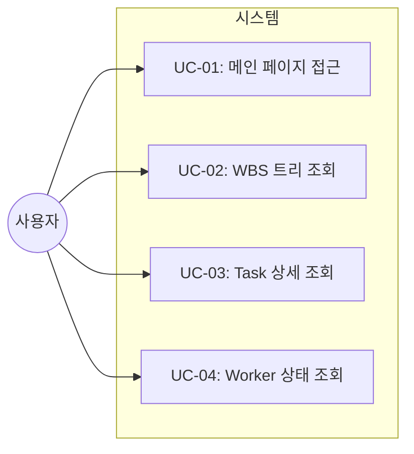
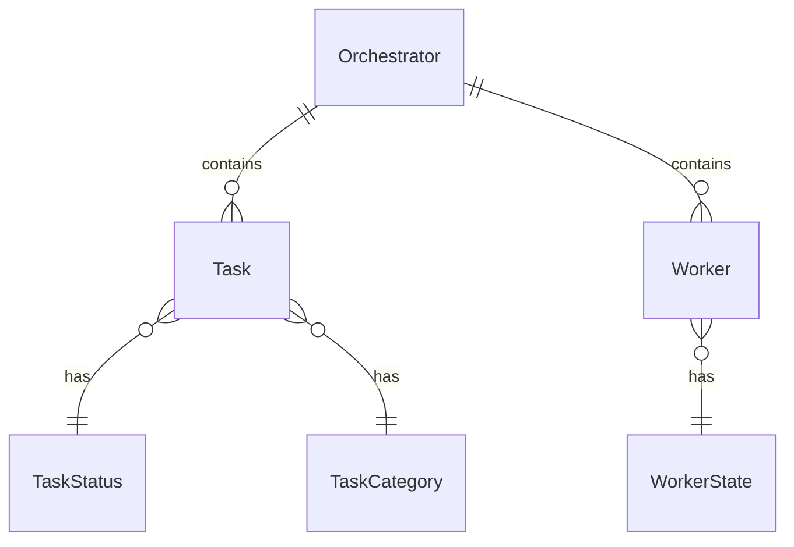

# TSK-01-01 - FastAPI 앱 및 라우트 정의 설계 문서

## 문서 정보

| 항목 | 내용 |
|------|------|
| Task ID | TSK-01-01 |
| 문서 버전 | 1.0 |
| 작성일 | 2025-12-28 |
| 상태 | 작성중 |
| 카테고리 | development |

---

## 1. 개요

### 1.1 배경 및 문제 정의

**현재 상황:**
- orchay 스케줄러는 TUI(Terminal User Interface) 기반으로만 동작
- WBS 트리와 Task 진행 상황을 확인하려면 터미널이 필요
- 원격 또는 모바일에서 모니터링이 어려움

**해결하려는 문제:**
- 브라우저에서 접근 가능한 웹 기반 모니터링 UI 필요
- orchay 스케줄러와 통합된 내장 웹서버 구현
- 기존 Orchestrator 데이터에 대한 HTTP API 제공

### 1.2 목적 및 기대 효과

**목적:**
- FastAPI 기반 웹 애플리케이션 생성
- Orchestrator 참조를 주입받아 데이터 접근
- 기본 라우트 정의 (/, /api/tree, /api/detail, /api/workers)
- 정적 파일 서빙 설정

**기대 효과:**
- 터미널 없이 브라우저로 모니터링 가능
- 다양한 디바이스에서 접근 가능
- 실시간 상태 확인 용이

### 1.3 범위

**포함:**
- FastAPI 앱 생성 (`create_app` 함수)
- Orchestrator 참조 주입
- 기본 라우트 정의 (4개 엔드포인트)
- Jinja2 템플릿 렌더링 설정
- 정적 파일(static) 서빙 설정

**제외:**
- 템플릿 파일 내용 구현 (TSK-01-02에서 진행)
- CLI 옵션 통합 (TSK-01-03에서 진행)
- 트리 UI 구현 (WP-02에서 진행)

### 1.4 참조 문서

| 문서 | 경로 | 관련 섹션 |
|------|------|----------|
| PRD | `.orchay/projects/orchay_web/prd.md` | 3.4 CLI 옵션, 1.3 사용 시나리오 |
| TRD | `.orchay/projects/orchay_web/trd.md` | API 설계, 아키텍처 |

---

## 2. 사용자 분석

### 2.1 대상 사용자

| 사용자 유형 | 특성 | 주요 니즈 |
|------------|------|----------|
| 개발자 | orchay 스케줄러 사용자 | 웹에서 Task 진행 상황 모니터링 |
| 프로젝트 관리자 | 비개발 직군 | 터미널 없이 진행 상황 확인 |

### 2.2 사용자 페르소나

**페르소나 1: 개발자 김철수**
- 역할: 프로젝트 담당 개발자
- 목표: 여러 Task가 동시에 진행되는 상황에서 진행 상황 파악
- 불만: TUI가 있는 터미널에 접근하기 어려울 때 상황 파악 어려움
- 시나리오: 모바일이나 다른 PC에서 브라우저로 진행 상황 확인

---

## 3. 유즈케이스

### 3.1 유즈케이스 다이어그램



### 3.2 유즈케이스 상세

#### UC-01: 메인 페이지 접근

| 항목 | 내용 |
|------|------|
| 액터 | 사용자 |
| 목적 | 웹 UI 메인 페이지 접근 |
| 사전 조건 | orchay --web 또는 --web-only로 서버 실행 중 |
| 사후 조건 | 메인 페이지 HTML 렌더링 완료 |
| 트리거 | 브라우저에서 http://localhost:8080 접속 |

**기본 흐름:**
1. 사용자가 브라우저에서 루트 URL에 접속한다
2. 서버가 index.html 템플릿을 렌더링한다
3. 사용자에게 메인 페이지가 표시된다

#### UC-02: WBS 트리 조회

| 항목 | 내용 |
|------|------|
| 액터 | 사용자 (HTMX 자동 요청) |
| 목적 | WBS 트리 구조 HTML 조각 획득 |
| 사전 조건 | 메인 페이지 로드 완료 |
| 사후 조건 | 트리 HTML 조각 수신 |
| 트리거 | HTMX hx-get 요청 (페이지 로드 시 또는 5초 주기) |

**기본 흐름:**
1. HTMX가 /api/tree 엔드포인트에 GET 요청
2. 서버가 Orchestrator.tasks에서 트리 데이터 추출
3. tree.html 파셜 템플릿 렌더링 후 반환
4. HTMX가 응답을 DOM에 삽입

#### UC-03: Task 상세 조회

| 항목 | 내용 |
|------|------|
| 액터 | 사용자 |
| 목적 | 특정 Task의 상세 정보 조회 |
| 사전 조건 | 트리에서 Task 선택 가능 |
| 사후 조건 | Task 상세 정보 표시 |
| 트리거 | Task 클릭 시 HTMX hx-get 요청 |

**기본 흐름:**
1. 사용자가 트리에서 Task를 클릭
2. HTMX가 /api/detail/{task_id}에 GET 요청
3. 서버가 해당 Task 정보 조회
4. detail.html 파셜 템플릿 렌더링 후 반환
5. HTMX가 응답을 상세 패널에 삽입

**예외 흐름:**
- 3a. Task ID가 존재하지 않으면:
  - 404 응답 반환
  - 에러 메시지 표시

#### UC-04: Worker 상태 조회

| 항목 | 내용 |
|------|------|
| 액터 | 사용자 (HTMX 자동 요청) |
| 목적 | Worker 상태 바 갱신 |
| 사전 조건 | 메인 페이지 로드 완료 |
| 사후 조건 | Worker 상태 바 갱신 |
| 트리거 | HTMX hx-trigger="every 5s" |

**기본 흐름:**
1. HTMX가 /api/workers 엔드포인트에 GET 요청
2. 서버가 Orchestrator.workers에서 상태 추출
3. workers.html 파셜 템플릿 렌더링 후 반환
4. HTMX가 응답을 Worker 상태 바에 삽입

---

## 4. 사용자 시나리오

### 4.1 시나리오 1: 초기 페이지 로드

**상황 설명:**
개발자가 orchay --web으로 스케줄러를 실행한 후, 브라우저에서 모니터링 페이지에 접속한다.

**단계별 진행:**

| 단계 | 사용자 행동 | 시스템 반응 | 사용자 기대 |
|------|-----------|------------|------------|
| 1 | 브라우저에서 localhost:8080 접속 | GET / 요청 처리 | 페이지 로드 시작 |
| 2 | - | index.html 렌더링 반환 | 레이아웃 표시 |
| 3 | - | HTMX가 /api/tree 자동 요청 | WBS 트리 로드 |
| 4 | - | HTMX가 /api/workers 자동 요청 | Worker 상태 표시 |

**성공 조건:**
- 1초 이내 페이지 완전 로드
- WBS 트리와 Worker 상태 모두 표시

### 4.2 시나리오 2: Task 상세 조회

**상황 설명:**
사용자가 WBS 트리에서 특정 Task를 클릭하여 상세 정보를 확인한다.

**단계별 진행:**

| 단계 | 사용자 행동 | 시스템 반응 | 사용자 기대 |
|------|-----------|------------|------------|
| 1 | TSK-01-01 클릭 | GET /api/detail/TSK-01-01 요청 | 로딩 표시 |
| 2 | - | Task 데이터 조회 및 렌더링 | - |
| 3 | - | detail.html 반환 | 상세 정보 표시 |

**성공 조건:**
- 클릭 후 0.5초 이내 상세 정보 표시
- 모든 Task 속성 정확히 표시

---

## 5. 화면 설계

### 5.1 화면 흐름도

```mermaid
flowchart LR
    A[메인 페이지<br/>index.html] --> B[WBS 트리 로드<br/>/api/tree]
    A --> C[Worker 상태 로드<br/>/api/workers]
    B --> D[Task 상세 로드<br/>/api/detail/{id}]
```

### 5.2 화면별 상세

#### 화면 1: 메인 페이지 (index.html)

**화면 목적:**
WBS 트리와 Task 상세를 동시에 볼 수 있는 2열 레이아웃 제공

**진입 경로:**
- http://localhost:8080 접속

**와이어프레임:**
```
┌─────────────────────────────────────────────────────────────┐
│  orchay - Project Monitor                    [MODE: quick]  │
├─────────────────────────────────────────────────────────────┤
│  Workers: 🟢 idle  🟡 busy  🟡 busy     Progress: ████░ 75% │
├───────────────────────────────┬─────────────────────────────┤
│  WBS Tree                     │  Task Detail                │
│  (hx-get="/api/tree")        │  (hx-get="/api/detail/{id}")│
│                              │                             │
│  ▼ WP-08 (25%)               │  TSK-08-01                  │
│    • TSK-08-01 [bd] ←선택    │  ─────────────────────────  │
│    • TSK-08-02 [dd]          │  Status: [bd] 기본설계      │
│    • TSK-08-03 [dd]          │  Category: infra            │
│  ▶ WP-01 (0%)                │  Priority: critical         │
│  ▶ WP-02 (0%)                │  Depends: -                 │
│                              │  ─────────────────────────  │
│                              │  Documents:                 │
│                              │  - 010-design.md            │
└───────────────────────────────┴─────────────────────────────┘
```

**화면 요소 설명:**

| 영역 | 설명 | 사용자 인터랙션 |
|------|------|----------------|
| 헤더 | 프로젝트명, 모드 표시 | 정보 표시만 |
| Worker Bar | Worker 상태, 진행률 | 5초 자동 갱신 |
| WBS Tree (좌측) | 트리 구조 표시 | 노드 클릭으로 확장/축소, Task 선택 |
| Detail Panel (우측) | Task 상세 정보 | 선택한 Task 정보 표시 |

---

## 6. 인터랙션 설계

### 6.1 사용자 액션과 피드백

| 사용자 액션 | 즉각 피드백 | 결과 피드백 | 에러 피드백 |
|------------|-----------|------------|------------|
| 페이지 접속 | 로딩 인디케이터 | 전체 UI 표시 | 연결 오류 메시지 |
| Task 클릭 | 선택 하이라이트 | 상세 정보 표시 | Task 없음 메시지 |
| 자동 갱신 | - | UI 갱신 | 갱신 실패 표시 (선택) |

### 6.2 상태별 화면 변화

| 상태 | 화면 표시 | 사용자 안내 |
|------|----------|------------|
| 초기 로딩 | 스켈레톤 UI | "불러오는 중..." |
| Task 없음 | 빈 상세 패널 | "Task를 선택하세요" |
| 연결 오류 | 에러 메시지 | "서버 연결을 확인하세요" |

---

## 7. 데이터 요구사항

### 7.1 필요한 데이터

| 데이터 | 설명 | 출처 | 용도 |
|--------|------|------|------|
| Orchestrator | 스케줄러 인스턴스 | main.py | 전체 데이터 소스 |
| tasks | Task 목록 | Orchestrator.tasks | 트리/상세 표시 |
| workers | Worker 목록 | Orchestrator.workers | 상태 바 표시 |
| mode | 실행 모드 | Orchestrator.mode | 헤더 표시 |
| project | 프로젝트명 | Orchestrator.project | 헤더 표시 |

### 7.2 데이터 관계



**관계 설명:**
- Orchestrator는 여러 Task와 Worker를 포함
- 각 Task는 상태(TaskStatus)와 카테고리(TaskCategory)를 가짐
- 각 Worker는 상태(WorkerState)를 가짐

### 7.3 데이터 유효성 규칙

| 데이터 필드 | 규칙 | 위반 시 동작 |
|------------|------|--------------|
| task_id | TSK-XX-XX 형식 | 404 반환 |
| Orchestrator | None 아님 | 500 반환 |

---

## 8. 비즈니스 규칙

### 8.1 핵심 규칙

| 규칙 ID | 규칙 설명 | 적용 상황 | 예외 |
|---------|----------|----------|------|
| BR-01 | Orchestrator 참조 필수 | create_app 호출 시 | 없음 |
| BR-02 | 읽기 전용 접근 | 모든 API | 없음 (수정 API 없음) |
| BR-03 | localhost 기본 바인딩 | 서버 시작 시 | --host 옵션 시 변경 가능 |

### 8.2 규칙 상세 설명

**BR-01: Orchestrator 참조 필수**

설명: FastAPI 앱 생성 시 반드시 Orchestrator 인스턴스를 주입받아야 함. 이를 통해 별도의 파일 I/O 없이 메모리에서 직접 데이터 접근.

예시:
- `create_app(orchestrator)` 형태로 호출
- 앱 상태에 orchestrator 저장

**BR-02: 읽기 전용 접근**

설명: 웹 UI는 모니터링 목적으로만 사용. Task 상태 변경 등 수정 작업은 불가.

---

## 9. 에러 처리

### 9.1 예상 에러 상황

| 상황 | 원인 | HTTP 응답 | 사용자 메시지 |
|------|------|----------|--------------|
| Task 없음 | 잘못된 task_id | 404 | "Task를 찾을 수 없습니다" |
| 서버 오류 | 내부 예외 | 500 | "서버 오류가 발생했습니다" |
| 템플릿 오류 | 템플릿 파일 없음 | 500 | "페이지를 렌더링할 수 없습니다" |

### 9.2 에러 표시 방식

| 에러 유형 | 표시 위치 | 표시 방법 |
|----------|----------|----------|
| 404 에러 | 해당 영역 | 에러 메시지 HTML |
| 500 에러 | 전체 화면 | 에러 페이지 |
| 네트워크 오류 | 토스트 | HTMX oob swap |

---

## 10. 연관 문서

> 상세 테스트 명세 및 요구사항 추적은 별도 문서에서 관리합니다.

| 문서 | 경로 | 용도 |
|------|------|------|
| 요구사항 추적 매트릭스 | `025-traceability-matrix.md` | PRD → 설계 → 테스트 양방향 추적 |
| 테스트 명세서 | `026-test-specification.md` | 단위/E2E/매뉴얼 테스트 상세 정의 |

---

## 11. 구현 범위

### 11.1 영향받는 영역

| 영역 | 변경 내용 | 영향도 |
|------|----------|--------|
| `orchay/src/orchay/web/` | 신규 모듈 생성 | 높음 |
| `orchay/src/orchay/web/server.py` | FastAPI 앱, 라우트 | 높음 |
| `orchay/src/orchay/web/templates/` | Jinja2 템플릿 디렉토리 | 중간 |
| `orchay/src/orchay/web/static/` | 정적 파일 디렉토리 | 낮음 |

### 11.2 구현 상세

#### 11.2.1 파일 구조

```
orchay/src/orchay/
├── web/
│   ├── __init__.py       # 모듈 초기화
│   ├── server.py         # FastAPI 앱, 라우트 정의
│   ├── templates/        # Jinja2 템플릿 디렉토리
│   │   └── .gitkeep      # 디렉토리 유지용
│   └── static/           # 정적 파일 디렉토리
│       └── .gitkeep      # 디렉토리 유지용
```

#### 11.2.2 server.py 핵심 구현

```python
from fastapi import FastAPI, Request
from fastapi.staticfiles import StaticFiles
from fastapi.templating import Jinja2Templates
from pathlib import Path

def create_app(orchestrator) -> FastAPI:
    """FastAPI 앱 생성 및 Orchestrator 참조 주입"""
    app = FastAPI(title="orchay Web Monitor")

    # 경로 설정
    base_dir = Path(__file__).parent
    templates = Jinja2Templates(directory=base_dir / "templates")

    # 정적 파일 마운트
    app.mount("/static", StaticFiles(directory=base_dir / "static"), name="static")

    # Orchestrator 참조 저장
    app.state.orchestrator = orchestrator

    @app.get("/")
    async def index(request: Request):
        """메인 페이지"""
        return templates.TemplateResponse("index.html", {
            "request": request,
            "project": orchestrator.project,
            "mode": orchestrator.mode.value
        })

    @app.get("/api/tree")
    async def get_tree(request: Request):
        """WBS 트리 HTML 조각"""
        tasks = orchestrator.tasks
        # Task를 WP/ACT 계층으로 그룹화
        tree = _build_tree(tasks)
        return templates.TemplateResponse("partials/tree.html", {
            "request": request,
            "tree": tree
        })

    @app.get("/api/detail/{task_id}")
    async def get_detail(request: Request, task_id: str):
        """Task 상세 HTML 조각"""
        task = _find_task(orchestrator.tasks, task_id)
        if not task:
            return templates.TemplateResponse("partials/error.html", {
                "request": request,
                "message": f"Task '{task_id}'를 찾을 수 없습니다"
            }, status_code=404)
        return templates.TemplateResponse("partials/detail.html", {
            "request": request,
            "task": task
        })

    @app.get("/api/workers")
    async def get_workers(request: Request):
        """Worker 상태 HTML 조각"""
        workers = orchestrator.workers
        return templates.TemplateResponse("partials/workers.html", {
            "request": request,
            "workers": workers
        })

    return app

def _build_tree(tasks: list) -> dict:
    """Task 목록을 WP/ACT 계층 구조로 변환"""
    # 구현 세부사항은 TSK-02-01에서 진행
    pass

def _find_task(tasks: list, task_id: str):
    """Task ID로 Task 검색"""
    for task in tasks:
        if task.id == task_id:
            return task
    return None
```

#### 11.2.3 API 엔드포인트

| 메서드 | 경로 | 응답 타입 | 설명 |
|--------|------|----------|------|
| GET | `/` | HTML | 메인 페이지 (index.html) |
| GET | `/api/tree` | HTML 조각 | WBS 트리 (partials/tree.html) |
| GET | `/api/detail/{task_id}` | HTML 조각 | Task 상세 (partials/detail.html) |
| GET | `/api/workers` | HTML 조각 | Worker 상태 (partials/workers.html) |

### 11.3 의존성

| 의존 항목 | 이유 | 상태 |
|----------|------|------|
| TSK-04-01 (의존성 추가) | fastapi, uvicorn, jinja2 패키지 필요 | 대기 |

> 참고: 의존성 추가(TSK-04-01)와 병렬로 진행 가능. pyproject.toml 수동 수정 시 선행 가능.

### 11.4 제약 사항

| 제약 | 설명 | 대응 방안 |
|------|------|----------|
| async 필수 | 모든 라우트 핸들러는 async 함수 | FastAPI 기본 패턴 사용 |
| 동기 블로킹 금지 | Orchestrator 메모리 접근만 허용 | 파일 I/O 시 async 사용 |
| 빌드 도구 금지 | npm/webpack 등 사용 불가 | CDN 또는 정적 파일 사용 |

---

## 12. 체크리스트

### 12.1 설계 완료 확인

- [x] 문제 정의 및 목적 명확화
- [x] 사용자 분석 완료
- [x] 유즈케이스 정의 완료
- [x] 사용자 시나리오 작성 완료
- [x] 화면 설계 완료 (와이어프레임)
- [x] 인터랙션 설계 완료
- [x] 데이터 요구사항 정의 완료
- [x] 비즈니스 규칙 정의 완료
- [x] 에러 처리 정의 완료

### 12.2 연관 문서 작성

- [ ] 요구사항 추적 매트릭스 작성 (→ `025-traceability-matrix.md`)
- [ ] 테스트 명세서 작성 (→ `026-test-specification.md`)

### 12.3 구현 준비

- [x] 구현 우선순위 결정
- [x] 의존성 확인 완료
- [x] 제약 사항 검토 완료

---

## 변경 이력

| 버전 | 일자 | 작성자 | 변경 내용 |
|------|------|--------|----------|
| 1.0 | 2025-12-28 | Claude | 최초 작성 |
