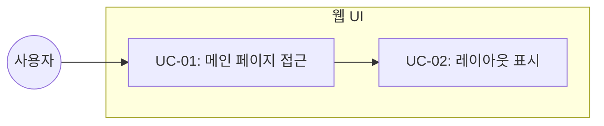

# TSK-01-02 - Jinja2 템플릿 기본 구조 설계 문서

## 문서 정보

| 항목 | 내용 |
|------|------|
| Task ID | TSK-01-02 |
| 문서 버전 | 1.0 |
| 작성일 | 2025-12-28 |
| 상태 | 작성중 |
| 카테고리 | development |
| 도메인 | frontend |

---

## 1. 개요

### 1.1 배경 및 문제 정의

**현재 상황:**
- orchay 스케줄러는 TUI(Textual) 기반으로만 모니터링 가능
- 터미널 환경이 없는 상황에서 진행 상황 확인 불가
- TSK-01-01에서 FastAPI 앱 및 라우트가 정의됨

**해결하려는 문제:**
- 브라우저 기반 웹 UI의 기본 템플릿 구조 필요
- HTMX와 Tailwind CSS를 활용한 모던 UI 프레임워크 구축

### 1.2 목적 및 기대 효과

**목적:**
- Jinja2 템플릿 엔진을 사용한 HTML 렌더링 기반 구축
- base.html 레이아웃과 index.html 메인 페이지 구현
- HTMX 및 Tailwind CSS CDN 통합

**기대 효과:**
- 브라우저에서 접근 가능한 모니터링 UI
- 다크테마 기반의 세련된 UI
- 빌드 도구 없이 CDN으로 스타일링 해결

### 1.3 범위

**포함:**
- base.html 기본 레이아웃 템플릿
- index.html 메인 페이지 템플릿
- HTMX 2.0 CDN 포함
- Tailwind CSS 3.x CDN 포함
- 2열 레이아웃 (WBS 트리 | Task 상세)

**제외:**
- 트리 데이터 API 구현 (TSK-02-01)
- 트리 템플릿 구현 (TSK-02-02)
- Task 상세 API 및 템플릿 (TSK-03-01)
- Worker 상태 바 (TSK-03-02)

### 1.4 참조 문서

| 문서 | 경로 | 관련 섹션 |
|------|------|----------|
| PRD | `.orchay/projects/orchay_web/prd.md` | 2.1 레이아웃, 2.2 주요 컴포넌트 |
| TRD | `.orchay/projects/orchay_web/trd.md` | 아키텍처, UI 스타일링 |

---

## 2. 사용자 분석

### 2.1 대상 사용자

| 사용자 유형 | 특성 | 주요 니즈 |
|------------|------|----------|
| 개발자 | orchay 스케줄러 사용자 | 브라우저에서 Task 진행 상황 모니터링 |
| 프로젝트 관리자 | WBS 진행률 확인 필요 | 직관적인 트리 구조와 상태 확인 |

### 2.2 사용자 페르소나

**페르소나 1: 개발자 A**
- 역할: orchay를 사용하는 개발자
- 목표: 터미널 없이 브라우저에서 작업 진행 상황 확인
- 불만: TUI만으로는 다른 작업 중 확인이 불편
- 시나리오: 브라우저 탭에서 실시간으로 Worker 상태 모니터링

---

## 3. 유즈케이스

### 3.1 유즈케이스 다이어그램



### 3.2 유즈케이스 상세

#### UC-01: 메인 페이지 접근

| 항목 | 내용 |
|------|------|
| 액터 | 사용자 |
| 목적 | 웹 UI 메인 페이지에 접근 |
| 사전 조건 | FastAPI 서버 실행 중 (TSK-01-01 완료) |
| 사후 조건 | 2열 레이아웃이 표시됨 |
| 트리거 | 브라우저에서 localhost:8080 접속 |

**기본 흐름:**
1. 사용자가 브라우저에서 http://localhost:8080 에 접속한다
2. 시스템이 index.html 템플릿을 렌더링한다
3. 사용자에게 2열 레이아웃의 메인 페이지가 표시된다
4. 좌측에는 WBS 트리 영역, 우측에는 Task 상세 영역이 표시된다

**예외 흐름:**
- 1a. 서버가 실행 중이 아니면:
  - 브라우저가 연결 실패 오류를 표시한다

#### UC-02: 레이아웃 표시

| 항목 | 내용 |
|------|------|
| 액터 | 시스템 |
| 목적 | 다크테마 기반 2열 레이아웃 렌더링 |
| 사전 조건 | HTTP 요청 수신 |
| 사후 조건 | 완전한 HTML 페이지 응답 |
| 트리거 | GET / 요청 |

**기본 흐름:**
1. FastAPI가 Jinja2Templates를 통해 index.html 렌더링
2. base.html 레이아웃이 적용됨
3. HTMX와 Tailwind CSS CDN이 로드됨
4. 다크테마 스타일이 적용된 페이지 반환

---

## 4. 사용자 시나리오

### 4.1 시나리오 1: 최초 페이지 접속

**상황 설명:**
개발자가 orchay 스케줄러를 --web 옵션으로 실행한 후, 브라우저에서 모니터링 페이지에 처음 접속하는 상황

**단계별 진행:**

| 단계 | 사용자 행동 | 시스템 반응 | 사용자 기대 |
|------|-----------|------------|------------|
| 1 | 브라우저 주소창에 localhost:8080 입력 | HTTP 요청 처리 | 페이지 로드 |
| 2 | Enter 키 누름 | index.html 렌더링 | 다크테마 UI |
| 3 | 페이지 확인 | 2열 레이아웃 표시 | 트리/상세 영역 확인 |

**성공 조건:**
- 다크테마가 적용된 페이지 렌더링
- 2열 레이아웃 (좌: 트리, 우: 상세) 표시
- 헤더에 프로젝트 정보 표시

### 4.2 시나리오 2: 페이지 로드 실패

**상황 설명:**
CDN 연결 실패로 스타일이 제대로 적용되지 않는 상황

**단계별 진행:**

| 단계 | 사용자 행동 | 시스템 반응 | 복구 방법 |
|------|-----------|------------|----------|
| 1 | 페이지 접속 | HTML만 렌더링 | 페이지 새로고침 |
| 2 | 스타일 없는 페이지 확인 | 기능은 동작 | 네트워크 확인 후 재접속 |

---

## 5. 화면 설계

### 5.1 화면 흐름도

```mermaid
flowchart LR
    A[/ 접속<br/>index.html] --> B[2열 레이아웃<br/>표시]
    B --> C[트리 영역<br/>WBS Tree]
    B --> D[상세 영역<br/>Task Detail]
```

### 5.2 화면별 상세

#### 화면 1: 메인 페이지 (index.html)

**화면 목적:**
WBS 트리와 Task 상세 정보를 함께 표시하는 메인 모니터링 페이지

**진입 경로:**
- http://localhost:8080/ 직접 접속
- --web 옵션 실행 시 터미널에 URL 출력

**와이어프레임:**
```
┌─────────────────────────────────────────────────────────────┐
│  orchay - Project Monitor                    [MODE: quick]  │
├─────────────────────────────────────────────────────────────┤
│  Workers: 🟢 idle  🟡 busy  🟡 busy     Progress: ████░ 75% │
├───────────────────────────────┬─────────────────────────────┤
│  WBS Tree                     │  Task Detail                │
│  ┌─────────────────────────┐  │  ┌─────────────────────────┐│
│  │ (트리 데이터 로드 영역) │  │  │ (상세 정보 로드 영역)  ││
│  │                         │  │  │                         ││
│  │ hx-get="/api/tree"      │  │  │ id="detail-panel"       ││
│  │ hx-trigger="load"       │  │  │                         ││
│  │                         │  │  │ Task 선택 시 갱신       ││
│  │                         │  │  │                         ││
│  └─────────────────────────┘  │  └─────────────────────────┘│
│                               │                             │
└───────────────────────────────┴─────────────────────────────┘
```

**화면 요소 설명:**

| 영역 | 설명 | 사용자 인터랙션 |
|------|------|----------------|
| 헤더 | 프로젝트명, 실행 모드 표시 | 읽기 전용 |
| Worker 바 | Worker 상태 아이콘, 진행률 | 5초마다 자동 갱신 |
| WBS Tree | 좌측 50%, 트리 구조 표시 | HTMX로 동적 로드 |
| Task Detail | 우측 50%, 선택된 Task 상세 | Task 선택 시 갱신 |

**사용자 행동 시나리오:**
1. 사용자가 페이지에 진입하면 2열 레이아웃을 본다
2. 좌측 트리 영역에서 Task를 클릭하면 우측에 상세 정보가 표시된다
3. Worker 상태 바는 5초마다 자동으로 갱신된다

#### 화면 2: 기본 레이아웃 (base.html)

**화면 목적:**
모든 페이지의 공통 레이아웃과 CDN 로드를 담당하는 기본 템플릿

**구조:**
```html
<!DOCTYPE html>
<html lang="ko" class="dark">
<head>
    <meta charset="UTF-8">
    <title>orchay - Project Monitor</title>
    <!-- Tailwind CSS CDN -->
    <!-- HTMX CDN -->
</head>
<body class="bg-gray-900 text-gray-100">
    <!-- Header -->
    <header>...</header>

    <!-- Main Content (자식 템플릿이 채움) -->
    <main>
        
    </main>

    <!-- Footer (선택) -->
</body>
</html>
```

### 5.3 반응형 동작

| 화면 크기 | 레이아웃 변화 | 사용자 경험 |
|----------|--------------|------------|
| 데스크톱 (1024px+) | 2열 레이아웃 (50%/50%) | 트리와 상세를 동시 확인 |
| 태블릿 (768-1023px) | 2열 유지 (40%/60%) | 상세 영역 더 넓게 |
| 모바일 (767px-) | 1열 (트리/상세 토글) | 한 영역씩 표시 |

---

## 6. 인터랙션 설계

### 6.1 사용자 액션과 피드백

| 사용자 액션 | 즉각 피드백 | 결과 피드백 | 에러 피드백 |
|------------|-----------|------------|------------|
| 페이지 로드 | 로딩 인디케이터 | 콘텐츠 표시 | 연결 실패 메시지 |
| HTMX 요청 | htmx-request 클래스 | 콘텐츠 교체 | 에러 메시지 |
| 5초 자동 갱신 | 무음 (배경) | 상태 업데이트 | 재시도 |

### 6.2 상태별 화면 변화

| 상태 | 화면 표시 | 사용자 안내 |
|------|----------|------------|
| 초기 로딩 | 스켈레톤 UI | "불러오는 중..." |
| 데이터 로드 완료 | 트리/상세 표시 | - |
| 네트워크 오류 | 오류 메시지 | "연결 상태를 확인해주세요" |
| Task 미선택 | 빈 상세 패널 | "Task를 선택하세요" |

### 6.3 키보드/접근성

| 기능 | 키보드 단축키 | 스크린 리더 안내 |
|------|-------------|-----------------|
| 새로고침 | F5 / Ctrl+R | "페이지 새로고침" |
| 트리 탐색 | Tab / Arrow Keys | "WBS 트리 탐색" |

---

## 7. 데이터 요구사항

### 7.1 필요한 데이터

| 데이터 | 설명 | 출처 | 용도 |
|--------|------|------|------|
| project_name | 프로젝트명 | Orchestrator | 헤더 표시 |
| mode | 실행 모드 | Orchestrator | 헤더 표시 |
| progress | 전체 진행률 | Orchestrator | Worker 바 표시 |

### 7.2 템플릿 컨텍스트

```python
# FastAPI 라우트에서 전달할 컨텍스트
context = {
    "request": request,
    "project_name": orchestrator.project,
    "mode": orchestrator.mode.value,
    "progress": calculate_progress(orchestrator.tasks),
}
```

---

## 8. 비즈니스 규칙

### 8.1 핵심 규칙

| 규칙 ID | 규칙 설명 | 적용 상황 | 예외 |
|---------|----------|----------|------|
| BR-01 | 다크테마 기본 적용 | 모든 페이지 | 없음 |
| BR-02 | CDN 우선 로드 | 스타일/스크립트 | 로컬 폴백 없음 |
| BR-03 | 2열 레이아웃 기본 | 데스크톱 뷰 | 모바일에서 1열 |

### 8.2 규칙 상세 설명

**BR-01: 다크테마 기본 적용**

설명: PRD에서 정의한 대로 다크테마를 기본으로 사용합니다. Tailwind CSS의 dark 모드 클래스를 사용합니다.

예시:
- `bg-gray-900`: 배경색
- `text-gray-100`: 텍스트색
- `border-gray-700`: 테두리색

**BR-02: CDN 우선 로드**

설명: 빌드 도구 없이 CDN으로 모든 외부 리소스를 로드합니다. 로컬 폴백은 구현하지 않습니다.

- HTMX: https://unpkg.com/htmx.org@2.0.0
- Tailwind CSS: https://cdn.tailwindcss.com

---

## 9. 에러 처리

### 9.1 예상 에러 상황

| 상황 | 원인 | 사용자 메시지 | 복구 방법 |
|------|------|--------------|----------|
| CDN 로드 실패 | 네트워크 차단 | 스타일 없이 표시 | 네트워크 확인 |
| 템플릿 렌더링 오류 | 변수 누락 | 500 에러 페이지 | 서버 로그 확인 |
| HTMX 요청 실패 | 서버 중단 | 에러 메시지 표시 | 페이지 새로고침 |

### 9.2 에러 표시 방식

| 에러 유형 | 표시 위치 | 표시 방법 |
|----------|----------|----------|
| 네트워크 오류 | 해당 영역 | 빨간색 에러 박스 |
| 서버 오류 | 전체 페이지 | 에러 페이지 |
| HTMX 오류 | 대상 요소 | hx-on::after-request 처리 |

---

## 10. 연관 문서

> 상세 테스트 명세 및 요구사항 추적은 별도 문서에서 관리합니다.

| 문서 | 경로 | 용도 |
|------|------|------|
| 요구사항 추적 매트릭스 | `025-traceability-matrix.md` | PRD → 설계 → 테스트 양방향 추적 |
| 테스트 명세서 | `026-test-specification.md` | 단위/E2E/매뉴얼 테스트 상세 정의 |

---

## 11. 구현 범위

### 11.1 영향받는 영역

| 영역 | 변경 내용 | 영향도 |
|------|----------|--------|
| orchay/src/orchay/web/templates/ | 신규 템플릿 파일 생성 | 높음 |
| orchay/src/orchay/web/server.py | 템플릿 렌더링 설정 | 중간 |

### 11.2 의존성

| 의존 항목 | 이유 | 상태 |
|----------|------|------|
| TSK-01-01 (FastAPI 앱) | 라우트에서 템플릿 렌더링 필요 | 의존 (선행 필요) |
| Jinja2 | 템플릿 엔진 | pyproject.toml에 추가 필요 |

### 11.3 제약 사항

| 제약 | 설명 | 대응 방안 |
|------|------|----------|
| 빌드 도구 금지 | npm, webpack 사용 불가 | CDN 사용 |
| JavaScript 프레임워크 금지 | React, Vue 사용 불가 | HTMX + 바닐라 JS |

### 11.4 파일 구조

```
orchay/src/orchay/web/
├── templates/
│   ├── base.html          # 기본 레이아웃
│   ├── index.html         # 메인 페이지
│   └── partials/
│       ├── tree.html      # WBS 트리 (TSK-02-02)
│       ├── detail.html    # Task 상세 (TSK-03-01)
│       └── workers.html   # Worker 상태 (TSK-03-02)
└── static/
    └── style.css          # 추가 스타일 (선택)
```

### 11.5 템플릿 구현 상세

#### base.html

```html
<!DOCTYPE html>
<html lang="ko">
<head>
    <meta charset="UTF-8">
    <meta name="viewport" content="width=device-width, initial-scale=1.0">
    <title>orchay - Project Monitor</title>

    <!-- Tailwind CSS CDN -->
    <script src="https://cdn.tailwindcss.com"></script>

    <!-- HTMX CDN -->
    <script src="https://unpkg.com/htmx.org@2.0.0"></script>

    <!-- Tailwind 다크테마 설정 -->
    <script>
        tailwind.config = {
            darkMode: 'class',
        }
    </script>

    
</head>
<body class="bg-gray-900 text-gray-100 min-h-screen">
    
</body>
</html>
```

#### index.html

```html



<!-- Header -->
<header class="bg-gray-800 border-b border-gray-700 px-4 py-3">
    <div class="flex justify-between items-center">
        <h1 class="text-xl font-bold">orchay - {{ project_name }}</h1>
        <span class="bg-blue-600 px-3 py-1 rounded text-sm">MODE: {{ mode }}</span>
    </div>
</header>

<!-- Worker Bar -->
<div id="workers-bar"
     class="bg-gray-800 border-b border-gray-700 px-4 py-2"
     hx-get="/api/workers"
     hx-trigger="load, every 5s"
     hx-swap="innerHTML">
    <div class="animate-pulse flex items-center gap-4">
        <span class="text-gray-500">Workers: 로딩 중...</span>
    </div>
</div>

<!-- Main Content: 2-Column Layout -->
<main class="flex h-[calc(100vh-100px)]">
    <!-- Left: WBS Tree -->
    <div class="w-1/2 border-r border-gray-700 overflow-auto p-4"
         id="tree-panel"
         hx-get="/api/tree"
         hx-trigger="load, every 5s"
         hx-swap="innerHTML">
        <div class="animate-pulse">
            <div class="h-4 bg-gray-700 rounded w-3/4 mb-2"></div>
            <div class="h-4 bg-gray-700 rounded w-1/2 mb-2 ml-4"></div>
            <div class="h-4 bg-gray-700 rounded w-2/3 mb-2 ml-4"></div>
        </div>
    </div>

    <!-- Right: Task Detail -->
    <div class="w-1/2 overflow-auto p-4" id="detail-panel">
        <div class="flex items-center justify-center h-full text-gray-500">
            <p>Task를 선택하세요</p>
        </div>
    </div>
</main>

```

---

## 12. 체크리스트

### 12.1 설계 완료 확인

- [x] 문제 정의 및 목적 명확화
- [x] 사용자 분석 완료
- [x] 유즈케이스 정의 완료
- [x] 사용자 시나리오 작성 완료
- [x] 화면 설계 완료 (와이어프레임)
- [x] 인터랙션 설계 완료
- [x] 데이터 요구사항 정의 완료
- [x] 비즈니스 규칙 정의 완료
- [x] 에러 처리 정의 완료

### 12.2 연관 문서 작성

- [ ] 요구사항 추적 매트릭스 작성 (→ `025-traceability-matrix.md`)
- [ ] 테스트 명세서 작성 (→ `026-test-specification.md`)

### 12.3 구현 준비

- [x] 구현 우선순위 결정
- [x] 의존성 확인 완료 (TSK-01-01 필요)
- [x] 제약 사항 검토 완료 (CDN 사용, 빌드 도구 금지)

---

## 변경 이력

| 버전 | 일자 | 작성자 | 변경 내용 |
|------|------|--------|----------|
| 1.0 | 2025-12-28 | Claude | 최초 작성 |
