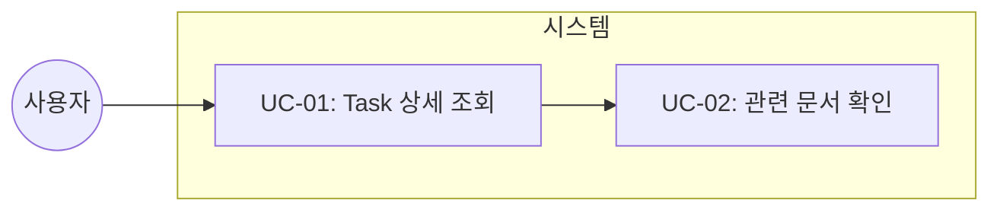
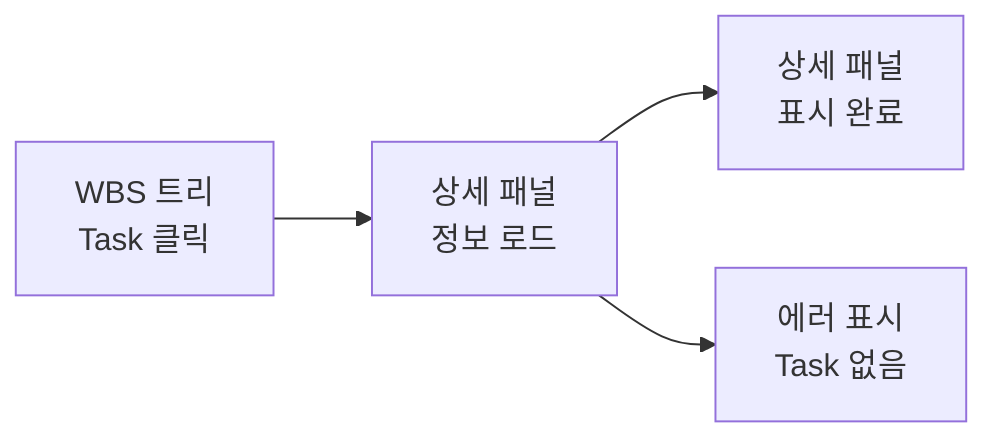
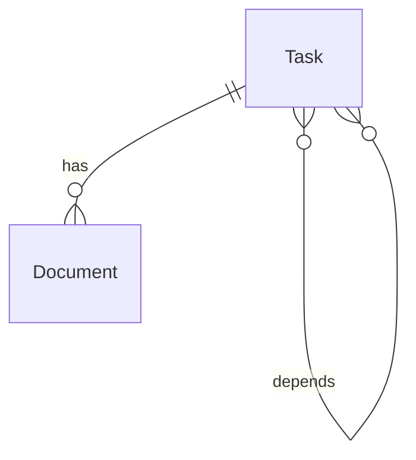

# TSK-03-01 - Task 상세 API 및 템플릿 설계 문서

## 문서 정보

| 항목 | 내용 |
|------|------|
| Task ID | TSK-03-01 |
| 문서 버전 | 1.0 |
| 작성일 | 2025-12-28 |
| 상태 | 작성중 |
| 카테고리 | development |

---

## 1. 개요

### 1.1 배경 및 문제 정의

**현재 상황:**
- orchay 스케줄러는 TUI만 지원하여 터미널에서만 Task 정보 확인 가능
- WBS 트리에서 Task를 선택해도 상세 정보를 볼 수 있는 별도 UI가 없음
- Task의 전체 속성(ID, 상태, 카테고리, 우선순위, 관련 문서 등)을 한눈에 확인하기 어려움

**해결하려는 문제:**
- Task 선택 시 상세 정보를 표시할 패널 필요
- API를 통해 Task 데이터를 조회하고 HTML 파셜로 렌더링하는 기능 필요
- 모든 Task 속성 및 관련 문서 링크를 시각적으로 표현

### 1.2 목적 및 기대 효과

**목적:**
- Task 상세 정보를 표시하는 API 엔드포인트 구현
- Jinja2 템플릿으로 상세 패널 HTML 렌더링

**기대 효과:**
- 사용자가 브라우저에서 Task 상세 정보를 즉시 확인 가능
- 관련 문서에 대한 빠른 접근
- 전체 모니터링 경험 향상

### 1.3 범위

**포함:**
- `/api/detail/{task_id}` API 엔드포인트 구현
- `detail.html` 파셜 템플릿 구현
- Task 모든 속성 표시 (ID, 제목, 상태, 카테고리, 우선순위, 의존성 등)
- 관련 문서 링크 목록 렌더링

**제외:**
- Task 편집 기능 (읽기 전용)
- 실시간 자동 갱신 (TSK-03-03에서 처리)
- Worker 상태 표시 (TSK-03-02에서 처리)

### 1.4 참조 문서

| 문서 | 경로 | 관련 섹션 |
|------|------|----------|
| PRD | `.orchay/projects/orchay_web/prd.md` | 3.2 Task 상세 패널 |
| TRD | `.orchay/projects/orchay_web/trd.md` | API 설계, UI 스타일링 |

---

## 2. 사용자 분석

### 2.1 대상 사용자

| 사용자 유형 | 특성 | 주요 니즈 |
|------------|------|----------|
| 개발자 | Claude Code Worker 사용자, 터미널 친숙 | 브라우저에서 Task 상세 정보 빠른 확인 |
| PM/관리자 | 진행 상황 모니터링 필요 | Task 상태 및 우선순위 한눈에 파악 |

### 2.2 사용자 페르소나

**페르소나 1: 개발자 민수**
- 역할: 백엔드 개발자
- 목표: 여러 Task 중 현재 진행 중인 Task의 상세 정보 확인
- 불만: TUI에서 Task 상세를 보려면 여러 단계를 거쳐야 함
- 시나리오: WBS 트리에서 Task를 클릭하면 즉시 상세 정보 확인

---

## 3. 유즈케이스

### 3.1 유즈케이스 다이어그램



### 3.2 유즈케이스 상세

#### UC-01: Task 상세 조회

| 항목 | 내용 |
|------|------|
| 액터 | 개발자, PM |
| 목적 | 선택한 Task의 상세 정보 확인 |
| 사전 조건 | 웹 UI가 실행 중, WBS 트리에 Task 존재 |
| 사후 조건 | 상세 패널에 Task 정보 표시 |
| 트리거 | WBS 트리에서 Task 노드 클릭 |

**기본 흐름:**
1. 사용자가 WBS 트리에서 Task 노드를 클릭한다
2. HTMX가 `/api/detail/{task_id}` 요청을 보낸다
3. 서버가 Task 데이터를 조회하여 detail.html을 렌더링한다
4. 상세 패널에 Task 정보가 표시된다

**예외 흐름:**
- 3a. Task ID가 존재하지 않으면:
  - 서버가 404 에러 응답
  - "Task를 찾을 수 없습니다" 메시지 표시

#### UC-02: 관련 문서 확인

| 항목 | 내용 |
|------|------|
| 액터 | 개발자, PM |
| 목적 | Task와 연결된 설계/구현 문서 목록 확인 |
| 사전 조건 | Task 상세 패널이 표시된 상태 |
| 사후 조건 | 문서 목록이 표시되고 클릭 가능 |
| 트리거 | Task 상세 조회 완료 |

**기본 흐름:**
1. 상세 패널에 Documents 섹션이 표시된다
2. 존재하는 문서 목록이 링크로 표시된다
3. 사용자가 문서 링크를 클릭한다 (향후 기능)

---

## 4. 사용자 시나리오

### 4.1 시나리오 1: Task 상세 조회

**상황 설명:**
개발자 민수가 현재 진행 중인 TSK-03-01의 상세 정보를 확인하고자 한다.

**단계별 진행:**

| 단계 | 사용자 행동 | 시스템 반응 | 사용자 기대 |
|------|-----------|------------|------------|
| 1 | WBS 트리에서 TSK-03-01 클릭 | 클릭한 노드 하이라이트 | 선택됨을 알 수 있음 |
| 2 | - | 상세 패널에 정보 로드 | 0.5초 내 표시 |
| 3 | 상세 정보 확인 | 모든 속성 표시 | 필요한 정보 확인 |

**성공 조건:**
- Task ID, 제목, 상태, 카테고리, 우선순위, 의존성이 모두 표시됨
- 관련 문서 목록이 표시됨

### 4.2 시나리오 2: Task가 존재하지 않는 경우

**상황 설명:**
잘못된 Task ID로 직접 URL 접근 시

**단계별 진행:**

| 단계 | 사용자 행동 | 시스템 반응 | 복구 방법 |
|------|-----------|------------|----------|
| 1 | 잘못된 URL 접근 | 에러 메시지 표시 | 트리에서 올바른 Task 선택 |

---

## 5. 화면 설계

### 5.1 화면 흐름도



### 5.2 화면별 상세

#### 화면 1: Task 상세 패널

**화면 목적:**
선택한 Task의 모든 속성과 관련 문서를 표시

**진입 경로:**
- WBS 트리에서 Task 노드 클릭

**와이어프레임:**
```
┌─────────────────────────────────────────────────────────┐
│  Task Detail                                            │
│  ───────────────────────────────────────────────────    │
│                                                         │
│  ┌───────────────────────────────────────────────────┐ │
│  │  TSK-03-01                                        │ │
│  │  Task 상세 API 및 템플릿                          │ │
│  │                                                   │ │
│  │  ┌─────────────┐  ┌─────────────────────────────┐│ │
│  │  │ Status      │  │ [dd] detail-design          ││ │
│  │  └─────────────┘  └─────────────────────────────┘│ │
│  │                                                   │ │
│  │  ┌─────────────┐  ┌─────────────────────────────┐│ │
│  │  │ Category    │  │ development                 ││ │
│  │  └─────────────┘  └─────────────────────────────┘│ │
│  │                                                   │ │
│  │  ┌─────────────┐  ┌─────────────────────────────┐│ │
│  │  │ Domain      │  │ fullstack                   ││ │
│  │  └─────────────┘  └─────────────────────────────┘│ │
│  │                                                   │ │
│  │  ┌─────────────┐  ┌─────────────────────────────┐│ │
│  │  │ Priority    │  │ high                        ││ │
│  │  └─────────────┘  └─────────────────────────────┘│ │
│  │                                                   │ │
│  │  ┌─────────────┐  ┌─────────────────────────────┐│ │
│  │  │ Depends     │  │ TSK-02-02                   ││ │
│  │  └─────────────┘  └─────────────────────────────┘│ │
│  │                                                   │ │
│  │  ─────────────────────────────────────────────── │ │
│  │                                                   │ │
│  │  Documents                                        │ │
│  │  ├─ 📄 010-design.md                             │ │
│  │  ├─ 📄 025-traceability-matrix.md                │ │
│  │  └─ 📄 026-test-specification.md                 │ │
│  │                                                   │ │
│  └───────────────────────────────────────────────────┘ │
│                                                         │
└─────────────────────────────────────────────────────────┘
```

**화면 요소 설명:**

| 영역 | 설명 | 사용자 인터랙션 |
|------|------|----------------|
| 헤더 | Task ID + 제목 | - |
| Status 배지 | 상태 코드 + 라벨, 색상 | - |
| 속성 테이블 | Category, Domain, Priority, Depends | - |
| Documents | 관련 문서 링크 목록 | 클릭 시 문서 열기 (향후) |

### 5.3 반응형 동작

| 화면 크기 | 레이아웃 변화 | 사용자 경험 |
|----------|--------------|------------|
| 데스크톱 (1024px+) | 2열 레이아웃 (트리 | 상세) | 동시 확인 |
| 태블릿 (768-1023px) | 2열 유지, 패딩 축소 | 동시 확인 |
| 모바일 (767px-) | 상세 패널 전체 화면 | 뒤로 버튼으로 트리 복귀 |

---

## 6. 인터랙션 설계

### 6.1 사용자 액션과 피드백

| 사용자 액션 | 즉각 피드백 | 결과 피드백 | 에러 피드백 |
|------------|-----------|------------|------------|
| Task 클릭 | 노드 하이라이트 | 상세 패널 업데이트 | 에러 메시지 |
| 문서 링크 클릭 | 링크 하이라이트 | 새 탭/모달 열림 | 파일 없음 메시지 |

### 6.2 상태별 화면 변화

| 상태 | 화면 표시 | 사용자 안내 |
|------|----------|------------|
| 초기 로딩 | 스켈레톤 UI | - |
| Task 없음 | 빈 상태 | "Task를 선택하세요" |
| 에러 발생 | 에러 메시지 | "Task를 찾을 수 없습니다" |
| 성공 완료 | 상세 정보 표시 | - |

### 6.3 키보드/접근성

| 기능 | 키보드 단축키 | 스크린 리더 안내 |
|------|-------------|-----------------|
| 이전 Task | ↑ | "이전 Task로 이동" |
| 다음 Task | ↓ | "다음 Task로 이동" |
| 문서 선택 | Tab | "{문서명} 링크" |

---

## 7. 데이터 요구사항

### 7.1 필요한 데이터

| 데이터 | 설명 | 출처 | 용도 |
|--------|------|------|------|
| Task.id | Task 식별자 | Orchestrator.tasks | 표시 |
| Task.title | Task 제목 | Orchestrator.tasks | 표시 |
| Task.status | 상태 코드 | Orchestrator.tasks | 배지 표시 |
| Task.category | 카테고리 | Orchestrator.tasks | 표시 |
| Task.domain | 도메인 | Orchestrator.tasks | 표시 |
| Task.priority | 우선순위 | Orchestrator.tasks | 표시 |
| Task.depends | 의존 Task | Orchestrator.tasks | 표시 |
| Documents | 관련 문서 목록 | 파일시스템 스캔 | 링크 표시 |

### 7.2 데이터 관계



**관계 설명:**
- Task는 여러 개의 Document를 가질 수 있음
- Task는 다른 Task에 의존할 수 있음 (다대다)

### 7.3 데이터 유효성 규칙

| 데이터 필드 | 규칙 | 위반 시 메시지 |
|------------|------|---------------|
| task_id | 필수, TSK-XX-XX 형식 | "유효하지 않은 Task ID" |

---

## 8. 비즈니스 규칙

### 8.1 핵심 규칙

| 규칙 ID | 규칙 설명 | 적용 상황 | 예외 |
|---------|----------|----------|------|
| BR-01 | Task ID는 WBS에 존재해야 함 | API 조회 시 | 404 반환 |
| BR-02 | 문서 목록은 실제 존재하는 파일만 표시 | 렌더링 시 | 빈 목록 표시 |

### 8.2 규칙 상세 설명

**BR-01: Task 존재 검증**

설명: `/api/detail/{task_id}` 요청 시 해당 Task가 Orchestrator.tasks에 존재해야 함

예시:
- TSK-03-01 존재 → 상세 정보 반환
- TSK-99-99 미존재 → 404 Not Found

**BR-02: 문서 존재 확인**

설명: Documents 섹션에는 `.orchay/projects/{project}/tasks/{task_id}/` 경로에 실제 존재하는 파일만 표시

---

## 9. 에러 처리

### 9.1 예상 에러 상황

| 상황 | 원인 | 사용자 메시지 | 복구 방법 |
|------|------|--------------|----------|
| Task 없음 | 잘못된 ID | "Task를 찾을 수 없습니다" | 올바른 Task 선택 |
| 서버 오류 | 내부 오류 | "서버 오류가 발생했습니다" | 새로고침 |
| 문서 없음 | 파일 미존재 | 빈 목록 표시 | - |

### 9.2 에러 표시 방식

| 에러 유형 | 표시 위치 | 표시 방법 |
|----------|----------|----------|
| Task 없음 | 상세 패널 | 경고 박스 (노란색) |
| 서버 오류 | 상세 패널 | 에러 박스 (빨간색) |

---

## 10. 연관 문서

> 상세 테스트 명세 및 요구사항 추적은 별도 문서에서 관리합니다.

| 문서 | 경로 | 용도 |
|------|------|------|
| 요구사항 추적 매트릭스 | `025-traceability-matrix.md` | PRD → 설계 → 테스트 양방향 추적 |
| 테스트 명세서 | `026-test-specification.md` | 단위/E2E/매뉴얼 테스트 상세 정의 |

---

## 11. 구현 범위

### 11.1 영향받는 영역

| 영역 | 변경 내용 | 영향도 |
|------|----------|--------|
| orchay/web/server.py | `/api/detail/{task_id}` 라우트 추가 | 높음 |
| orchay/web/templates/partials/detail.html | 상세 패널 템플릿 신규 생성 | 높음 |
| orchay/web/templates/index.html | 상세 패널 영역 추가 | 중간 |

### 11.2 의존성

| 의존 항목 | 이유 | 상태 |
|----------|------|------|
| TSK-01-01 | FastAPI 앱 기본 구조 필요 | 완료 (dd) |
| TSK-01-02 | Jinja2 템플릿 기본 구조 필요 | 대기 |
| TSK-02-02 | 트리 템플릿에서 Task 클릭 이벤트 | 대기 |

### 11.3 제약 사항

| 제약 | 설명 | 대응 방안 |
|------|------|----------|
| 읽기 전용 | Task 편집 기능 없음 | 향후 버전에서 추가 |
| 동기식 렌더링 | SSE 미사용 | 폴링으로 대체 |

---

## 12. 기술 상세

### 12.1 API 엔드포인트

```python
@app.get("/api/detail/{task_id}")
async def get_task_detail(task_id: str, request: Request):
    """Task 상세 정보 HTML 파셜 반환"""
    task = orchestrator.get_task(task_id)
    if not task:
        return templates.TemplateResponse(
            "partials/detail.html",
            {"request": request, "error": "Task를 찾을 수 없습니다"}
        )

    documents = get_task_documents(task_id)

    return templates.TemplateResponse(
        "partials/detail.html",
        {
            "request": request,
            "task": task,
            "documents": documents,
            "status_color": STATUS_COLORS.get(task.status, "bg-gray-500")
        }
    )
```

### 12.2 템플릿 구조

```html
<!-- partials/detail.html -->

<div class="bg-yellow-900 border border-yellow-700 text-yellow-200 p-4 rounded">
    {{ error }}
</div>

<div class="space-y-4">
    <!-- Header -->
    <div>
        <h2 class="text-xl font-bold text-gray-100">{{ task.id }}</h2>
        <p class="text-gray-400">{{ task.title }}</p>
    </div>

    <!-- Status Badge -->
    <div class="flex items-center gap-2">
        <span class="px-2 py-1 text-xs rounded {{ status_color }}">
            {{ task.status }}
        </span>
        <span class="text-gray-400">{{ task.status_label }}</span>
    </div>

    <!-- Properties -->
    <div class="space-y-2 text-sm">
        <div class="flex">
            <span class="w-24 text-gray-500">Category</span>
            <span class="text-gray-300">{{ task.category }}</span>
        </div>
        <div class="flex">
            <span class="w-24 text-gray-500">Domain</span>
            <span class="text-gray-300">{{ task.domain or '-' }}</span>
        </div>
        <div class="flex">
            <span class="w-24 text-gray-500">Priority</span>
            <span class="text-gray-300">{{ task.priority }}</span>
        </div>
        <div class="flex">
            <span class="w-24 text-gray-500">Depends</span>
            <span class="text-gray-300">{{ task.depends|join(', ') or '-' }}</span>
        </div>
    </div>

    <!-- Documents -->
    <div class="border-t border-gray-700 pt-4">
        <h3 class="text-sm font-medium text-gray-400 mb-2">Documents</h3>
        <ul class="space-y-1 text-sm">
            
            <li class="flex items-center gap-2">
                <span>📄</span>
                <span class="text-blue-400">{{ doc }}</span>
            </li>
            
            <li class="text-gray-500">문서 없음</li>
            
        </ul>
    </div>
</div>

```

### 12.3 상태 색상 매핑

```python
STATUS_COLORS = {
    "[ ]": "bg-gray-500",      # Todo
    "[bd]": "bg-blue-500",      # Basic Design
    "[dd]": "bg-purple-500",    # Detail Design
    "[ap]": "bg-green-500",     # Approved
    "[im]": "bg-yellow-500",    # Implement
    "[vf]": "bg-cyan-500",      # Verify
    "[xx]": "bg-emerald-500",   # Done
}
```

---

## 13. 체크리스트

### 13.1 설계 완료 확인

- [x] 문제 정의 및 목적 명확화
- [x] 사용자 분석 완료
- [x] 유즈케이스 정의 완료
- [x] 사용자 시나리오 작성 완료
- [x] 화면 설계 완료 (와이어프레임)
- [x] 인터랙션 설계 완료
- [x] 데이터 요구사항 정의 완료
- [x] 비즈니스 규칙 정의 완료
- [x] 에러 처리 정의 완료

### 13.2 연관 문서 작성

- [x] 요구사항 추적 매트릭스 작성 (→ `025-traceability-matrix.md`)
- [x] 테스트 명세서 작성 (→ `026-test-specification.md`)

### 13.3 구현 준비

- [x] 구현 우선순위 결정
- [x] 의존성 확인 완료
- [x] 제약 사항 검토 완료

---

## 변경 이력

| 버전 | 일자 | 작성자 | 변경 내용 |
|------|------|--------|----------|
| 1.0 | 2025-12-28 | Claude | 최초 작성 |
