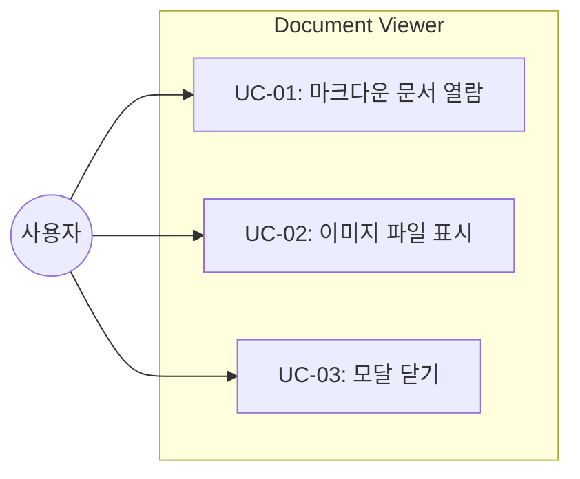
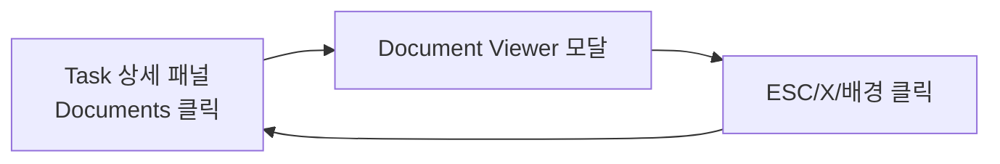
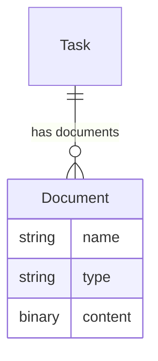

# TSK-05-01 - Document Viewer 구현 설계 문서

## 문서 정보

| 항목 | 내용 |
|------|------|
| Task ID | TSK-05-01 |
| 문서 버전 | 1.0 |
| 작성일 | 2025-12-28 |
| 상태 | 작성중 |
| 카테고리 | development |

---

## 1. 개요

### 1.1 배경 및 문제 정의

**현재 상황:**
- Task 상세 패널에 관련 문서 목록이 표시됨 (`detail.html:72-86`)
- 문서 클릭 시 아무 동작 없음 (뷰어 미구현)
- 사용자가 문서 내용을 확인하려면 파일 시스템을 직접 탐색해야 함

**해결하려는 문제:**
- 웹 UI에서 문서 내용을 직접 확인할 수 없음
- Mermaid 다이어그램이 포함된 설계 문서 시각화 불가
- 이미지 파일 (와이어프레임, 스크린샷 등) 확인 불가

### 1.2 목적 및 기대 효과

**목적:**
- Task 관련 문서를 웹 UI에서 바로 열람할 수 있는 Document Viewer 구현

**기대 효과:**
- 마크다운 문서를 렌더링된 HTML로 확인 가능
- Mermaid 다이어그램 시각화
- 이미지 파일 즉시 조회
- 파일 시스템 접근 없이 브라우저에서 모든 문서 확인

### 1.3 범위

**포함:**
- Document API 엔드포인트 (`/api/document/{task_id}/{doc_name}`)
- 모달 팝업 UI (열기/닫기)
- 마크다운 렌더링 (marked.js CDN)
- Mermaid 다이어그램 렌더링 (mermaid.js CDN)
- 이미지 파일 표시 (png, jpg, gif, webp)
- Path traversal 보안 처리

**제외:**
- PDF 파일 지원 (향후 과제)
- 문서 편집 기능 (읽기 전용)
- 문서 검색 기능

### 1.4 참조 문서

| 문서 | 경로 | 관련 섹션 |
|------|------|----------|
| PRD | `.orchay/projects/orchay_web/prd.md` | 3.5 Document Viewer |
| TRD | `.orchay/projects/orchay_web/trd.md` | 기술 스택 |
| 기존 서버 | `orchay/src/orchay/web/server.py` | get_task_documents() |

---

## 2. 사용자 분석

### 2.1 대상 사용자

| 사용자 유형 | 특성 | 주요 니즈 |
|------------|------|----------|
| 개발자 | Claude Code Worker 작업 모니터링 | 설계 문서, 코드 리뷰 결과 확인 |
| PM | 프로젝트 진행 상황 파악 | WBS 트리와 문서 내용 연계 확인 |

### 2.2 사용자 페르소나

**페르소나 1: 개발자 김철수**
- 역할: Claude Code Worker 작업 모니터링
- 목표: Task 진행 중 생성된 설계 문서 확인
- 불만: 파일 탐색기로 문서를 찾아 열어야 함
- 시나리오: 특정 Task의 010-design.md 내용을 웹에서 바로 확인

---

## 3. 유즈케이스

### 3.1 유즈케이스 다이어그램



### 3.2 유즈케이스 상세

#### UC-01: 마크다운 문서 열람

| 항목 | 내용 |
|------|------|
| 액터 | 웹 UI 사용자 |
| 목적 | Task 관련 마크다운 문서 내용 확인 |
| 사전 조건 | Task 상세 패널이 열려 있음, 문서 목록에 .md 파일 존재 |
| 사후 조건 | 모달에 렌더링된 HTML 표시 |
| 트리거 | 문서 목록에서 .md 파일 클릭 |

**기본 흐름:**
1. 사용자가 Task 상세 패널의 Documents 섹션에서 문서 클릭
2. 시스템이 `/api/document/{task_id}/{doc_name}` 요청
3. 서버가 마크다운 텍스트 반환
4. 클라이언트가 marked.js로 HTML 렌더링
5. mermaid.js가 코드블록 다이어그램 렌더링
6. 모달 팝업에 결과 표시

**대안 흐름:**
- 4a. Mermaid 코드블록이 없으면:
  - mermaid.init() 스킵

**예외 흐름:**
- 2a. 파일이 존재하지 않으면:
  - 404 에러 모달 표시
- 2b. Path traversal 시도 시:
  - 403 에러 반환

#### UC-02: 이미지 파일 표시

| 항목 | 내용 |
|------|------|
| 액터 | 웹 UI 사용자 |
| 목적 | Task 관련 이미지 파일 확인 |
| 사전 조건 | Task 상세 패널이 열려 있음, 이미지 파일 존재 |
| 사후 조건 | 모달에 이미지 표시 |
| 트리거 | 문서 목록에서 이미지 파일 클릭 |

**기본 흐름:**
1. 사용자가 이미지 파일 (.png, .jpg 등) 클릭
2. 시스템이 `/api/document/{task_id}/{doc_name}` 요청
3. 서버가 FileResponse로 이미지 반환
4. 모달에 `` 태그로 표시

#### UC-03: 모달 닫기

| 항목 | 내용 |
|------|------|
| 액터 | 웹 UI 사용자 |
| 목적 | Document Viewer 모달 종료 |
| 사전 조건 | 모달이 열려 있음 |
| 사후 조건 | 모달 닫힘, Task 상세 패널 복귀 |
| 트리거 | ESC 키 또는 X 버튼 또는 배경 클릭 |

**기본 흐름:**
1. 사용자가 ESC 키 누름
2. 모달이 페이드아웃 애니메이션과 함께 닫힘
3. 포커스가 이전 위치로 복귀

---

## 4. 사용자 시나리오

### 4.1 시나리오 1: 설계 문서 확인

**상황 설명:**
개발자가 TSK-05-01의 설계 문서를 확인하려 함. WBS 트리에서 해당 Task를 클릭하여 상세 패널을 열고, Documents 섹션에서 010-design.md를 클릭한다.

**단계별 진행:**

| 단계 | 사용자 행동 | 시스템 반응 | 사용자 기대 |
|------|-----------|------------|------------|
| 1 | 문서 목록에서 `010-design.md` 클릭 | 로딩 인디케이터 표시 | 문서가 열림 |
| 2 | 기다림 | 모달 팝업 열림, 마크다운 렌더링 | 보기 좋은 문서 |
| 3 | Mermaid 다이어그램 확인 | 다이어그램 SVG 렌더링 | 시각화된 플로우 |
| 4 | ESC 키 누름 | 모달 닫힘 | Task 패널 복귀 |

**성공 조건:**
- 마크다운이 HTML로 렌더링됨
- Mermaid 코드블록이 SVG 다이어그램으로 변환됨
- 모달이 ESC/X/배경 클릭으로 닫힘

### 4.2 시나리오 2: 이미지 확인

**상황 설명:**
PM이 UI 와이어프레임 이미지를 확인하려 함.

**단계별 진행:**

| 단계 | 사용자 행동 | 시스템 반응 | 사용자 기대 |
|------|-----------|------------|------------|
| 1 | `wireframe.png` 클릭 | 이미지 로딩 | 이미지가 열림 |
| 2 | 기다림 | 모달에 이미지 표시 | 선명한 이미지 |
| 3 | X 버튼 클릭 | 모달 닫힘 | Task 패널 복귀 |

---

## 5. 화면 설계

### 5.1 화면 흐름도



### 5.2 화면별 상세

#### 화면 1: Document Viewer 모달

**화면 목적:**
마크다운 문서 또는 이미지를 모달 팝업으로 표시

**진입 경로:**
- Task 상세 패널 > Documents 섹션 > 문서 클릭

**와이어프레임:**
```
┌─────────────────────────────────────────────────────────────────────┐
│  ┌───────────────────────────────────────────────────────────────┐  │
│  │                                                         [X]   │  │
│  │  📄 010-design.md                                             │  │
│  │  ─────────────────────────────────────────────────────────────│  │
│  │                                                               │  │
│  │  # TSK-05-01 설계 문서                                        │  │
│  │                                                               │  │
│  │  ## 1. 개요                                                   │  │
│  │  ...                                                          │  │
│  │                                                               │  │
│  │  ```mermaid                                                   │  │
│  │  ┌─────────┐    ┌─────────┐                                   │  │
│  │  │ Start   │───▶│  End    │   (렌더링된 다이어그램)           │  │
│  │  └─────────┘    └─────────┘                                   │  │
│  │  ```                                                          │  │
│  │                                                               │  │
│  └───────────────────────────────────────────────────────────────┘  │
│  (반투명 배경 - 클릭 시 닫힘)                                        │
└─────────────────────────────────────────────────────────────────────┘
```

**화면 요소 설명:**

| 영역 | 설명 | 사용자 인터랙션 |
|------|------|----------------|
| 헤더 | 파일명 + X 버튼 | X 클릭 시 모달 닫기 |
| 콘텐츠 | 렌더링된 마크다운 또는 이미지 | 스크롤 가능 |
| 배경 | 반투명 오버레이 | 클릭 시 모달 닫기 |

**사용자 행동 시나리오:**
1. 모달이 열리면 문서 제목과 내용이 표시됨
2. 스크롤하여 전체 내용 확인
3. ESC 키, X 버튼, 또는 배경 클릭으로 닫기

### 5.3 반응형 동작

| 화면 크기 | 레이아웃 변화 | 사용자 경험 |
|----------|--------------|------------|
| 데스크톱 (1024px+) | 모달 너비 80%, max-width 900px | 넉넉한 읽기 공간 |
| 태블릿 (768-1023px) | 모달 너비 90% | 적정 읽기 공간 |
| 모바일 (767px-) | 모달 너비 95% | 풀스크린에 가까움 |

---

## 6. 인터랙션 설계

### 6.1 사용자 액션과 피드백

| 사용자 액션 | 즉각 피드백 | 결과 피드백 | 에러 피드백 |
|------------|-----------|------------|------------|
| 문서 클릭 | 커서 포인터, 호버 하이라이트 | 모달 열림 | 에러 메시지 표시 |
| ESC 키 | - | 모달 닫힘 | - |
| X 버튼 클릭 | 버튼 호버 효과 | 모달 닫힘 | - |
| 배경 클릭 | - | 모달 닫힘 | - |

### 6.2 상태별 화면 변화

| 상태 | 화면 표시 | 사용자 안내 |
|------|----------|------------|
| 로딩 중 | 스피너 또는 "불러오는 중..." | - |
| 마크다운 표시 | 렌더링된 HTML | - |
| 이미지 표시 | `` 태그 | - |
| 파일 없음 | 에러 메시지 | "문서를 찾을 수 없습니다" |

### 6.3 키보드/접근성

| 기능 | 키보드 단축키 | 스크린 리더 안내 |
|------|-------------|-----------------|
| 모달 닫기 | ESC | "문서 뷰어 닫기" |
| 포커스 트랩 | Tab | 모달 내부 요소만 순환 |

---

## 7. 데이터 요구사항

### 7.1 필요한 데이터

| 데이터 | 설명 | 출처 | 용도 |
|--------|------|------|------|
| task_id | Task 식별자 | URL 경로 파라미터 | 문서 디렉토리 위치 |
| doc_name | 파일명 | URL 경로 파라미터 | 파일 조회 |
| 파일 내용 | 마크다운 텍스트 또는 바이너리 | 파일 시스템 | 렌더링 |

### 7.2 데이터 관계



**관계 설명:**
- Task는 여러 Document를 가질 수 있음
- Document 경로: `.orchay/projects/{project}/tasks/{task_id}/{doc_name}`

### 7.3 데이터 유효성 규칙

| 데이터 필드 | 규칙 | 위반 시 메시지 |
|------------|------|---------------|
| task_id | 존재하는 Task ID | 404 Not Found |
| doc_name | 허용 확장자만 (.md, .png, .jpg, .jpeg, .gif, .webp) | 400 Bad Request |
| 경로 | Path traversal 불가 (../ 포함 불가) | 403 Forbidden |

---

## 8. 비즈니스 규칙

### 8.1 핵심 규칙

| 규칙 ID | 규칙 설명 | 적용 상황 | 예외 |
|---------|----------|----------|------|
| BR-01 | 허용된 확장자만 제공 | 모든 문서 요청 | 없음 |
| BR-02 | Path traversal 차단 | 모든 문서 요청 | 없음 |
| BR-03 | 마크다운은 PlainTextResponse | .md 파일 요청 | 없음 |
| BR-04 | 이미지는 FileResponse | 이미지 파일 요청 | 없음 |

### 8.2 규칙 상세 설명

**BR-01: 허용 확장자**

설명: 보안과 기능 범위를 제한하기 위해 특정 확장자만 허용

허용 목록:
- `.md` - 마크다운 문서
- `.png`, `.jpg`, `.jpeg`, `.gif`, `.webp` - 이미지

**BR-02: Path Traversal 방지**

설명: 디렉토리 탈출 공격 차단

검증 로직:
```python
resolved = (base_path / task_id / doc_name).resolve()
if not resolved.is_relative_to(base_path):
    raise HTTPException(403, "Access denied")
```

---

## 9. 에러 처리

### 9.1 예상 에러 상황

| 상황 | 원인 | 사용자 메시지 | 복구 방법 |
|------|------|--------------|----------|
| 파일 없음 | 잘못된 경로 | "문서를 찾을 수 없습니다" | 다른 문서 선택 |
| 허용되지 않는 확장자 | .pdf 등 요청 | "지원하지 않는 파일 형식입니다" | 허용 형식 안내 |
| Path traversal | 공격 시도 | "접근이 거부되었습니다" | - |
| 서버 오류 | 파일 읽기 실패 | "서버 오류가 발생했습니다" | 새로고침 |

### 9.2 에러 표시 방식

| 에러 유형 | 표시 위치 | 표시 방법 |
|----------|----------|----------|
| 404 | 모달 콘텐츠 영역 | 에러 아이콘 + 메시지 |
| 403 | 모달 콘텐츠 영역 | 에러 아이콘 + 메시지 |
| 500 | 모달 콘텐츠 영역 | 에러 아이콘 + 메시지 |

---

## 10. 연관 문서

> 상세 테스트 명세 및 요구사항 추적은 별도 문서에서 관리합니다.

| 문서 | 경로 | 용도 |
|------|------|------|
| 요구사항 추적 매트릭스 | `025-traceability-matrix.md` | PRD → 설계 → 테스트 양방향 추적 |
| 테스트 명세서 | `026-test-specification.md` | 단위/E2E/매뉴얼 테스트 상세 정의 |

---

## 11. 구현 범위

### 11.1 영향받는 영역

| 영역 | 변경 내용 | 영향도 |
|------|----------|--------|
| `server.py` | `/api/document/` 라우트 추가 | 중간 |
| `detail.html` | 문서 클릭 이벤트 추가 | 중간 |
| `base.html` | 모달 HTML + JS 추가, marked.js/mermaid.js CDN | 높음 |
| `get_task_documents()` | 이미지 확장자도 반환하도록 수정 | 낮음 |

### 11.2 의존성

| 의존 항목 | 이유 | 상태 |
|----------|------|------|
| TSK-03-01 | Task 상세 패널, Documents 목록 | 완료 |
| marked.js CDN | 마크다운 렌더링 | 외부 |
| mermaid.js CDN | 다이어그램 렌더링 | 외부 |

### 11.3 제약 사항

| 제약 | 설명 | 대응 방안 |
|------|------|----------|
| 빌드 도구 불가 | npm 사용 금지 | CDN 사용 |
| Python 단일 스택 | FastAPI + Jinja2만 | 서버 사이드 최소화 |

---

## 12. 기술 설계

### 12.1 API 엔드포인트

```
GET /api/document/{task_id}/{doc_name}
```

| 파라미터 | 타입 | 설명 |
|---------|------|------|
| task_id | path | Task ID (예: TSK-05-01) |
| doc_name | path | 파일명 (예: 010-design.md) |

**응답:**
- `.md` → `PlainTextResponse(content, media_type="text/plain; charset=utf-8")`
- 이미지 → `FileResponse(file_path, media_type="image/png")`

### 12.2 클라이언트 로직

```javascript
async function openDocument(taskId, docName) {
    const modal = document.getElementById('document-modal');
    const content = document.getElementById('document-content');

    const res = await fetch(`/api/document/${taskId}/${docName}`);

    if (docName.endsWith('.md')) {
        const text = await res.text();
        content.innerHTML = marked.parse(text);
        mermaid.run({ nodes: content.querySelectorAll('.language-mermaid') });
    } else {
        content.innerHTML = ``;
    }

    modal.classList.remove('hidden');
}

function closeDocument() {
    document.getElementById('document-modal').classList.add('hidden');
}

// ESC 키 핸들러
document.addEventListener('keydown', (e) => {
    if (e.key === 'Escape') closeDocument();
});
```

### 12.3 서버 로직

```python
ALLOWED_EXTENSIONS = {".md", ".png", ".jpg", ".jpeg", ".gif", ".webp"}

@app.get("/api/document/{task_id}/{doc_name}")
async def get_document(task_id: str, doc_name: str):
    base_path = Path(".orchay/projects") / orchestrator.project_name / "tasks"
    file_path = (base_path / task_id / doc_name).resolve()

    # Path traversal 검증
    if not file_path.is_relative_to(base_path.resolve()):
        raise HTTPException(403, "Access denied")

    # 확장자 검증
    if file_path.suffix.lower() not in ALLOWED_EXTENSIONS:
        raise HTTPException(400, f"Unsupported file type: {file_path.suffix}")

    # 파일 존재 확인
    if not file_path.exists():
        raise HTTPException(404, "Document not found")

    # 응답 타입 결정
    if file_path.suffix == ".md":
        return PlainTextResponse(file_path.read_text(encoding="utf-8"))
    else:
        return FileResponse(file_path)
```

---

## 13. 체크리스트

### 13.1 설계 완료 확인

- [x] 문제 정의 및 목적 명확화
- [x] 사용자 분석 완료
- [x] 유즈케이스 정의 완료
- [x] 사용자 시나리오 작성 완료
- [x] 화면 설계 완료 (와이어프레임)
- [x] 인터랙션 설계 완료
- [x] 데이터 요구사항 정의 완료
- [x] 비즈니스 규칙 정의 완료
- [x] 에러 처리 정의 완료
- [x] 기술 설계 완료 (API, 클라이언트, 서버)

### 13.2 연관 문서 작성

- [ ] 요구사항 추적 매트릭스 작성 (→ `025-traceability-matrix.md`)
- [ ] 테스트 명세서 작성 (→ `026-test-specification.md`)

### 13.3 구현 준비

- [x] 구현 우선순위: 1. API → 2. 모달 UI → 3. 마크다운 렌더링 → 4. Mermaid
- [x] 의존성 확인 완료 (TSK-03-01 완료)
- [x] 제약 사항 검토 완료

---

## 변경 이력

| 버전 | 일자 | 작성자 | 변경 내용 |
|------|------|--------|----------|
| 1.0 | 2025-12-28 | Claude | 최초 작성 |
