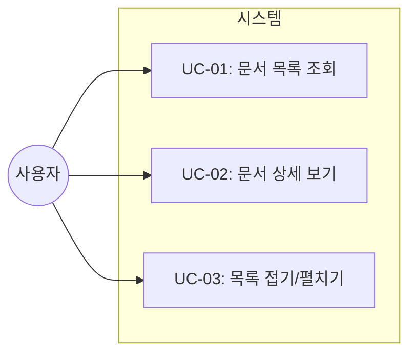
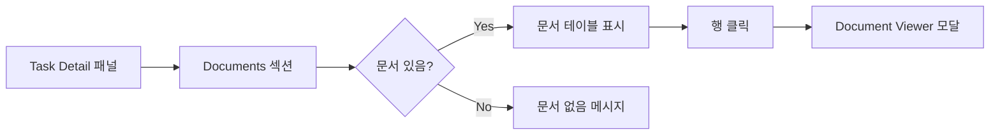
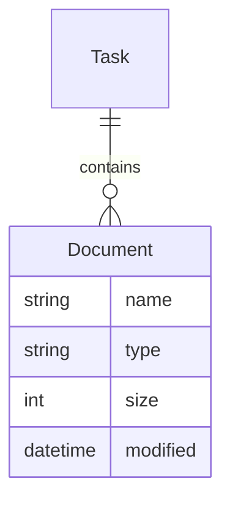

# TSK-06-03 - 문서 테이블 설계 문서

## 문서 정보

| 항목 | 내용 |
|------|------|
| Task ID | TSK-06-03 |
| 문서 버전 | 1.0 |
| 작성일 | 2025-12-28 |
| 상태 | 작성중 |
| 카테고리 | development |

---

## 1. 개요

### 1.1 배경 및 문제 정의

**현재 상황:**
- Task Detail 패널에서 문서 목록이 단순 파일명 리스트로 표시됨
- 파일 메타정보(타입, 크기, 수정일)를 확인할 수 없음
- 많은 문서가 있을 때 스크롤이 길어져 가독성 저하

**해결하려는 문제:**
- 문서 메타정보 부족으로 문서 식별이 어려움
- 문서 목록 섹션을 접거나 펼칠 수 없어 UI 공간 활용 비효율적

### 1.2 목적 및 기대 효과

**목적:**
- 문서 목록을 테이블 형태로 개선하여 메타정보(타입, 크기, 수정일) 표시
- 접기/펼치기 기능으로 UI 공간 효율성 향상

**기대 효과:**
- 문서 식별 용이 (타입, 크기, 수정일 한눈에 확인)
- 깔끔한 UI (접기 시 공간 절약)
- 기존 Document Viewer 연동 유지

### 1.3 범위

**포함:**
- 문서 목록 테이블 UI (4컬럼: 문서명, 타입, 크기, 수정일)
- 문서 메타정보 API 응답 확장
- 접기/펼치기 토글 기능
- Document Viewer 연동 유지

**제외:**
- Document Viewer 모달 자체 (TSK-05-01에서 완료)
- Task Detail 패널의 다른 섹션 개선 (TSK-06-02 범위)

### 1.4 참조 문서

| 문서 | 경로 | 관련 섹션 |
|------|------|----------|
| PRD | `.orchay/projects/orchay_web/prd.md` | 3.6.4 관련 문서 섹션 |
| TRD | `.orchay/projects/orchay_web/trd.md` | UI 스타일링, 트리 UI 구현 |

---

## 2. 사용자 분석

### 2.1 대상 사용자

| 사용자 유형 | 특성 | 주요 니즈 |
|------------|------|----------|
| 개발자 | 웹 UI로 Task 모니터링 | 문서 내용 빠르게 확인 |
| 프로젝트 관리자 | 진행 상황 파악 | 문서 최신 여부 확인 (수정일) |

### 2.2 사용자 페르소나

**페르소나 1: 개발자 (철수)**
- 역할: 백엔드 개발자
- 목표: Task 관련 설계 문서를 빠르게 확인
- 불만: 문서가 여러 개일 때 어떤 문서가 최신인지 알 수 없음
- 시나리오: 구현 중 설계 문서를 참조하며 작업

---

## 3. 유즈케이스

### 3.1 유즈케이스 다이어그램



### 3.2 유즈케이스 상세

#### UC-01: 문서 목록 조회

| 항목 | 내용 |
|------|------|
| 액터 | 사용자 |
| 목적 | Task 관련 문서 목록과 메타정보 확인 |
| 사전 조건 | Task Detail 패널에 Task가 선택됨 |
| 사후 조건 | 문서 테이블이 표시됨 |
| 트리거 | Task 클릭 또는 자동 갱신 |

**기본 흐름:**
1. 사용자가 WBS 트리에서 Task를 클릭한다
2. 시스템이 Task Detail API를 호출한다
3. 시스템이 문서 목록을 테이블 형태로 표시한다
4. 각 문서의 이름, 타입, 크기, 수정일이 표시된다

**대안 흐름:**
- 3a. 문서가 없을 경우:
  - "문서 없음" 메시지 표시

#### UC-02: 문서 상세 보기

| 항목 | 내용 |
|------|------|
| 액터 | 사용자 |
| 목적 | 문서 내용을 모달로 확인 |
| 사전 조건 | 문서 테이블이 표시됨 |
| 사후 조건 | Document Viewer 모달이 열림 |
| 트리거 | 문서 행 클릭 |

**기본 흐름:**
1. 사용자가 문서 테이블에서 행을 클릭한다
2. 시스템이 `openDocument(taskId, docName)`을 호출한다
3. Document Viewer 모달이 열린다 (TSK-05-01)

#### UC-03: 목록 접기/펼치기

| 항목 | 내용 |
|------|------|
| 액터 | 사용자 |
| 목적 | 문서 섹션을 접거나 펼쳐 공간 관리 |
| 사전 조건 | 문서 섹션이 존재함 |
| 사후 조건 | 섹션이 접히거나 펼쳐짐 |
| 트리거 | 섹션 헤더 클릭 |

**기본 흐름:**
1. 사용자가 "Documents" 섹션 헤더를 클릭한다
2. 시스템이 테이블 영역을 토글한다
3. 아이콘이 ▼(펼침) ↔ ▶(접힘) 변경된다

---

## 4. 사용자 시나리오

### 4.1 시나리오 1: 문서 확인 및 열기

**상황 설명:**
개발자 철수가 TSK-06-03 구현을 위해 설계 문서를 확인하려 한다.

**단계별 진행:**

| 단계 | 사용자 행동 | 시스템 반응 | 사용자 기대 |
|------|-----------|------------|------------|
| 1 | Task 클릭 | Detail 패널 로드 | 문서 목록 표시 |
| 2 | 테이블에서 010-design.md 확인 | 크기: 8.5KB, 수정일: 2025-12-28 표시 | 최신 문서 확인 |
| 3 | 010-design.md 행 클릭 | Document Viewer 모달 열림 | 마크다운 렌더링 |

**성공 조건:**
- 문서 메타정보가 정확히 표시됨
- 클릭 시 Document Viewer가 정상 동작함

### 4.2 시나리오 2: 문서 섹션 접기

**상황 설명:**
문서가 많아 Detail 패널이 길어질 때 접기 기능 사용.

**단계별 진행:**

| 단계 | 사용자 행동 | 시스템 반응 | 복구 방법 |
|------|-----------|------------|----------|
| 1 | Documents 헤더 클릭 | 테이블 영역 숨김 | 다시 클릭하면 펼침 |

---

## 5. 화면 설계

### 5.1 화면 흐름도



### 5.2 화면별 상세

#### 화면 1: 문서 테이블 섹션

**화면 목적:**
Task 관련 문서를 테이블 형태로 표시하고 메타정보 제공

**진입 경로:**
- Task Detail 패널 하단 Documents 섹션

**와이어프레임:**
```
┌─────────────────────────────────────────────────────────┐
│  Documents ▼                              [3개 문서]   │
├─────────────────────────────────────────────────────────┤
│  문서명              │ 타입  │ 크기    │ 수정일        │
├─────────────────────────────────────────────────────────┤
│  📄 010-design.md    │ MD    │ 8.5 KB  │ 2025-12-28   │
│  📄 025-traceability │ MD    │ 2.1 KB  │ 2025-12-28   │
│  🖼️ diagram.png      │ PNG   │ 45 KB   │ 2025-12-27   │
└─────────────────────────────────────────────────────────┘
```

**접힌 상태:**
```
┌─────────────────────────────────────────────────────────┐
│  Documents ▶                              [3개 문서]   │
└─────────────────────────────────────────────────────────┘
```

**화면 요소 설명:**

| 영역 | 설명 | 사용자 인터랙션 |
|------|------|----------------|
| 섹션 헤더 | "Documents" + 토글 아이콘 + 문서 개수 | 클릭 시 접기/펼치기 |
| 테이블 헤더 | 문서명, 타입, 크기, 수정일 컬럼 | - |
| 테이블 행 | 문서 정보 + hover 효과 | 클릭 시 Document Viewer |

**사용자 행동 시나리오:**
1. 사용자가 화면에 진입하면 문서 테이블을 본다
2. 헤더를 클릭하면 테이블이 접힌다
3. 행을 클릭하면 Document Viewer가 열린다

### 5.3 반응형 동작

| 화면 크기 | 레이아웃 변화 | 사용자 경험 |
|----------|--------------|------------|
| 데스크톱 (1024px+) | 4컬럼 테이블 | 모든 정보 표시 |
| 태블릿 (768-1023px) | 3컬럼 (크기 숨김) | 핵심 정보 표시 |
| 모바일 (767px-) | 리스트 형태 (현재 유지) | 문서명 + 아이콘만 |

---

## 6. 인터랙션 설계

### 6.1 사용자 액션과 피드백

| 사용자 액션 | 즉각 피드백 | 결과 피드백 | 에러 피드백 |
|------------|-----------|------------|------------|
| 행 hover | 배경색 변경 (bg-gray-700) | - | - |
| 행 클릭 | 눌림 효과 | 모달 열림 | "문서를 불러올 수 없습니다" |
| 헤더 클릭 | 아이콘 회전 | 영역 접힘/펼침 | - |

### 6.2 상태별 화면 변화

| 상태 | 화면 표시 | 사용자 안내 |
|------|----------|------------|
| 초기 로딩 | 펼쳐진 상태 | 테이블 표시 |
| 문서 없음 | 빈 상태 메시지 | "문서 없음" |
| 접힘 | 헤더만 표시 | 아이콘 ▶ |
| 펼침 | 헤더 + 테이블 | 아이콘 ▼ |

### 6.3 키보드/접근성

| 기능 | 키보드 단축키 | 스크린 리더 안내 |
|------|-------------|-----------------|
| 문서 열기 | Enter (포커스된 행) | "문서 열기: {문서명}" |
| 접기/펼치기 | Space (헤더 포커스) | "문서 섹션 접기/펼치기" |

---

## 7. 데이터 요구사항

### 7.1 필요한 데이터

| 데이터 | 설명 | 출처 | 용도 |
|--------|------|------|------|
| 파일명 | 문서 파일 이름 | Task 디렉토리 스캔 | 테이블 표시 |
| 파일 타입 | 확장자 기반 타입 | 파일 확장자 추출 | 타입 컬럼 |
| 파일 크기 | 바이트 크기 | os.stat().st_size | 크기 컬럼 (포맷팅) |
| 수정일 | 마지막 수정 시간 | os.stat().st_mtime | 수정일 컬럼 |

### 7.2 데이터 관계



**관계 설명:**
- Task는 0개 이상의 Document를 포함한다
- Document는 파일 시스템에서 메타정보를 조회한다

### 7.3 데이터 유효성 규칙

| 데이터 필드 | 규칙 | 위반 시 처리 |
|------------|------|-------------|
| 파일명 | 허용 확장자만 | 필터링 제외 |
| 크기 | 양수 정수 | 0으로 표시 |
| 수정일 | Unix timestamp | 현재 시간 표시 |

---

## 8. 비즈니스 규칙

### 8.1 핵심 규칙

| 규칙 ID | 규칙 설명 | 적용 상황 | 예외 |
|---------|----------|----------|------|
| BR-01 | 허용 확장자만 표시 | 파일 목록 조회 시 | .md, .png, .jpg, .jpeg, .gif, .webp |
| BR-02 | 크기 포맷팅 | 표시 시 | B, KB, MB 자동 변환 |
| BR-03 | 날짜 포맷 | 표시 시 | YYYY-MM-DD 형식 |

### 8.2 규칙 상세 설명

**BR-01: 허용 확장자 필터링**

설명: 보안을 위해 허용된 확장자의 파일만 목록에 표시합니다.

예시:
- `.md` 파일: 표시됨
- `.exe` 파일: 표시 안됨

**BR-02: 크기 포맷팅**

설명: 파일 크기를 사람이 읽기 쉬운 형태로 변환합니다.

예시:
- 8500 bytes → 8.3 KB
- 46080 bytes → 45.0 KB

---

## 9. 에러 처리

### 9.1 예상 에러 상황

| 상황 | 원인 | 사용자 메시지 | 복구 방법 |
|------|------|--------------|----------|
| 파일 없음 | 디렉토리 비어있음 | "문서 없음" | - |
| 메타정보 실패 | 파일 삭제됨 | 해당 행 제외 | 새로고침 |
| Document Viewer 실패 | 파일 읽기 오류 | 모달에 에러 표시 | 닫기 버튼 |

### 9.2 에러 표시 방식

| 에러 유형 | 표시 위치 | 표시 방법 |
|----------|----------|----------|
| 문서 없음 | 테이블 영역 | 회색 텍스트 |
| 로드 실패 | 모달 내부 | 에러 박스 |

---

## 10. 연관 문서

> 상세 테스트 명세 및 요구사항 추적은 별도 문서에서 관리합니다.

| 문서 | 경로 | 용도 |
|------|------|------|
| 요구사항 추적 매트릭스 | `025-traceability-matrix.md` | PRD → 설계 → 테스트 양방향 추적 |
| 테스트 명세서 | `026-test-specification.md` | 단위/E2E/매뉴얼 테스트 상세 정의 |

---

## 11. 구현 범위

### 11.1 영향받는 영역

| 영역 | 변경 내용 | 영향도 |
|------|----------|--------|
| server.py | `get_task_documents()` 메타정보 반환 확장 | 중간 |
| detail.html | 문서 테이블 UI 구현 | 높음 |
| style (Tailwind) | 테이블 스타일 추가 | 낮음 |

### 11.2 의존성

| 의존 항목 | 이유 | 상태 |
|----------|------|------|
| TSK-05-01 | Document Viewer 호출 필요 | ✅ 완료 |
| TSK-06-02 | Detail 패널 카드 스타일 참조 | 🔄 진행중 |

### 11.3 제약 사항

| 제약 | 설명 | 대응 방안 |
|------|------|----------|
| JavaScript 프레임워크 금지 | TRD 제약 | 순수 JS + HTMX 사용 |
| CDN만 사용 | TRD 제약 | Tailwind CDN 활용 |

---

## 12. 체크리스트

### 12.1 설계 완료 확인

- [x] 문제 정의 및 목적 명확화
- [x] 사용자 분석 완료
- [x] 유즈케이스 정의 완료
- [x] 사용자 시나리오 작성 완료
- [x] 화면 설계 완료 (와이어프레임)
- [x] 인터랙션 설계 완료
- [x] 데이터 요구사항 정의 완료
- [x] 비즈니스 규칙 정의 완료
- [x] 에러 처리 정의 완료

### 12.2 연관 문서 작성

- [ ] 요구사항 추적 매트릭스 작성 (→ `025-traceability-matrix.md`)
- [ ] 테스트 명세서 작성 (→ `026-test-specification.md`)

### 12.3 구현 준비

- [x] 구현 우선순위 결정
- [x] 의존성 확인 완료
- [x] 제약 사항 검토 완료

---

## 변경 이력

| 버전 | 일자 | 작성자 | 변경 내용 |
|------|------|--------|----------|
| 1.0 | 2025-12-28 | Claude | 최초 작성 |
